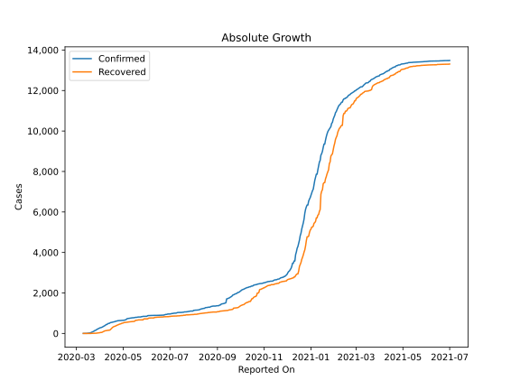
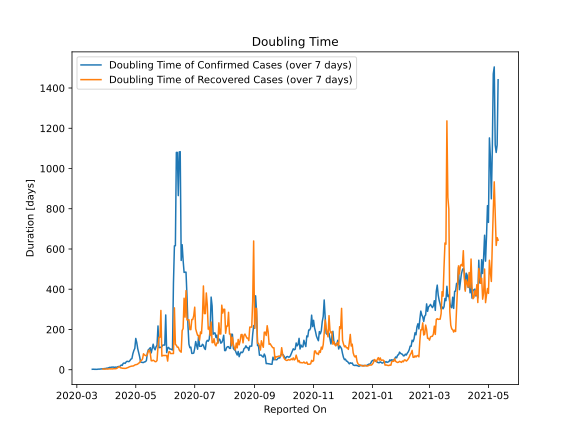

# Country Figures: Doubling Time of Infections for BurkinaFaso 

The doubling time below are calculated based on
* an exponential growth assumption
* for time difference of past seven (7) days.
The doubling time's unit is "days".

The first doubling time indicates the increase of confirmed (infected)
cases. There, the *higher* the number is, the better is to take control
of the disease.

The second doubling time indicates the increase of recovered (healed)
cases. There, the *lower* the number is, the better it is to take
control of the disease.

| Reported On | Confirmed | Doubling Time (Confirmed) | Recovered | Doubling Time (Recovered) |
|-------------|-----------|---------------------------|-----------|---------------------------|
| 2020-04-17 | 557 |  21.5 days  | 294 |  7.3 days  | 
| 2020-04-16 | 546 |  23.6 days  | 257 |  8.9 days  | 
| 2020-04-15 | 542 |  18.4 days  | 226 |  9.6 days  | 
| 2020-04-14 | 528 |  15.6 days  | 177 |  15.0 days  | 
| 2020-04-13 | 497 |  15.9 days  | 161 |  12.5 days  | 
| 2020-04-12 | 497 |  13.6 days  | 161 |  8.7 days  | 
| 2020-04-11 | 484 |  11.9 days  | 155 |  6.0 days  | 
| 2020-04-10 | 443 |  13.0 days  | 146 |  4.9 days  | 
| 2020-04-09 | 443 |  11.6 days  | 146 |  4.9 days  | 
| 2020-04-08 | 414 |  13.0 days  | 134 |  4.9 days  | 
| 2020-04-07 | 384 |  12.9 days  | 127 |  3.9 days  | 
| 2020-04-06 | 364 |  12.7 days  | 108 |  4.2 days  | 
| 2020-04-05 | 345 |  11.3 days  | 90 |  3.9 days  | 
| 2020-04-04 | 318 |  11.6 days  | 66 |  4.6 days  | 
| 2020-04-03 | 302 |  9.7 days  | 50 |  3.7 days  | 
| 2020-04-02 | 288 |  7.9 days  | 50 |  3.3 days  | 
| 2020-04-01 | 282 |  7.7 days  | 46 |  3.5 days  | 
| 2020-03-31 | 261 |  6.2 days  | 32 |  3.5 days  | 
| 2020-03-30 | 246 |  5.7 days  | 31 |  3.0 days  | 
| 2020-03-29 | 222 |  4.8 days  | 23 |  3.5 days  | 
| 2020-03-28 | 207 |  4.5 days  | 21 |  3.7 days  | 
| 2020-03-27 | 180 |  3.6 days  | 12 |  None  | 
| 2020-03-26 | 152 |  3.5 days  | 10 |  None  | 
| 2020-03-25 | 146 |  2.8 days  | 10 |  None  | 
| 2020-03-24 | 114 |  2.7 days  | 7 |  None  | 
| 2020-03-23 | 99 |  2.9 days  | 5 |  None  | 
| 2020-03-22 | 75 |  1.8 days  | 5 |  None  | 
| 2020-03-21 | 64 |  1.7 days  | 5 |  None  | 
| 2020-03-20 | 40 |  1.9 days  | 0 |  None  | 
| 2020-03-19 | 33 |  2.1 days  | 0 |  None  | 
| 2020-03-18 | 20 |  2.4 days  | 0 |  None  | 
| 2020-03-17 | 15 |  2.1 days  | 0 |  None  | 
| 2020-03-16 | 15 |  None  | 0 |  None  | 
| 2020-03-15 | 3 |  None  | 0 |  None  | 
| 2020-03-14 | 2 |  None  | 0 |  None  | 
| 2020-03-13 | 2 |  None  | 0 |  None  | 
| 2020-03-12 | 2 |  None  | 0 |  None  | 
| 2020-03-11 | 2 |  None  | 0 |  None  | 
| 2020-03-10 | 1 |  None  | 0 |  None  | 

