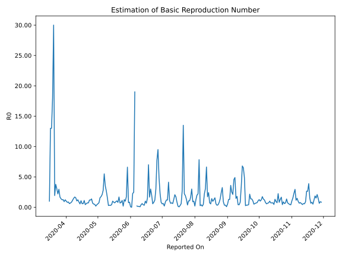

# Country Figures: Time Series for Basic Reproduction Number of BurkinaFaso 

| Reported On | &Delta; Confirmed | Total &Delta; Confirmed First Interval | Total &Delta; Confirmed Second Interval | Estimated Basic Reproduction Number R0 | 
|-------------|-------------------|----------------------------------------|-----------------------------------------|---------------------------------------------------|
| 2020-05-07 | 7 |  77  |  14  |  5.50  | 
| 2020-05-06 | 41 |  39  |  14  |  2.79  | 
| 2020-05-05 | 16 |  27  |  13  |  2.08  | 
| 2020-05-04 | 10 |  21  |  12  |  1.75  | 
| 2020-05-03 | 10 |  14  |  9  |  1.56  | 
| 2020-05-02 | 3 |  14  |  19  |  0.74  | 
| 2020-05-01 | 4 |  13  |  23  |  0.57  | 
| 2020-04-30 | 4 |  12  |  29  |  0.41  | 
| 2020-04-29 | 3 |  9  |  48  |  0.19  | 
| 2020-04-28 | 3 |  19  |  40  |  0.47  | 
| 2020-04-27 | 3 |  23  |  44  |  0.52  | 
| 2020-04-26 | 3 |  29  |  43  |  0.67  | 
| 2020-04-25 | 0 |  48  |  35  |  1.37  | 
| 2020-04-24 | 13 |  40  |  34  |  1.18  | 
| 2020-04-23 | 7 |  44  |  37  |  1.19  | 
| 2020-04-22 | 9 |  43  |  60  |  0.72  | 
| 2020-04-21 | 19 |  35  |  49  |  0.71  | 
| 2020-04-20 | 5 |  34  |  58  |  0.59  | 
| 2020-04-19 | 11 |  37  |  85  |  0.44  | 
| 2020-04-18 | 8 |  60  |  54  |  1.11  | 
| 2020-04-17 | 11 |  49  |  83  |  0.59  | 
| 2020-04-16 | 4 |  58  |  100  |  0.58  | 
| 2020-04-15 | 14 |  85  |  79  |  1.08  | 
| 2020-04-14 | 31 |  54  |  98  |  0.55  | 
| 2020-04-13 | 0 |  83  |  96  |  0.86  | 
| 2020-04-12 | 13 |  100  |  82  |  1.22  | 
| 2020-04-11 | 41 |  79  |  76  |  1.04  | 
| 2020-04-10 | 0 |  98  |  63  |  1.56  | 
| 2020-04-09 | 29 |  96  |  57  |  1.68  | 
| 2020-04-08 | 30 |  82  |  56  |  1.46  | 
| 2020-04-07 | 20 |  76  |  66  |  1.15  | 
| 2020-04-06 | 19 |  63  |  75  |  0.84  | 
| 2020-04-05 | 27 |  57  |  81  |  0.70  | 
| 2020-04-04 | 16 |  56  |  94  |  0.60  | 
| 2020-04-03 | 14 |  66  |  76  |  0.87  | 
| 2020-04-02 | 6 |  75  |  93  |  0.81  | 
| 2020-04-01 | 21 |  81  |  81  |  1.00  | 
| 2020-03-31 | 15 |  94  |  77  |  1.22  | 
| 2020-03-30 | 24 |  76  |  82  |  0.93  | 
| 2020-03-29 | 15 |  93  |  74  |  1.26  | 
| 2020-03-28 | 27 |  81  |  66  |  1.23  | 
| 2020-03-27 | 28 |  77  |  55  |  1.40  | 
| 2020-03-26 | 6 |  82  |  49  |  1.67  | 
| 2020-03-25 | 32 |  74  |  25  |  2.96  | 
| 2020-03-24 | 15 |  66  |  30  |  2.20  | 
| 2020-03-23 | 24 |  55  |  18  |  3.06  | 
| 2020-03-22 | 11 |  49  |  13  |  3.77  | 
| 2020-03-21 | 24 |  25  |  13  |  1.92  | 
| 2020-03-20 | 7 |  30  |  1  |  30.00  | 
| 2020-03-19 | 13 |  18  |  1  |  18.00  | 
| 2020-03-18 | 5 |  13  |  1  |  13.00  | 
| 2020-03-17 | 0 |  13  |  1  |  13.00  | 
| 2020-03-16 | 12 |  1  |  1  |  1.00  | 
| 2020-03-15 | 1 |  1  |  None  |  None  | 
| 2020-03-14 | 0 |  1  |  None  |  None  | 
| 2020-03-13 | 0 |  1  |  None  |  None  | 
| 2020-03-12 | 0 |  1  |  None  |  None  | 
| 2020-03-11 | 1 |  None  |  None  |  None  | 
| 2020-03-10 | None |  None  |  None  |  None  | 

