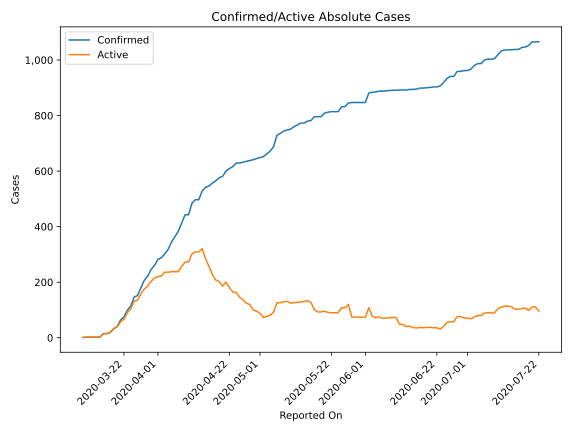
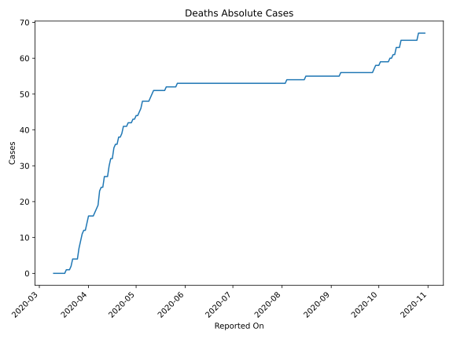
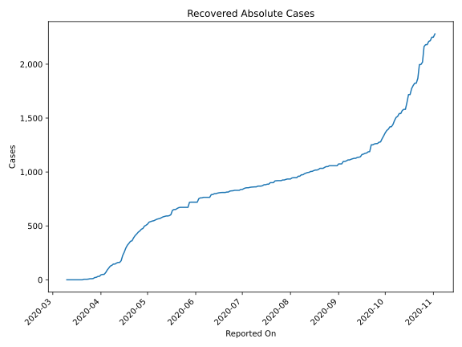
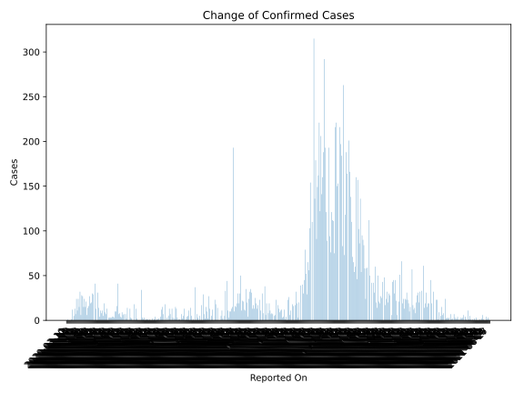
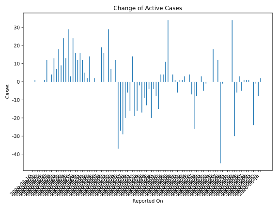
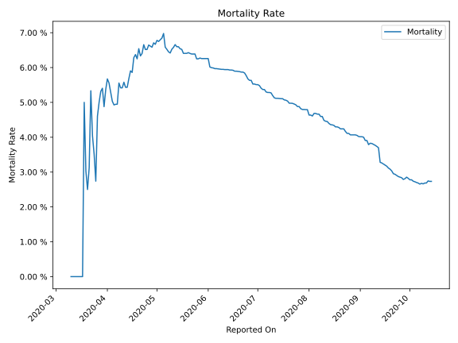

# Country Figures: Time Series for BurkinaFaso 

| Reported On | Confirmed | Deaths | Recovered | Active | Mortality | &Delta; Confirmed | &Delta; Deaths | &Delta; Active | % Active of Population |
|-------------|-----------|--------|-----------|--------|-----------|-------------------|----------------|----------------|------------------------|
| 2020-04-06 | 364 | 18 | 108 | 238 |  4.95 %  | 19 | 1 | 0 |  0.001 %  | 
| 2020-04-05 | 345 | 17 | 90 | 238 |  4.93 %  | 27 | 1 | 2 |  0.001 %  | 
| 2020-04-04 | 318 | 16 | 66 | 236 |  5.03 %  | 16 | 0 | 0 |  0.001 %  | 
| 2020-04-03 | 302 | 16 | 50 | 236 |  5.30 %  | 14 | 0 | 14 |  0.001 %  | 
| 2020-04-02 | 288 | 16 | 50 | 222 |  5.56 %  | 6 | 0 | 2 |  0.001 %  | 
| 2020-04-01 | 282 | 16 | 46 | 220 |  5.67 %  | 21 | 2 | 5 |  0.001 %  | 
| 2020-03-31 | 261 | 14 | 32 | 215 |  5.36 %  | 15 | 2 | 12 |  0.001 %  | 
| 2020-03-30 | 246 | 12 | 31 | 203 |  4.88 %  | 24 | 0 | 16 |  0.001 %  | 
| 2020-03-29 | 222 | 12 | 23 | 187 |  5.41 %  | 15 | 1 | 12 |  0.001 %  | 
| 2020-03-28 | 207 | 11 | 21 | 175 |  5.31 %  | 27 | 2 | 16 |  0.001 %  | 
| 2020-03-27 | 180 | 9 | 12 | 159 |  5.00 %  | 28 | 2 | 24 |  0.001 %  | 
| 2020-03-26 | 152 | 7 | 10 | 135 |  4.61 %  | 6 | 3 | 3 |  0.001 %  | 
| 2020-03-25 | 146 | 4 | 10 | 132 |  2.74 %  | 32 | 0 | 29 |  0.001 %  | 
| 2020-03-24 | 114 | 4 | 7 | 103 |  3.51 %  | 15 | 0 | 13 |  0.001 %  | 
| 2020-03-23 | 99 | 4 | 5 | 90 |  4.04 %  | 24 | 0 | 24 |  0.000 %  | 
| 2020-03-22 | 75 | 4 | 5 | 66 |  5.33 %  | 11 | 2 | 9 |  0.000 %  | 
| 2020-03-21 | 64 | 2 | 5 | 57 |  3.12 %  | 24 | 1 | 18 |  0.000 %  | 
| 2020-03-20 | 40 | 1 | 0 | 39 |  2.50 %  | 7 | 0 | 7 |  0.000 %  | 
| 2020-03-19 | 33 | 1 | 0 | 32 |  3.03 %  | 13 | 0 | 13 |  0.000 %  | 
| 2020-03-18 | 20 | 1 | 0 | 19 |  5.00 %  | 5 | 1 | 4 |  0.000 %  | 
| 2020-03-17 | 15 | 0 | 0 | 15 |  None  | 0 | 0 | 0 |  0.000 %  | 
| 2020-03-16 | 15 | 0 | 0 | 15 |  None  | 12 | 0 | 12 |  0.000 %  | 
| 2020-03-15 | 3 | 0 | 0 | 3 |  None  | 1 | 0 | 1 |  0.000 %  | 
| 2020-03-14 | 2 | 0 | 0 | 2 |  None  | 0 | 0 | 0 |  0.000 %  | 
| 2020-03-13 | 2 | 0 | 0 | 2 |  None  | 0 | 0 | 0 |  0.000 %  | 
| 2020-03-12 | 2 | 0 | 0 | 2 |  None  | 0 | 0 | 0 |  0.000 %  | 
| 2020-03-11 | 2 | 0 | 0 | 2 |  None  | 1 | 0 | 1 |  0.000 %  | 
| 2020-03-10 | 1 | 0 | 0 | 1 |  None  | None | None | None |  0.000 %  | 

