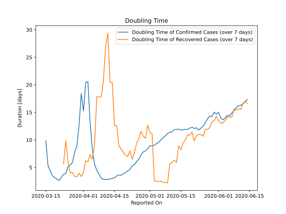

# Country Figures: New Infections in Previous 7 Days per 100,000 Population for Bangladesh 

<!--  --> 

| Reported On | &Delta; Confirmed (on the day) | &Delta; Confirmed (last 7 days) | New Cases in Previous 7 Days per 100,000 Population |
|-------------|--------------------------------|---------------------------------|-----------------------------------------------------|
| 2020-05-08 |  709  |  4896  |  3.034  |
| 2020-05-07 |  706  |  4758  |  2.949  |
| 2020-05-06 |  790  |  4616  |  2.861  |
| 2020-05-05 |  786  |  4467  |  2.768  |
| 2020-05-04 |  688  |  4230  |  2.622  |
| 2020-05-03 |  665  |  4039  |  2.503  |
| 2020-05-02 |  552  |  3792  |  2.350  |
| 2020-05-01 |  571  |  3549  |  2.199  |
| 2020-04-30 |  564  |  3481  |  2.157  |
| 2020-04-29 |  641  |  3331  |  2.064  |
| 2020-04-28 |  549  |  3080  |  1.909  |
| 2020-04-27 |  497  |  2965  |  1.838  |
| 2020-04-26 |  418  |  2960  |  1.834  |
| 2020-04-25 |  309  |  2854  |  1.769  |
| 2020-04-24 |  503  |  2851  |  1.767  |
| 2020-04-23 |  414  |  2614  |  1.620  |
| 2020-04-22 |  390  |  2541  |  1.575  |
| 2020-04-21 |  434  |  2370  |  1.469  |
| 2020-04-20 |  492  |  2145  |  1.329  |
| 2020-04-19 |  312  |  1835  |  1.137  |
| 2020-04-18 |  306  |  1662  |  1.030  |
| 2020-04-17 |  266  |  1414  |  0.876  |
| 2020-04-16 |  341  |  1242  |  0.770  |
| 2020-04-15 |  219  |  1013  |  0.628  |
| 2020-04-14 |  209  |  848  |  0.526  |
| 2020-04-13 |  182  |  680  |  0.421  |
| 2020-04-12 |  139  |  533  |  0.330  |
| 2020-04-11 |  58  |  412  |  0.255  |
| 2020-04-10 |  94  |  363  |  0.225  |
| 2020-04-09 |  112  |  274  |  0.170  |
| 2020-04-08 |  54  |  164  |  0.102  |
| 2020-04-07 |  41  |  113  |  0.070  |
| 2020-04-06 |  35  |  74  |  0.046  |
| 2020-04-05 |  18  |  40  |  0.025  |
| 2020-04-04 |  9  |  22  |  0.014  |
| 2020-04-03 |  5  |  13  |  0.008  |
| 2020-04-02 |  2  |  12  |  0.007  |
| 2020-04-01 |  3  |  15  |  0.009  |
| 2020-03-31 |  2  |  12  |  0.007  |
| 2020-03-30 |  1  |  16  |  0.010  |
| 2020-03-29 |  None  |  21  |  0.013  |
| 2020-03-28 |  None  |  23  |  0.014  |
| 2020-03-27 |  4  |  28  |  0.017  |
| 2020-03-26 |  5  |  27  |  0.017  |
| 2020-03-25 |  None  |  25  |  0.015  |
| 2020-03-24 |  6  |  29  |  0.018  |
| 2020-03-23 |  6  |  25  |  0.015  |
| 2020-03-22 |  2  |  22  |  0.014  |
| 2020-03-21 |  5  |  22  |  0.014  |
| 2020-03-20 |  3  |  17  |  0.011  |
| 2020-03-19 |  3  |  14  |  0.009  |
| 2020-03-18 |  4  |  11  |  0.007  |
| 2020-03-17 |  2  |  7  |  0.004  |
| 2020-03-16 |  3  |  5  |  0.003  |
| 2020-03-15 |  2  |  2  |  0.001  |
| 2020-03-14 |  None  |  None  |  None  |
| 2020-03-13 |  None  |  None  |  None  |
| 2020-03-12 |  None  |  None  |  None  |
| 2020-03-11 |  None  |  None  |  None  |
| 2020-03-10 |  None  |  None  |  None  |
| 2020-03-09 |  None  |  None  |  None  |
| 2020-03-08 |  None  |  None  |  None  |

