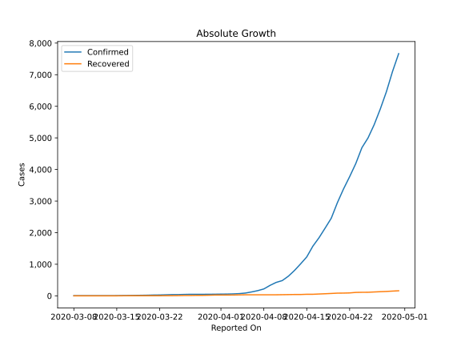

# Country Figures: Doubling Time of Infections for Bangladesh 

The doubling time below are calculated based on
* an exponential growth assumption
* for time difference of past seven (7) days.
The doubling time's unit is "days".

The first doubling time indicates the increase of confirmed (infected)
cases. There, the *higher* the number is, the better is to take control
of the disease.

The second doubling time indicates the increase of recovered (healed)
cases. There, the *lower* the number is, the better it is to take
control of the disease.

| Reported On | Confirmed | Doubling Time (Confirmed) | Recovered | Doubling Time (Recovered) |
|-------------|-----------|---------------------------|-----------|---------------------------|
| 2020-04-03 | 61 |  20.6 days  | 26 |  6.0 days  | 
| 2020-04-02 | 56 |  20.5 days  | 25 |  6.3 days  | 
| 2020-04-01 | 54 |  15.3 days  | 25 |  4.1 days  | 
| 2020-03-31 | 51 |  18.4 days  | 25 |  3.3 days  | 
| 2020-03-30 | 49 |  12.6 days  | 19 |  4.0 days  | 
| 2020-03-29 | 48 |  8.8 days  | 15 |  3.3 days  | 
| 2020-03-28 | 48 |  7.8 days  | 15 |  3.3 days  | 
| 2020-03-27 | 48 |  5.9 days  | 11 |  4.1 days  | 
| 2020-03-26 | 44 |  5.4 days  | 11 |  4.1 days  | 
| 2020-03-25 | 39 |  5.1 days  | 7 |  6.1 days  | 
| 2020-03-24 | 39 |  3.9 days  | 5 |  9.8 days  | 
| 2020-03-23 | 33 |  3.8 days  | 5 |  5.6 days  | 
| 2020-03-22 | 27 |  3.2 days  | 3 |  None  | 
| 2020-03-21 | 25 |  2.6 days  | 3 |  None  | 
| 2020-03-20 | 20 |  2.9 days  | 3 |  None  | 
| 2020-03-19 | 17 |  3.1 days  | 3 |  None  | 
| 2020-03-18 | 14 |  3.5 days  | 3 |  None  | 
| 2020-03-17 | 10 |  4.4 days  | 3 |  None  | 
| 2020-03-16 | 8 |  5.3 days  | 2 |  None  | 
| 2020-03-15 | 5 |  9.8 days  | 0 |  None  | 
| 2020-03-14 | 3 |  None  | 0 |  None  | 
| 2020-03-13 | 3 |  None  | 0 |  None  | 
| 2020-03-12 | 3 |  None  | 0 |  None  | 
| 2020-03-11 | 3 |  None  | 0 |  None  | 
| 2020-03-10 | 3 |  None  | 0 |  None  | 
| 2020-03-09 | 3 |  None  | 0 |  None  | 
| 2020-03-08 | 3 |  None  | 0 |  None  | 

