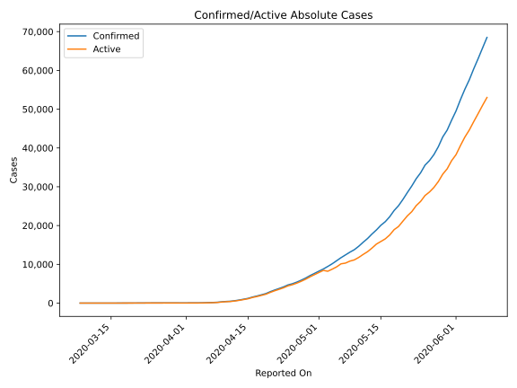
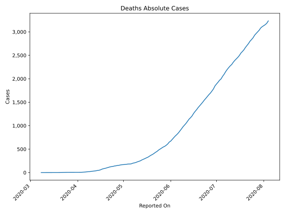
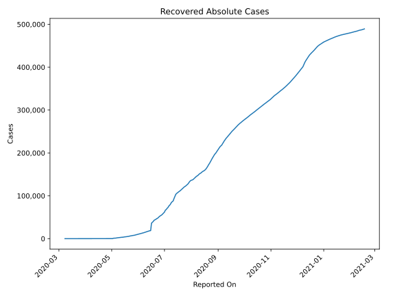
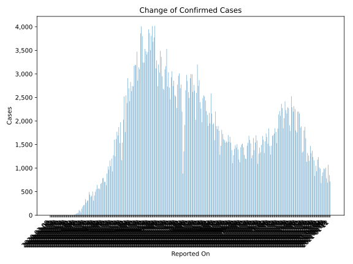
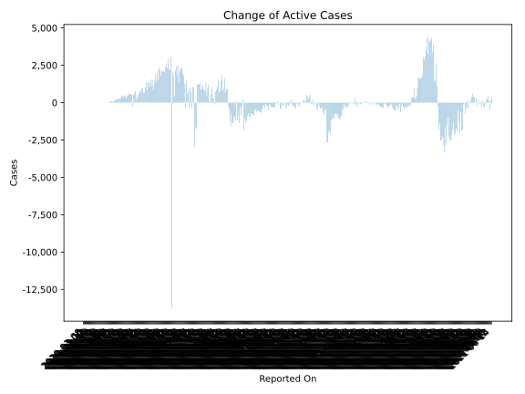
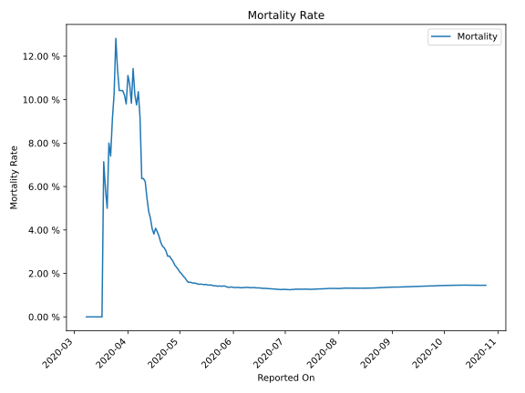

# Country Figures: Time Series for Bangladesh 

| Reported On | Confirmed | Deaths | Recovered | Active | Mortality | &Delta; Confirmed | &Delta; Deaths | &Delta; Recovered | &Delta; Active | % Active of Population |
|-------------|-----------|--------|-----------|--------|-----------|-------------------|----------------|-------------------|----------------|------------------------|
| 2020-04-25 | 4998 | 140 | 113 | 4745 |  2.80 %  | 309 | 9 | 1 | 299 |  0.003 %  | 
| 2020-04-24 | 4689 | 131 | 112 | 4446 |  2.79 %  | 503 | 4 | 4 | 495 |  0.003 %  | 
| 2020-04-23 | 4186 | 127 | 108 | 3951 |  3.03 %  | 414 | 7 | 16 | 391 |  0.002 %  | 
| 2020-04-22 | 3772 | 120 | 92 | 3560 |  3.18 %  | 390 | 10 | 5 | 375 |  0.002 %  | 
| 2020-04-21 | 3382 | 110 | 87 | 3185 |  3.25 %  | 434 | 9 | 2 | 423 |  0.002 %  | 
| 2020-04-20 | 2948 | 101 | 85 | 2762 |  3.43 %  | 492 | 10 | 10 | 472 |  0.002 %  | 
| 2020-04-19 | 2456 | 91 | 75 | 2290 |  3.71 %  | 312 | 7 | 9 | 296 |  0.001 %  | 
| 2020-04-18 | 2144 | 84 | 66 | 1994 |  3.92 %  | 306 | 9 | 8 | 289 |  0.001 %  | 
| 2020-04-17 | 1838 | 75 | 58 | 1705 |  4.08 %  | 266 | 15 | 9 | 242 |  0.001 %  | 
| 2020-04-16 | 1572 | 60 | 49 | 1463 |  3.82 %  | 341 | 10 | 0 | 331 |  0.001 %  | 
| 2020-04-15 | 1231 | 50 | 49 | 1132 |  4.06 %  | 219 | 4 | 7 | 208 |  0.001 %  | 
| 2020-04-14 | 1012 | 46 | 42 | 924 |  4.55 %  | 209 | 7 | 0 | 202 |  0.001 %  | 
| 2020-04-13 | 803 | 39 | 42 | 722 |  4.86 %  | 182 | 5 | 3 | 174 |  0.000 %  | 
| 2020-04-12 | 621 | 34 | 39 | 548 |  5.48 %  | 139 | 4 | 3 | 132 |  0.000 %  | 
| 2020-04-11 | 482 | 30 | 36 | 416 |  6.22 %  | 58 | 3 | 3 | 52 |  0.000 %  | 
| 2020-04-10 | 424 | 27 | 33 | 364 |  6.37 %  | 94 | 6 | 0 | 88 |  0.000 %  | 
| 2020-04-09 | 330 | 21 | 33 | 276 |  6.36 %  | 112 | 1 | 0 | 111 |  0.000 %  | 
| 2020-04-08 | 218 | 20 | 33 | 165 |  9.17 %  | 54 | 3 | 0 | 51 |  0.000 %  | 
| 2020-04-07 | 164 | 17 | 33 | 114 |  10.37 %  | 41 | 5 | 0 | 36 |  0.000 %  | 
| 2020-04-06 | 123 | 12 | 33 | 78 |  9.76 %  | 35 | 3 | 0 | 32 |  0.000 %  | 
| 2020-04-05 | 88 | 9 | 33 | 46 |  10.23 %  | 18 | 1 | 3 | 14 |  0.000 %  | 
| 2020-04-04 | 70 | 8 | 30 | 32 |  11.43 %  | 9 | 2 | 4 | 3 |  0.000 %  | 
| 2020-04-03 | 61 | 6 | 26 | 29 |  9.84 %  | 5 | 0 | 1 | 4 |  0.000 %  | 
| 2020-04-02 | 56 | 6 | 25 | 25 |  10.71 %  | 2 | 0 | 0 | 2 |  0.000 %  | 
| 2020-04-01 | 54 | 6 | 25 | 23 |  11.11 %  | 3 | 1 | 0 | 2 |  0.000 %  | 
| 2020-03-31 | 51 | 5 | 25 | 21 |  9.80 %  | 2 | 0 | 6 | -4 |  0.000 %  | 
| 2020-03-30 | 49 | 5 | 19 | 25 |  10.20 %  | 1 | 0 | 4 | -3 |  0.000 %  | 
| 2020-03-29 | 48 | 5 | 15 | 28 |  10.42 %  | 0 | 0 | 0 | 0 |  0.000 %  | 
| 2020-03-28 | 48 | 5 | 15 | 28 |  10.42 %  | 0 | 0 | 4 | -4 |  0.000 %  | 
| 2020-03-27 | 48 | 5 | 11 | 32 |  10.42 %  | 4 | 0 | 0 | 4 |  0.000 %  | 
| 2020-03-26 | 44 | 5 | 11 | 28 |  11.36 %  | 5 | 0 | 4 | 1 |  0.000 %  | 
| 2020-03-25 | 39 | 5 | 7 | 27 |  12.82 %  | 0 | 1 | 2 | -3 |  0.000 %  | 
| 2020-03-24 | 39 | 4 | 5 | 30 |  10.26 %  | 6 | 1 | 0 | 5 |  0.000 %  | 
| 2020-03-23 | 33 | 3 | 5 | 25 |  9.09 %  | 6 | 1 | 2 | 3 |  0.000 %  | 
| 2020-03-22 | 27 | 2 | 3 | 22 |  7.41 %  | 2 | 0 | 0 | 2 |  0.000 %  | 
| 2020-03-21 | 25 | 2 | 3 | 20 |  8.00 %  | 5 | 1 | 0 | 4 |  0.000 %  | 
| 2020-03-20 | 20 | 1 | 3 | 16 |  5.00 %  | 3 | 0 | 0 | 3 |  0.000 %  | 
| 2020-03-19 | 17 | 1 | 3 | 13 |  5.88 %  | 3 | 0 | 0 | 3 |  0.000 %  | 
| 2020-03-18 | 14 | 1 | 3 | 10 |  7.14 %  | 4 | 1 | 0 | 3 |  0.000 %  | 
| 2020-03-17 | 10 | 0 | 3 | 7 |  None  | 2 | 0 | 1 | 1 |  0.000 %  | 
| 2020-03-16 | 8 | 0 | 2 | 6 |  None  | 3 | 0 | 2 | 1 |  0.000 %  | 
| 2020-03-15 | 5 | 0 | 0 | 5 |  None  | 2 | 0 | 0 | 2 |  0.000 %  | 
| 2020-03-14 | 3 | 0 | 0 | 3 |  None  | 0 | 0 | 0 | 0 |  0.000 %  | 
| 2020-03-13 | 3 | 0 | 0 | 3 |  None  | 0 | 0 | 0 | 0 |  0.000 %  | 
| 2020-03-12 | 3 | 0 | 0 | 3 |  None  | 0 | 0 | 0 | 0 |  0.000 %  | 
| 2020-03-11 | 3 | 0 | 0 | 3 |  None  | 0 | 0 | 0 | 0 |  0.000 %  | 
| 2020-03-10 | 3 | 0 | 0 | 3 |  None  | 0 | 0 | 0 | 0 |  0.000 %  | 
| 2020-03-09 | 3 | 0 | 0 | 3 |  None  | 0 | 0 | 0 | 0 |  0.000 %  | 
| 2020-03-08 | 3 | 0 | 0 | 3 |  None  | None | None | None | None |  0.000 %  | 

