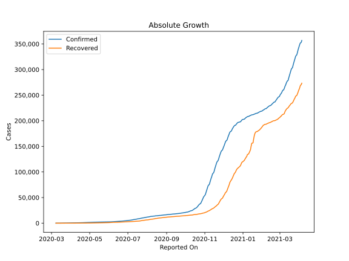
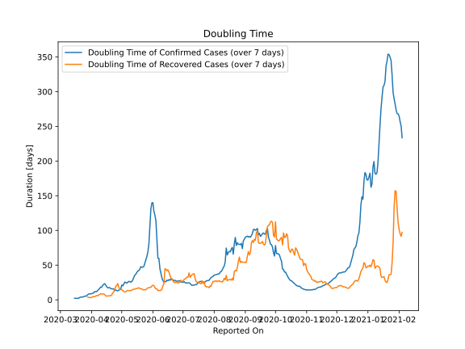

# Country Figures: Doubling Time of Infections for Bulgaria 

The doubling time below are calculated based on
* an exponential growth assumption
* for time difference of past seven (7) days.
The doubling time's unit is "days".

The first doubling time indicates the increase of confirmed (infected)
cases. There, the *higher* the number is, the better is to take control
of the disease.

The second doubling time indicates the increase of recovered (healed)
cases. There, the *lower* the number is, the better it is to take
control of the disease.

| Reported On | Confirmed | Doubling Time (Confirmed) | Recovered | Doubling Time (Recovered) |
|-------------|-----------|---------------------------|-----------|---------------------------|
| 2020-04-12 | 675 |  20.6 days  | 68 |  8.3 days  | 
| 2020-04-11 | 661 |  18.1 days  | 62 |  8.4 days  | 
| 2020-04-10 | 635 |  18.3 days  | 54 |  8.6 days  | 
| 2020-04-09 | 618 |  16.4 days  | 48 |  7.8 days  | 
| 2020-04-08 | 593 |  14.6 days  | 42 |  6.9 days  | 
| 2020-04-07 | 577 |  13.5 days  | 42 |  5.7 days  | 
| 2020-04-06 | 549 |  11.8 days  | 39 |  6.2 days  | 
| 2020-04-05 | 531 |  11.7 days  | 37 |  5.3 days  | 
| 2020-04-04 | 503 |  11.9 days  | 34 |  4.6 days  | 
| 2020-04-03 | 485 |  10.0 days  | 30 |  4.4 days  | 
| 2020-04-02 | 457 |  9.2 days  | 25 |  4.6 days  | 
| 2020-04-01 | 422 |  9.1 days  | 20 |  3.3 days  | 
| 2020-03-31 | 399 |  8.4 days  | 17 |  3.1 days  | 
| 2020-03-30 | 359 |  8.7 days  | 17 |  3.1 days  | 
| 2020-03-29 | 346 |  8.2 days  | 14 |  3.5 days  | 
| 2020-03-28 | 331 |  7.2 days  | 11 |  4.1 days  | 
| 2020-03-27 | 293 |  6.1 days  | 9 |  None  | 
| 2020-03-26 | 264 |  5.0 days  | 8 |  None  | 
| 2020-03-25 | 242 |  5.4 days  | 4 |  None  | 
| 2020-03-24 | 218 |  4.5 days  | 3 |  None  | 
| 2020-03-23 | 201 |  3.9 days  | 3 |  None  | 
| 2020-03-22 | 187 |  4.1 days  | 3 |  None  | 
| 2020-03-21 | 163 |  3.9 days  | 3 |  None  | 
| 2020-03-20 | 127 |  3.2 days  | 0 |  None  | 
| 2020-03-19 | 94 |  2.2 days  | 0 |  None  | 
| 2020-03-18 | 92 |  2.2 days  | 0 |  None  | 
| 2020-03-17 | 67 |  2.0 days  | 0 |  None  | 
| 2020-03-16 | 52 |  2.2 days  | 0 |  None  | 
| 2020-03-15 | 51 |  2.2 days  | 0 |  None  | 
| 2020-03-14 | 41 |  None  | 0 |  None  | 
| 2020-03-13 | 23 |  None  | 0 |  None  | 
| 2020-03-12 | 7 |  None  | 0 |  None  | 
| 2020-03-11 | 7 |  None  | 0 |  None  | 
| 2020-03-10 | 4 |  None  | 0 |  None  | 
| 2020-03-09 | 4 |  None  | 0 |  None  | 
| 2020-03-08 | 4 |  None  | 0 |  None  | 

