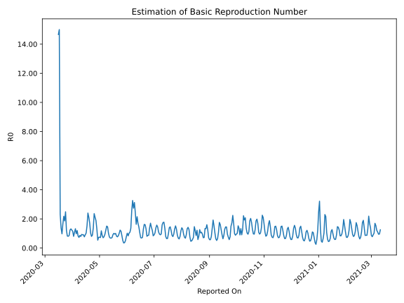

# Country Figures: Time Series for Basic Reproduction Number of Bulgaria 

| Reported On | &Delta; Confirmed | Total &Delta; Confirmed First Interval | Total &Delta; Confirmed Second Interval | Estimated Basic Reproduction Number R0 | 
|-------------|-------------------|----------------------------------------|-----------------------------------------|---------------------------------------------------|
| 2020-05-02 | 39 |  192  |  266  |  0.72  | 
| 2020-05-01 | 49 |  206  |  276  |  0.75  | 
| 2020-04-30 | 59 |  200  |  272  |  0.74  | 
| 2020-04-29 | 48 |  165  |  305  |  0.54  | 
| 2020-04-28 | 36 |  266  |  203  |  1.31  | 
| 2020-04-27 | 63 |  276  |  146  |  1.89  | 
| 2020-04-26 | 53 |  272  |  129  |  2.11  | 
| 2020-04-25 | 13 |  305  |  129  |  2.36  | 
| 2020-04-24 | 137 |  203  |  147  |  1.38  | 
| 2020-04-23 | 73 |  146  |  165  |  0.88  | 
| 2020-04-22 | 49 |  129  |  161  |  0.80  | 
| 2020-04-21 | 46 |  129  |  125  |  1.03  | 
| 2020-04-20 | 35 |  147  |  86  |  1.71  | 
| 2020-04-19 | 16 |  165  |  78  |  2.12  | 
| 2020-04-18 | 32 |  161  |  67  |  2.40  | 
| 2020-04-17 | 46 |  125  |  82  |  1.52  | 
| 2020-04-16 | 53 |  86  |  84  |  1.02  | 
| 2020-04-15 | 34 |  78  |  86  |  0.91  | 
| 2020-04-14 | 28 |  67  |  87  |  0.77  | 
| 2020-04-13 | 10 |  82  |  90  |  0.91  | 
| 2020-04-12 | 14 |  84  |  92  |  0.91  | 
| 2020-04-11 | 26 |  86  |  92  |  0.93  | 
| 2020-04-10 | 17 |  87  |  109  |  0.80  | 
| 2020-04-09 | 25 |  90  |  104  |  0.87  | 
| 2020-04-08 | 16 |  92  |  126  |  0.73  | 
| 2020-04-07 | 28 |  92  |  111  |  0.83  | 
| 2020-04-06 | 18 |  109  |  91  |  1.20  | 
| 2020-04-05 | 28 |  104  |  106  |  0.98  | 
| 2020-04-04 | 18 |  126  |  95  |  1.33  | 
| 2020-04-03 | 28 |  111  |  104  |  1.07  | 
| 2020-04-02 | 35 |  91  |  113  |  0.81  | 
| 2020-04-01 | 23 |  106  |  92  |  1.15  | 
| 2020-03-31 | 40 |  95  |  77  |  1.23  | 
| 2020-03-30 | 13 |  104  |  79  |  1.32  | 
| 2020-03-29 | 15 |  113  |  91  |  1.24  | 
| 2020-03-28 | 38 |  92  |  107  |  0.86  | 
| 2020-03-27 | 29 |  77  |  95  |  0.81  | 
| 2020-03-26 | 22 |  79  |  96  |  0.82  | 
| 2020-03-25 | 24 |  91  |  75  |  1.21  | 
| 2020-03-24 | 17 |  107  |  43  |  2.49  | 
| 2020-03-23 | 14 |  95  |  51  |  1.86  | 
| 2020-03-22 | 24 |  96  |  44  |  2.18  | 
| 2020-03-21 | 36 |  75  |  45  |  1.67  | 
| 2020-03-20 | 33 |  43  |  44  |  0.98  | 
| 2020-03-19 | 2 |  51  |  37  |  1.38  | 
| 2020-03-18 | 25 |  44  |  19  |  2.32  | 
| 2020-03-17 | 15 |  45  |  3  |  15.00  | 
| 2020-03-16 | 1 |  44  |  3  |  14.67  | 
| 2020-03-15 | 10 |  37  |  None  |  None  | 
| 2020-03-14 | 18 |  19  |  None  |  None  | 
| 2020-03-13 | 16 |  3  |  None  |  None  | 
| 2020-03-12 | 0 |  3  |  None  |  None  | 
| 2020-03-11 | 3 |  None  |  None  |  None  | 
| 2020-03-10 | 0 |  None  |  None  |  None  | 
| 2020-03-09 | 0 |  None  |  None  |  None  | 
| 2020-03-08 | None |  None  |  None  |  None  | 

