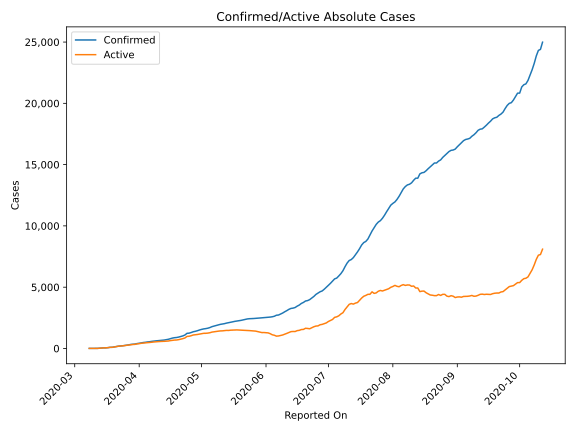
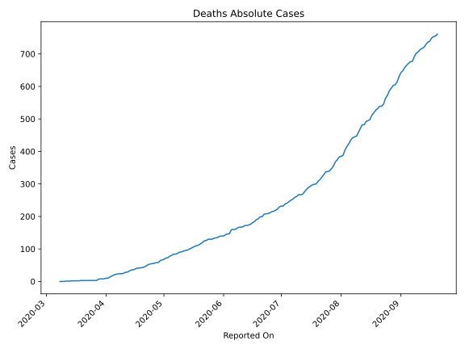
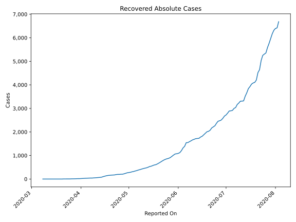
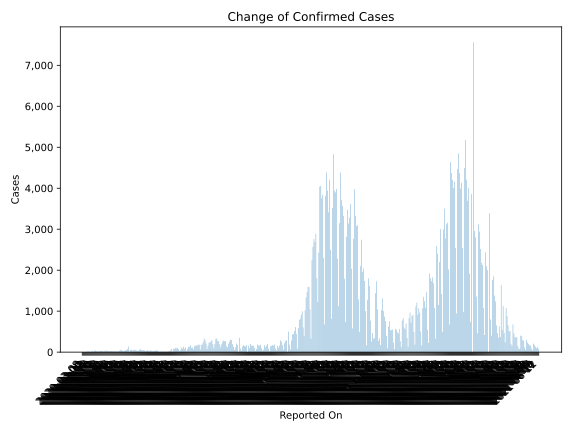
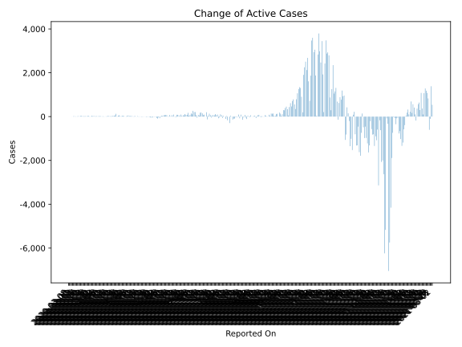
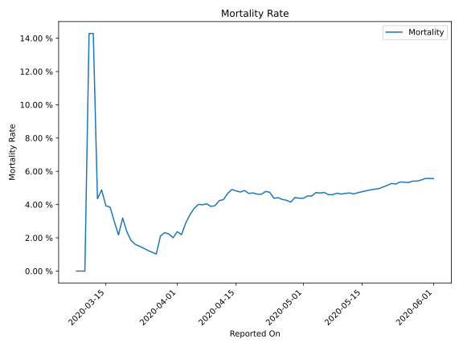

# Country Figures: Time Series for Bulgaria 

| Reported On | Confirmed | Deaths | Recovered | Active | Mortality | &Delta; Confirmed | &Delta; Deaths | &Delta; Recovered | &Delta; Active | % Active of Population |
|-------------|-----------|--------|-----------|--------|-----------|-------------------|----------------|-------------------|----------------|------------------------|
| 2020-04-28 | 1399 | 58 | 222 | 1119 |  4.15 %  | 36 | 0 | 16 | 20 |  0.016 %  | 
| 2020-04-27 | 1363 | 58 | 206 | 1099 |  4.26 %  | 63 | 2 | 1 | 60 |  0.016 %  | 
| 2020-04-26 | 1300 | 56 | 205 | 1039 |  4.31 %  | 53 | 1 | 8 | 44 |  0.015 %  | 
| 2020-04-25 | 1247 | 55 | 197 | 995 |  4.41 %  | 13 | 1 | 0 | 12 |  0.014 %  | 
| 2020-04-24 | 1234 | 54 | 197 | 983 |  4.38 %  | 137 | 2 | 7 | 128 |  0.014 %  | 
| 2020-04-23 | 1097 | 52 | 190 | 855 |  4.74 %  | 73 | 3 | 16 | 54 |  0.012 %  | 
| 2020-04-22 | 1024 | 49 | 174 | 801 |  4.79 %  | 49 | 4 | 4 | 41 |  0.011 %  | 
| 2020-04-21 | 975 | 45 | 170 | 760 |  4.62 %  | 46 | 2 | 3 | 41 |  0.011 %  | 
| 2020-04-20 | 929 | 43 | 167 | 719 |  4.63 %  | 35 | 1 | 6 | 28 |  0.010 %  | 
| 2020-04-19 | 894 | 42 | 161 | 691 |  4.70 %  | 16 | 1 | 8 | 7 |  0.010 %  | 
| 2020-04-18 | 878 | 41 | 153 | 684 |  4.67 %  | 32 | 0 | 12 | 20 |  0.010 %  | 
| 2020-04-17 | 846 | 41 | 141 | 664 |  4.85 %  | 46 | 3 | 19 | 24 |  0.009 %  | 
| 2020-04-16 | 800 | 38 | 122 | 640 |  4.75 %  | 53 | 2 | 17 | 34 |  0.009 %  | 
| 2020-04-15 | 747 | 36 | 105 | 606 |  4.82 %  | 34 | 1 | 24 | 9 |  0.009 %  | 
| 2020-04-14 | 713 | 35 | 81 | 597 |  4.91 %  | 28 | 3 | 10 | 15 |  0.008 %  | 
| 2020-04-13 | 685 | 32 | 71 | 582 |  4.67 %  | 10 | 3 | 3 | 4 |  0.008 %  | 
| 2020-04-12 | 675 | 29 | 68 | 578 |  4.30 %  | 14 | 1 | 6 | 7 |  0.008 %  | 
| 2020-04-11 | 661 | 28 | 62 | 571 |  4.24 %  | 26 | 3 | 8 | 15 |  0.008 %  | 
| 2020-04-10 | 635 | 25 | 54 | 556 |  3.94 %  | 17 | 1 | 6 | 10 |  0.008 %  | 
| 2020-04-09 | 618 | 24 | 48 | 546 |  3.88 %  | 25 | 0 | 6 | 19 |  0.008 %  | 
| 2020-04-08 | 593 | 24 | 42 | 527 |  4.05 %  | 16 | 1 | 0 | 15 |  0.008 %  | 
| 2020-04-07 | 577 | 23 | 42 | 512 |  3.99 %  | 28 | 1 | 3 | 24 |  0.007 %  | 
| 2020-04-06 | 549 | 22 | 39 | 488 |  4.01 %  | 18 | 2 | 2 | 14 |  0.007 %  | 
| 2020-04-05 | 531 | 20 | 37 | 474 |  3.77 %  | 28 | 3 | 3 | 22 |  0.007 %  | 
| 2020-04-04 | 503 | 17 | 34 | 452 |  3.38 %  | 18 | 3 | 4 | 11 |  0.006 %  | 
| 2020-04-03 | 485 | 14 | 30 | 441 |  2.89 %  | 28 | 4 | 5 | 19 |  0.006 %  | 
| 2020-04-02 | 457 | 10 | 25 | 422 |  2.19 %  | 35 | 0 | 5 | 30 |  0.006 %  | 
| 2020-04-01 | 422 | 10 | 20 | 392 |  2.37 %  | 23 | 2 | 3 | 18 |  0.006 %  | 
| 2020-03-31 | 399 | 8 | 17 | 374 |  2.01 %  | 40 | 0 | 0 | 40 |  0.005 %  | 
| 2020-03-30 | 359 | 8 | 17 | 334 |  2.23 %  | 13 | 0 | 3 | 10 |  0.005 %  | 
| 2020-03-29 | 346 | 8 | 14 | 324 |  2.31 %  | 15 | 1 | 3 | 11 |  0.005 %  | 
| 2020-03-28 | 331 | 7 | 11 | 313 |  2.11 %  | 38 | 4 | 2 | 32 |  0.004 %  | 
| 2020-03-27 | 293 | 3 | 9 | 281 |  1.02 %  | 29 | 0 | 1 | 28 |  0.004 %  | 
| 2020-03-26 | 264 | 3 | 8 | 253 |  1.14 %  | 22 | 0 | 4 | 18 |  0.004 %  | 
| 2020-03-25 | 242 | 3 | 4 | 235 |  1.24 %  | 24 | 0 | 1 | 23 |  0.003 %  | 
| 2020-03-24 | 218 | 3 | 3 | 212 |  1.38 %  | 17 | 0 | 0 | 17 |  0.003 %  | 
| 2020-03-23 | 201 | 3 | 3 | 195 |  1.49 %  | 14 | 0 | 0 | 14 |  0.003 %  | 
| 2020-03-22 | 187 | 3 | 3 | 181 |  1.60 %  | 24 | 0 | 0 | 24 |  0.003 %  | 
| 2020-03-21 | 163 | 3 | 3 | 157 |  1.84 %  | 36 | 0 | 3 | 33 |  0.002 %  | 
| 2020-03-20 | 127 | 3 | 0 | 124 |  2.36 %  | 33 | 0 | 0 | 33 |  0.002 %  | 
| 2020-03-19 | 94 | 3 | 0 | 91 |  3.19 %  | 2 | 1 | 0 | 1 |  0.001 %  | 
| 2020-03-18 | 92 | 2 | 0 | 90 |  2.17 %  | 25 | 0 | 0 | 25 |  0.001 %  | 
| 2020-03-17 | 67 | 2 | 0 | 65 |  2.99 %  | 15 | 0 | 0 | 15 |  0.001 %  | 
| 2020-03-16 | 52 | 2 | 0 | 50 |  3.85 %  | 1 | 0 | 0 | 1 |  0.001 %  | 
| 2020-03-15 | 51 | 2 | 0 | 49 |  3.92 %  | 10 | 0 | 0 | 10 |  0.001 %  | 
| 2020-03-14 | 41 | 2 | 0 | 39 |  4.88 %  | 18 | 1 | 0 | 17 |  0.001 %  | 
| 2020-03-13 | 23 | 1 | 0 | 22 |  4.35 %  | 16 | 0 | 0 | 16 |  0.000 %  | 
| 2020-03-12 | 7 | 1 | 0 | 6 |  14.29 %  | 0 | 0 | 0 | 0 |  0.000 %  | 
| 2020-03-11 | 7 | 1 | 0 | 6 |  14.29 %  | 3 | 1 | 0 | 2 |  0.000 %  | 
| 2020-03-10 | 4 | 0 | 0 | 4 |  None  | 0 | 0 | 0 | 0 |  0.000 %  | 
| 2020-03-09 | 4 | 0 | 0 | 4 |  None  | 0 | 0 | 0 | 0 |  0.000 %  | 
| 2020-03-08 | 4 | 0 | 0 | 4 |  None  | None | None | None | None |  0.000 %  | 

