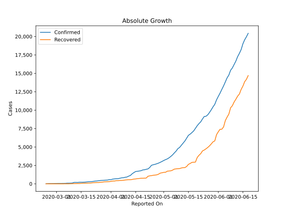
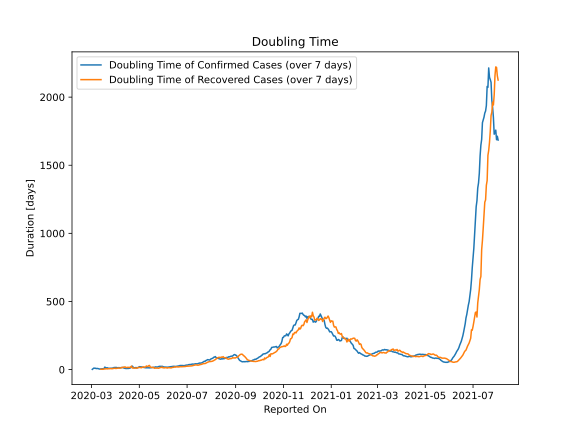

# Country Figures: Doubling Time of Infections for Bahrain 

The doubling time below are calculated based on
* an exponential growth assumption
* for time difference of past seven (7) days.
The doubling time's unit is "days".

The first doubling time indicates the increase of confirmed (infected)
cases. There, the *higher* the number is, the better is to take control
of the disease.

The second doubling time indicates the increase of recovered (healed)
cases. There, the *lower* the number is, the better it is to take
control of the disease.

| Reported On | Confirmed | Doubling Time (Confirmed) | Recovered | Doubling Time (Recovered) |
|-------------|-----------|---------------------------|-----------|---------------------------|
| 2020-04-25 | 2588 |  13.2 days  | 1160 |  11.6 days  | 
| 2020-04-24 | 2518 |  13.5 days  | 1113 |  11.7 days  | 
| 2020-04-23 | 2217 |  18.6 days  | 1082 |  11.6 days  | 
| 2020-04-22 | 2027 |  25.5 days  | 1026 |  11.5 days  | 
| 2020-04-21 | 1973 |  19.3 days  | 784 |  25.2 days  | 
| 2020-04-20 | 1907 |  14.7 days  | 769 |  18.8 days  | 
| 2020-04-19 | 1881 |  10.0 days  | 759 |  16.1 days  | 
| 2020-04-18 | 1773 |  9.4 days  | 755 |  16.1 days  | 
| 2020-04-17 | 1740 |  8.0 days  | 725 |  16.7 days  | 
| 2020-04-16 | 1700 |  7.8 days  | 703 |  16.3 days  | 
| 2020-04-15 | 1671 |  7.2 days  | 663 |  15.1 days  | 
| 2020-04-14 | 1528 |  8.0 days  | 645 |  14.5 days  | 
| 2020-04-13 | 1361 |  8.6 days  | 591 |  19.4 days  | 
| 2020-04-12 | 1136 |  10.4 days  | 558 |  19.1 days  | 
| 2020-04-11 | 1040 |  12.1 days  | 555 |  18.2 days  | 
| 2020-04-10 | 925 |  15.5 days  | 539 |  14.4 days  | 
| 2020-04-09 | 887 |  15.4 days  | 519 |  16.0 days  | 
| 2020-04-08 | 823 |  13.5 days  | 477 |  14.3 days  | 
| 2020-04-07 | 811 |  13.9 days  | 458 |  11.4 days  | 
| 2020-04-06 | 756 |  13.0 days  | 458 |  10.1 days  | 
| 2020-04-05 | 700 |  14.7 days  | 431 |  10.9 days  | 
| 2020-04-04 | 688 |  13.5 days  | 423 |  10.7 days  | 
| 2020-04-03 | 672 |  13.6 days  | 382 |  9.7 days  | 
| 2020-04-02 | 643 |  14.6 days  | 381 |  8.1 days  | 
| 2020-04-01 | 569 |  16.2 days  | 337 |  7.9 days  | 
| 2020-03-31 | 567 |  13.5 days  | 295 |  9.8 days  | 
| 2020-03-30 | 515 |  15.9 days  | 279 |  9.5 days  | 
| 2020-03-29 | 499 |  12.4 days  | 272 |  8.4 days  | 
| 2020-03-28 | 476 |  11.2 days  | 265 |  6.8 days  | 
| 2020-03-27 | 466 |  10.2 days  | 227 |  6.3 days  | 
| 2020-03-26 | 458 |  10.1 days  | 204 |  7.1 days  | 
| 2020-03-25 | 419 |  10.2 days  | 177 |  7.3 days  | 
| 2020-03-24 | 392 |  9.3 days  | 177 |  6.5 days  | 
| 2020-03-23 | 377 |  8.9 days  | 164 |  6.8 days  | 
| 2020-03-22 | 334 |  11.2 days  | 149 |  5.7 days  | 
| 2020-03-21 | 305 |  13.3 days  | 125 |  5.0 days  | 
| 2020-03-20 | 285 |  12.2 days  | 100 |  6.3 days  | 
| 2020-03-19 | 278 |  14.0 days  | 100 |  5.0 days  | 
| 2020-03-18 | 256 |  18.2 days  | 88 |  5.6 days  | 
| 2020-03-17 | 228 |  7.0 days  | 81 |  4.1 days  | 
| 2020-03-16 | 214 |  6.3 days  | 77 |  3.2 days  | 
| 2020-03-15 | 214 |  5.6 days  | 60 |  2.1 days  | 
| 2020-03-14 | 210 |  5.7 days  | 44 |  2.4 days  | 
| 2020-03-13 | 189 |  4.6 days  | 44 |  2.4 days  | 
| 2020-03-12 | 195 |  4.2 days  | 35 |  None  | 
| 2020-03-11 | 195 |  4.0 days  | 35 |  None  | 
| 2020-03-10 | 110 |  6.3 days  | 22 |  None  | 
| 2020-03-09 | 95 |  7.7 days  | 14 |  None  | 
| 2020-03-08 | 85 |  8.5 days  | 4 |  None  | 
| 2020-03-07 | 85 |  7.0 days  | 4 |  None  | 
| 2020-03-06 | 60 |  9.8 days  | 4 |  None  | 
| 2020-03-05 | 55 |  9.8 days  | 0 |  None  | 
| 2020-03-04 | 52 |  11.0 days  | 0 |  None  | 
| 2020-03-03 | 49 |  6.8 days  | 0 |  None  | 
| 2020-03-02 | 49 |  1.6 days  | 0 |  None  | 
| 2020-03-01 | 47 |  None  | 0 |  None  | 
| 2020-02-29 | 41 |  None  | 0 |  None  | 
| 2020-02-28 | 36 |  None  | 0 |  None  | 
| 2020-02-27 | 33 |  None  | 0 |  None  | 
| 2020-02-26 | 33 |  None  | 0 |  None  | 
| 2020-02-25 | 23 |  None  | 0 |  None  | 
| 2020-02-24 | 1 |  None  | 0 |  None  | 

