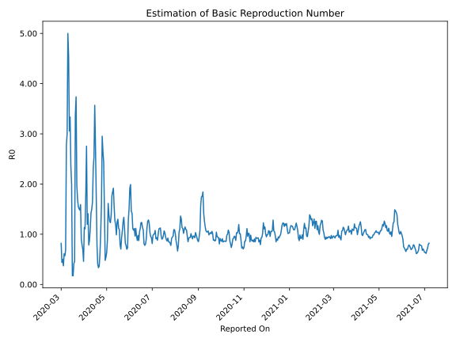

# Country Figures: Time Series for Basic Reproduction Number of Bahrain 

| Reported On | &Delta; Confirmed | Total &Delta; Confirmed First Interval | Total &Delta; Confirmed Second Interval | Estimated Basic Reproduction Number R0 | 
|-------------|-------------------|----------------------------------------|-----------------------------------------|---------------------------------------------------|
| 2020-05-03 | 99 |  473  |  293  |  1.61  | 
| 2020-05-02 | 114 |  447  |  506  |  0.88  | 
| 2020-05-01 | 130 |  393  |  620  |  0.63  | 
| 2020-04-30 | 119 |  333  |  615  |  0.54  | 
| 2020-04-29 | 110 |  293  |  611  |  0.48  | 
| 2020-04-28 | 88 |  506  |  336  |  1.51  | 
| 2020-04-27 | 76 |  620  |  254  |  2.44  | 
| 2020-04-26 | 59 |  615  |  233  |  2.64  | 
| 2020-04-25 | 70 |  611  |  207  |  2.95  | 
| 2020-04-24 | 301 |  336  |  210  |  1.60  | 
| 2020-04-23 | 190 |  254  |  245  |  1.04  | 
| 2020-04-22 | 54 |  233  |  379  |  0.61  | 
| 2020-04-21 | 66 |  207  |  564  |  0.37  | 
| 2020-04-20 | 26 |  210  |  631  |  0.33  | 
| 2020-04-19 | 108 |  245  |  603  |  0.41  | 
| 2020-04-18 | 33 |  379  |  474  |  0.80  | 
| 2020-04-17 | 40 |  564  |  313  |  1.80  | 
| 2020-04-16 | 29 |  631  |  229  |  2.76  | 
| 2020-04-15 | 143 |  603  |  169  |  3.57  | 
| 2020-04-14 | 167 |  474  |  187  |  2.53  | 
| 2020-04-13 | 225 |  313  |  135  |  2.32  | 
| 2020-04-12 | 96 |  229  |  139  |  1.65  | 
| 2020-04-11 | 115 |  169  |  113  |  1.50  | 
| 2020-04-10 | 38 |  187  |  131  |  1.43  | 
| 2020-04-09 | 64 |  135  |  121  |  1.12  | 
| 2020-04-08 | 12 |  139  |  157  |  0.89  | 
| 2020-04-07 | 55 |  113  |  144  |  0.78  | 
| 2020-04-06 | 56 |  131  |  93  |  1.41  | 
| 2020-04-05 | 12 |  121  |  101  |  1.20  | 
| 2020-04-04 | 16 |  157  |  57  |  2.75  | 
| 2020-04-03 | 29 |  144  |  80  |  1.80  | 
| 2020-04-02 | 74 |  93  |  84  |  1.11  | 
| 2020-04-01 | 2 |  101  |  89  |  1.13  | 
| 2020-03-31 | 52 |  57  |  124  |  0.46  | 
| 2020-03-30 | 16 |  80  |  114  |  0.70  | 
| 2020-03-29 | 23 |  84  |  107  |  0.79  | 
| 2020-03-28 | 10 |  89  |  99  |  0.90  | 
| 2020-03-27 | 8 |  124  |  78  |  1.59  | 
| 2020-03-26 | 39 |  114  |  77  |  1.48  | 
| 2020-03-25 | 27 |  107  |  71  |  1.51  | 
| 2020-03-24 | 15 |  99  |  64  |  1.55  | 
| 2020-03-23 | 43 |  78  |  46  |  1.70  | 
| 2020-03-22 | 29 |  77  |  39  |  1.97  | 
| 2020-03-21 | 20 |  71  |  19  |  3.74  | 
| 2020-03-20 | 7 |  64  |  19  |  3.37  | 
| 2020-03-19 | 22 |  46  |  100  |  0.46  | 
| 2020-03-18 | 28 |  39  |  94  |  0.41  | 
| 2020-03-17 | 14 |  19  |  110  |  0.17  | 
| 2020-03-16 | 0 |  19  |  110  |  0.17  | 
| 2020-03-15 | 4 |  100  |  50  |  2.00  | 
| 2020-03-14 | 21 |  94  |  40  |  2.35  | 
| 2020-03-13 | -6 |  110  |  33  |  3.33  | 
| 2020-03-12 | 0 |  110  |  36  |  3.06  | 
| 2020-03-11 | 85 |  50  |  11  |  4.55  | 
| 2020-03-10 | 15 |  40  |  8  |  5.00  | 
| 2020-03-09 | 10 |  33  |  11  |  3.00  | 
| 2020-03-08 | 0 |  36  |  13  |  2.77  | 
| 2020-03-07 | 25 |  11  |  16  |  0.69  | 
| 2020-03-06 | 5 |  8  |  14  |  0.57  | 
| 2020-03-05 | 3 |  11  |  18  |  0.61  | 
| 2020-03-04 | 3 |  13  |  35  |  0.37  | 
| 2020-03-03 | 0 |  16  |  32  |  0.50  | 
| 2020-03-02 | 2 |  14  |  32  |  0.44  | 
| 2020-03-01 | 6 |  18  |  22  |  0.82  | 
| 2020-02-29 | 5 |  35  |  None  |  None  | 
| 2020-02-28 | 3 |  32  |  None  |  None  | 
| 2020-02-27 | 0 |  32  |  None  |  None  | 
| 2020-02-26 | 10 |  22  |  None  |  None  | 
| 2020-02-25 | 22 |  None  |  None  |  None  | 
| 2020-02-24 | None |  None  |  None  |  None  | 

