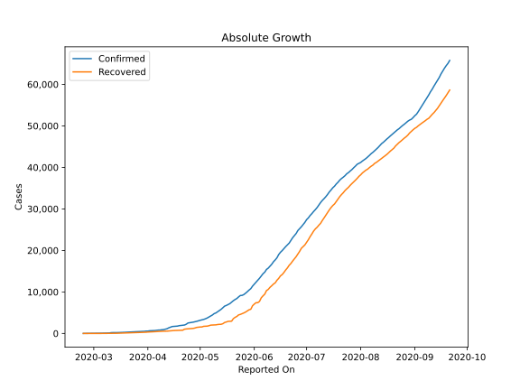
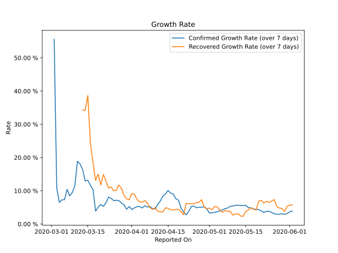

# Country Figures: Growth Rate for Bahrain 

The growth rates below are calculated based on
* an exponential growth assumption
* for time difference of past seven (7) days.
The growth rate is to be understood as on "growth per day".

The first growth rate indicates the increase of confirmed (infected) cases.

The second growth rate indicates the increase of recovered (healed) cases.

| Reported On | Confirmed | Growth Rate (Confirmed) | Recovered | Growth Rate (Recovered) |
|-------------|-----------|-------------------------|-----------|-------------------------|
| 2020-05-07 | 4199 |  4.61 %  | 2000 |  4.110 %  | 
| 2020-05-06 | 3934 |  4.25 %  | 1860 |  3.508 %  | 
| 2020-05-05 | 3720 |  4.00 %  | 1762 |  4.235 %  | 
| 2020-05-04 | 3533 |  3.72 %  | 1744 |  5.128 %  | 
| 2020-05-03 | 3383 |  3.50 %  | 1718 |  5.258 %  | 
| 2020-05-02 | 3284 |  3.40 %  | 1568 |  4.305 %  | 
| 2020-05-01 | 3170 |  3.29 %  | 1555 |  4.777 %  | 
| 2020-04-30 | 3040 |  4.51 %  | 1500 |  4.666 %  | 
| 2020-04-29 | 2921 |  5.22 %  | 1455 |  4.991 %  | 
| 2020-04-28 | 2811 |  5.06 %  | 1310 |  7.334 %  | 
| 2020-04-27 | 2723 |  5.09 %  | 1218 |  6.570 %  | 
| 2020-04-26 | 2647 |  4.88 %  | 1189 |  6.412 %  | 
| 2020-04-25 | 2588 |  5.40 %  | 1160 |  6.135 %  | 
| 2020-04-24 | 2518 |  5.28 %  | 1113 |  6.123 %  | 
| 2020-04-23 | 2217 |  3.79 %  | 1082 |  6.160 %  | 
| 2020-04-22 | 2027 |  2.76 %  | 1026 |  6.238 %  | 
| 2020-04-21 | 1973 |  3.65 %  | 784 |  2.788 %  | 
| 2020-04-20 | 1907 |  4.82 %  | 769 |  3.761 %  | 
| 2020-04-19 | 1881 |  7.20 %  | 759 |  4.395 %  | 
| 2020-04-18 | 1773 |  7.62 %  | 755 |  4.396 %  | 
| 2020-04-17 | 1740 |  9.03 %  | 725 |  4.235 %  | 
| 2020-04-16 | 1700 |  9.29 %  | 703 |  4.335 %  | 
| 2020-04-15 | 1671 |  10.12 %  | 663 |  4.704 %  | 
| 2020-04-14 | 1528 |  9.05 %  | 645 |  4.891 %  | 
| 2020-04-13 | 1361 |  8.40 %  | 591 |  3.642 %  | 
| 2020-04-12 | 1136 |  6.92 %  | 558 |  3.689 %  | 
| 2020-04-11 | 1040 |  5.90 %  | 555 |  3.880 %  | 
| 2020-04-10 | 925 |  4.56 %  | 539 |  4.918 %  | 
| 2020-04-09 | 887 |  4.60 %  | 519 |  4.416 %  | 
| 2020-04-08 | 823 |  5.27 %  | 477 |  4.963 %  | 
| 2020-04-07 | 811 |  5.11 %  | 458 |  6.284 %  | 
| 2020-04-06 | 756 |  5.48 %  | 458 |  7.081 %  | 
| 2020-04-05 | 700 |  4.84 %  | 431 |  6.576 %  | 
| 2020-04-04 | 688 |  5.26 %  | 423 |  6.681 %  | 
| 2020-04-03 | 672 |  5.23 %  | 382 |  7.435 %  | 
| 2020-04-02 | 643 |  4.85 %  | 381 |  8.924 %  | 
| 2020-04-01 | 569 |  4.37 %  | 337 |  9.199 %  | 
| 2020-03-31 | 567 |  5.27 %  | 295 |  7.298 %  | 
| 2020-03-30 | 515 |  4.46 %  | 279 |  7.591 %  | 
| 2020-03-29 | 499 |  5.74 %  | 272 |  8.598 %  | 
| 2020-03-28 | 476 |  6.36 %  | 265 |  10.735 %  | 
| 2020-03-27 | 466 |  7.02 %  | 227 |  11.711 %  | 
| 2020-03-26 | 458 |  7.13 %  | 204 |  10.185 %  | 
| 2020-03-25 | 419 |  7.04 %  | 177 |  9.983 %  | 
| 2020-03-24 | 392 |  7.74 %  | 177 |  11.167 %  | 
| 2020-03-23 | 377 |  8.09 %  | 164 |  10.801 %  | 
| 2020-03-22 | 334 |  6.36 %  | 149 |  12.994 %  | 
| 2020-03-21 | 305 |  5.33 %  | 125 |  14.916 %  | 
| 2020-03-20 | 285 |  5.87 %  | 100 |  11.728 %  | 
| 2020-03-19 | 278 |  5.07 %  | 100 |  14.997 %  | 
| 2020-03-18 | 256 |  3.89 %  | 88 |  13.171 %  | 
| 2020-03-17 | 228 |  10.41 %  | 81 |  18.620 %  | 
| 2020-03-16 | 214 |  11.60 %  | 77 |  24.354 %  | 
| 2020-03-15 | 214 |  13.19 %  | 60 |  38.686 %  | 
| 2020-03-14 | 210 |  12.92 %  | 44 |  34.256 %  | 
| 2020-03-13 | 189 |  16.39 %  | 44 |  34.256 %  | 
| 2020-03-12 | 195 |  18.08 %  | 35 |  None  | 
| 2020-03-11 | 195 |  18.88 %  | 35 |  None  | 
| 2020-03-10 | 110 |  11.55 %  | 22 |  None  | 
| 2020-03-09 | 95 |  9.46 %  | 14 |  None  | 
| 2020-03-08 | 85 |  8.46 %  | 4 |  None  | 
| 2020-03-07 | 85 |  10.42 %  | 4 |  None  | 
| 2020-03-06 | 60 |  7.30 %  | 4 |  None  | 
| 2020-03-05 | 55 |  7.30 %  | 0 |  None  | 
| 2020-03-04 | 52 |  6.50 %  | 0 |  None  | 
| 2020-03-03 | 49 |  10.80 %  | 0 |  None  | 
| 2020-03-02 | 49 |  55.60 %  | 0 |  None  | 
| 2020-03-01 | 47 |  None  | 0 |  None  | 
| 2020-02-29 | 41 |  None  | 0 |  None  | 
| 2020-02-28 | 36 |  None  | 0 |  None  | 
| 2020-02-27 | 33 |  None  | 0 |  None  | 
| 2020-02-26 | 33 |  None  | 0 |  None  | 
| 2020-02-25 | 23 |  None  | 0 |  None  | 
| 2020-02-24 | 1 |  None  | 0 |  None  | 

