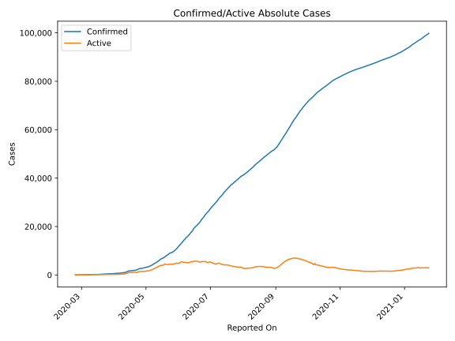
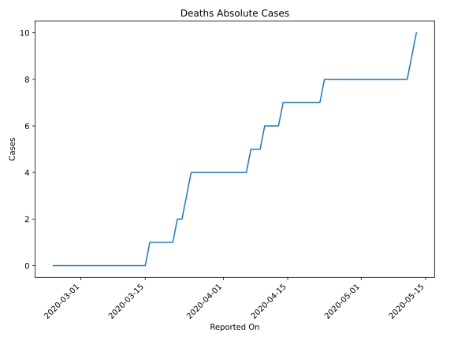
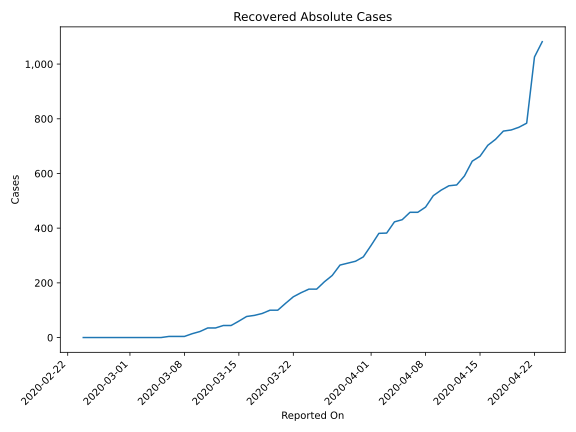
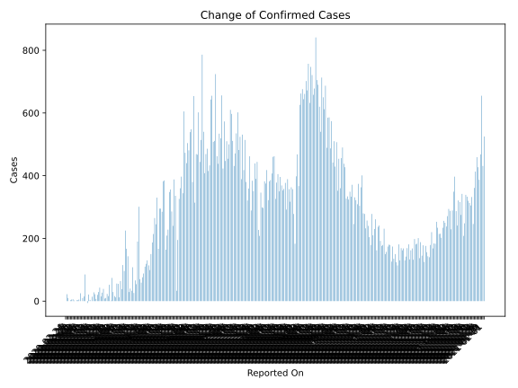
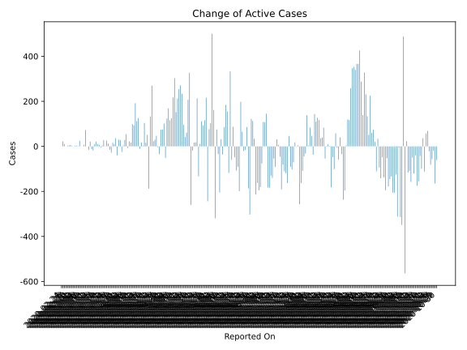
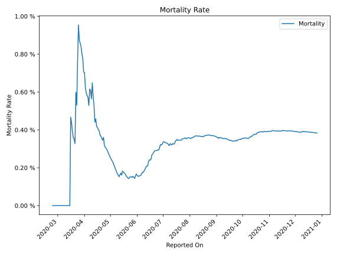

# Country Figures: Time Series for Bahrain 

| Reported On | Confirmed | Deaths | Recovered | Active | Mortality | &Delta; Confirmed | &Delta; Deaths | &Delta; Active | % Active of Population |
|-------------|-----------|--------|-----------|--------|-----------|-------------------|----------------|----------------|------------------------|
| 2020-03-21 | 305 | 1 | 125 | 179 |  0.33 %  | 20 | 0 | -5 |  0.011 %  | 
| 2020-03-20 | 285 | 1 | 100 | 184 |  0.35 %  | 7 | 0 | 7 |  0.012 %  | 
| 2020-03-19 | 278 | 1 | 100 | 177 |  0.36 %  | 22 | 0 | 10 |  0.011 %  | 
| 2020-03-18 | 256 | 1 | 88 | 167 |  0.39 %  | 28 | 0 | 21 |  0.011 %  | 
| 2020-03-17 | 228 | 1 | 81 | 146 |  0.44 %  | 14 | 0 | 10 |  0.009 %  | 
| 2020-03-16 | 214 | 1 | 77 | 136 |  0.47 %  | 0 | 1 | -18 |  0.009 %  | 
| 2020-03-15 | 214 | 0 | 60 | 154 |  None  | 4 | 0 | -12 |  0.010 %  | 
| 2020-03-14 | 210 | 0 | 44 | 166 |  None  | 21 | 0 | 21 |  0.011 %  | 
| 2020-03-13 | 189 | 0 | 44 | 145 |  None  | -6 | 0 | -15 |  0.009 %  | 
| 2020-03-12 | 195 | 0 | 35 | 160 |  None  | 0 | 0 | 0 |  0.010 %  | 
| 2020-03-11 | 195 | 0 | 35 | 160 |  None  | 85 | 0 | 72 |  0.010 %  | 
| 2020-03-10 | 110 | 0 | 22 | 88 |  None  | 15 | 0 | 7 |  0.006 %  | 
| 2020-03-09 | 95 | 0 | 14 | 81 |  None  | 10 | 0 | 0 |  0.005 %  | 
| 2020-03-08 | 85 | 0 | 4 | 81 |  None  | 0 | 0 | 0 |  0.005 %  | 
| 2020-03-07 | 85 | 0 | 4 | 81 |  None  | 25 | 0 | 25 |  0.005 %  | 
| 2020-03-06 | 60 | 0 | 4 | 56 |  None  | 5 | 0 | 1 |  0.004 %  | 
| 2020-03-05 | 55 | 0 | 0 | 55 |  None  | 3 | 0 | 3 |  0.004 %  | 
| 2020-03-04 | 52 | 0 | 0 | 52 |  None  | 3 | 0 | 3 |  0.003 %  | 
| 2020-03-03 | 49 | 0 | 0 | 49 |  None  | 0 | 0 | 0 |  0.003 %  | 
| 2020-03-02 | 49 | 0 | 0 | 49 |  None  | 2 | 0 | 2 |  0.003 %  | 
| 2020-03-01 | 47 | 0 | 0 | 47 |  None  | 6 | 0 | 6 |  0.003 %  | 
| 2020-02-29 | 41 | 0 | 0 | 41 |  None  | 5 | 0 | 5 |  0.003 %  | 
| 2020-02-28 | 36 | 0 | 0 | 36 |  None  | 3 | 0 | 3 |  0.002 %  | 
| 2020-02-27 | 33 | 0 | 0 | 33 |  None  | 0 | 0 | 0 |  0.002 %  | 
| 2020-02-26 | 33 | 0 | 0 | 33 |  None  | 10 | 0 | 10 |  0.002 %  | 
| 2020-02-25 | 23 | 0 | 0 | 23 |  None  | 22 | 0 | 22 |  0.001 %  | 
| 2020-02-24 | 1 | 0 | 0 | 1 |  None  | None | None | None |  0.000 %  | 

