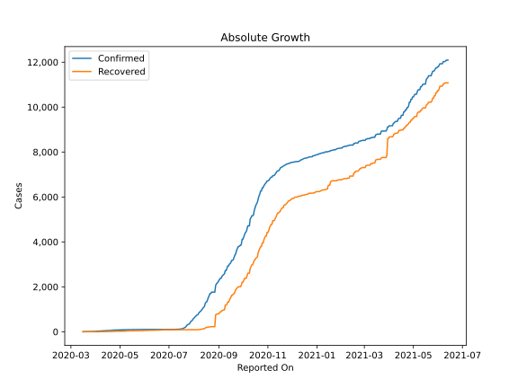
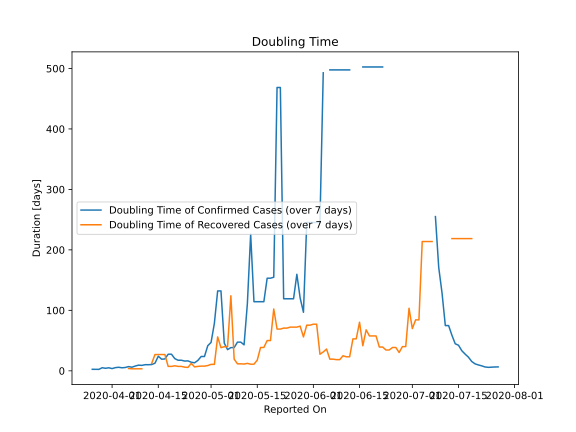

# Country Figures: Doubling Time of Infections for Bahamas 

The doubling time below are calculated based on
* an exponential growth assumption
* for time difference of past seven (7) days.
The doubling time's unit is "days".

The first doubling time indicates the increase of confirmed (infected)
cases. There, the *higher* the number is, the better is to take control
of the disease.

The second doubling time indicates the increase of recovered (healed)
cases. There, the *lower* the number is, the better it is to take
control of the disease.

| Reported On | Confirmed | Doubling Time (Confirmed) | Recovered | Doubling Time (Recovered) |
|-------------|-----------|---------------------------|-----------|---------------------------|
| 2020-05-09 | 92 |  47.5 days  | 37 |  11.6 days  | 
| 2020-05-08 | 92 |  38.4 days  | 31 |  19.3 days  | 
| 2020-05-07 | 92 |  38.4 days  | 26 |  124.1 days  | 
| 2020-05-06 | 92 |  35.1 days  | 26 |  39.9 days  | 
| 2020-05-05 | 89 |  45.9 days  | 26 |  39.9 days  | 
| 2020-05-04 | 83 |  132.1 days  | 25 |  38.3 days  | 
| 2020-05-03 | 83 |  132.1 days  | 24 |  56.1 days  | 
| 2020-05-02 | 83 |  78.4 days  | 24 |  10.7 days  | 
| 2020-05-01 | 81 |  47.0 days  | 24 |  10.7 days  | 
| 2020-04-30 | 81 |  41.5 days  | 25 |  8.7 days  | 
| 2020-04-29 | 80 |  23.7 days  | 23 |  7.8 days  | 
| 2020-04-28 | 80 |  23.7 days  | 23 |  7.8 days  | 
| 2020-04-27 | 80 |  17.2 days  | 22 |  7.3 days  | 
| 2020-04-26 | 80 |  13.3 days  | 22 |  6.5 days  | 
| 2020-04-25 | 78 |  14.2 days  | 15 |  12.3 days  | 
| 2020-04-24 | 73 |  16.4 days  | 15 |  5.6 days  | 
| 2020-04-23 | 72 |  16.2 days  | 14 |  6.1 days  | 
| 2020-04-22 | 65 |  17.5 days  | 12 |  7.3 days  | 
| 2020-04-21 | 65 |  17.5 days  | 12 |  7.3 days  | 
| 2020-04-20 | 60 |  20.2 days  | 11 |  8.3 days  | 
| 2020-04-19 | 55 |  27.5 days  | 10 |  7.3 days  | 
| 2020-04-18 | 55 |  27.5 days  | 10 |  7.3 days  | 
| 2020-04-17 | 54 |  19.7 days  | 6 |  27.0 days  | 
| 2020-04-16 | 53 |  19.2 days  | 6 |  27.0 days  | 
| 2020-04-15 | 49 |  24.3 days  | 6 |  27.0 days  | 
| 2020-04-14 | 49 |  12.6 days  | 6 |  27.0 days  | 
| 2020-04-13 | 47 |  10.4 days  | 6 |  12.3 days  | 
| 2020-04-12 | 46 |  10.1 days  | 5 |  None  | 
| 2020-04-11 | 46 |  10.1 days  | 5 |  None  | 
| 2020-04-10 | 42 |  9.0 days  | 5 |  3.3 days  | 
| 2020-04-09 | 41 |  9.4 days  | 5 |  3.3 days  | 
| 2020-04-08 | 40 |  7.9 days  | 5 |  3.3 days  | 
| 2020-04-07 | 33 |  6.0 days  | 5 |  3.3 days  | 
| 2020-04-06 | 29 |  7.0 days  | 4 |  3.8 days  | 
| 2020-04-05 | 28 |  5.5 days  | 0 |  None  | 
| 2020-04-04 | 28 |  5.1 days  | 0 |  None  | 
| 2020-04-03 | 24 |  5.9 days  | 1 |  None  | 
| 2020-04-02 | 24 |  5.3 days  | 1 |  None  | 
| 2020-04-01 | 21 |  3.7 days  | 1 |  None  | 
| 2020-03-31 | 14 |  5.1 days  | 1 |  None  | 
| 2020-03-30 | 14 |  4.2 days  | 1 |  None  | 
| 2020-03-29 | 11 |  5.1 days  | 1 |  None  | 
| 2020-03-28 | 10 |  2.4 days  | 1 |  None  | 
| 2020-03-27 | 10 |  2.4 days  | 1 |  None  | 
| 2020-03-26 | 9 |  2.5 days  | 1 |  None  | 
| 2020-03-25 | 5 |  None  | 1 |  None  | 
| 2020-03-24 | 5 |  None  | 1 |  None  | 
| 2020-03-23 | 4 |  None  | 0 |  None  | 
| 2020-03-22 | 4 |  None  | 0 |  None  | 
| 2020-03-18 | 1 |  None  | 0 |  None  | 
| 2020-03-17 | 1 |  None  | 0 |  None  | 
| 2020-03-16 | 1 |  None  | 0 |  None  | 

