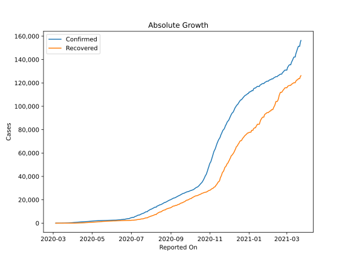
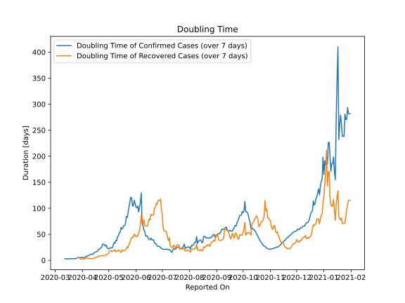

# Country Figures: Doubling Time of Infections for Bosniaand Herzegovina 

The doubling time below are calculated based on
* an exponential growth assumption
* for time difference of past seven (7) days.
The doubling time's unit is "days".

The first doubling time indicates the increase of confirmed (infected)
cases. There, the *higher* the number is, the better is to take control
of the disease.

The second doubling time indicates the increase of recovered (healed)
cases. There, the *lower* the number is, the better it is to take
control of the disease.

| Reported On | Confirmed | Doubling Time (Confirmed) | Recovered | Doubling Time (Recovered) |
|-------------|-----------|---------------------------|-----------|---------------------------|
| 2020-04-19 | 1285 |  20.4 days  | 347 |  8.6 days  | 
| 2020-04-18 | 1268 |  16.9 days  | 338 |  5.8 days  | 
| 2020-04-17 | 1214 |  16.6 days  | 320 |  5.7 days  | 
| 2020-04-16 | 1167 |  16.1 days  | 277 |  5.1 days  | 
| 2020-04-15 | 1110 |  15.4 days  | 253 |  4.5 days  | 
| 2020-04-14 | 1083 |  14.2 days  | 236 |  4.2 days  | 
| 2020-04-13 | 1037 |  11.6 days  | 206 |  3.6 days  | 
| 2020-04-12 | 1009 |  11.5 days  | 193 |  2.9 days  | 
| 2020-04-11 | 946 |  12.0 days  | 139 |  3.5 days  | 
| 2020-04-10 | 901 |  11.3 days  | 129 |  3.4 days  | 
| 2020-04-09 | 858 |  10.5 days  | 101 |  3.3 days  | 
| 2020-04-08 | 804 |  9.0 days  | 79 |  3.7 days  | 
| 2020-04-07 | 764 |  8.5 days  | 68 |  3.8 days  | 
| 2020-04-06 | 674 |  8.4 days  | 47 |  5.1 days  | 
| 2020-04-05 | 654 |  7.2 days  | 30 |  4.0 days  | 
| 2020-04-04 | 624 |  5.8 days  | 30 |  3.0 days  | 
| 2020-04-03 | 579 |  5.8 days  | 27 |  3.2 days  | 
| 2020-04-02 | 533 |  5.1 days  | 20 |  2.4 days  | 
| 2020-04-01 | 459 |  5.4 days  | 19 |  2.5 days  | 
| 2020-03-31 | 420 |  5.6 days  | 17 |  2.6 days  | 
| 2020-03-30 | 368 |  5.1 days  | 17 |  2.6 days  | 
| 2020-03-29 | 323 |  5.5 days  | 8 |  3.8 days  | 
| 2020-03-28 | 258 |  5.1 days  | 5 |  5.6 days  | 
| 2020-03-27 | 237 |  5.3 days  | 5 |  5.6 days  | 
| 2020-03-26 | 191 |  4.7 days  | 2 |  None  | 
| 2020-03-25 | 176 |  3.5 days  | 2 |  None  | 
| 2020-03-24 | 166 |  3.0 days  | 2 |  None  | 
| 2020-03-23 | 132 |  3.3 days  | 2 |  None  | 
| 2020-03-22 | 126 |  3.3 days  | 2 |  None  | 
| 2020-03-21 | 93 |  3.3 days  | 2 |  None  | 
| 2020-03-20 | 89 |  2.9 days  | 2 |  None  | 
| 2020-03-19 | 63 |  3.1 days  | 2 |  None  | 
| 2020-03-18 | 38 |  3.2 days  | 2 |  None  | 
| 2020-03-17 | 26 |  3.3 days  | 2 |  None  | 
| 2020-03-16 | 25 |  2.6 days  | 0 |  None  | 
| 2020-03-15 | 24 |  2.7 days  | 0 |  None  | 
| 2020-03-14 | 18 |  3.0 days  | 0 |  None  | 
| 2020-03-13 | 13 |  2.9 days  | 0 |  None  | 
| 2020-03-12 | 11 |  3.2 days  | 0 |  None  | 
| 2020-03-11 | 7 |  None  | 0 |  None  | 
| 2020-03-10 | 5 |  None  | 0 |  None  | 
| 2020-03-09 | 3 |  None  | 0 |  None  | 
| 2020-03-08 | 3 |  None  | 0 |  None  | 
| 2020-03-07 | 3 |  None  | 0 |  None  | 
| 2020-03-06 | 2 |  None  | 0 |  None  | 
| 2020-03-05 | 2 |  None  | 0 |  None  | 

