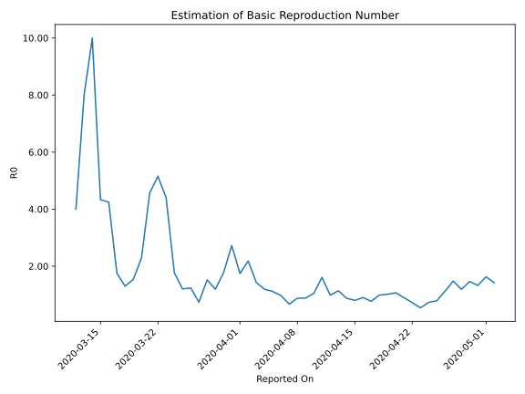

# Country Figures: Time Series for Basic Reproduction Number of Bosniaand Herzegovina 

| Reported On | &Delta; Confirmed | Total &Delta; Confirmed First Interval | Total &Delta; Confirmed Second Interval | Estimated Basic Reproduction Number R0 | 
|-------------|-------------------|----------------------------------------|-----------------------------------------|---------------------------------------------------|
| 2020-04-30 | 80 |  191  |  144  |  1.33  | 
| 2020-04-29 | 92 |  164  |  112  |  1.46  | 
| 2020-04-28 | 20 |  152  |  128  |  1.19  | 
| 2020-04-27 | 49 |  148  |  100  |  1.48  | 
| 2020-04-26 | 30 |  144  |  128  |  1.12  | 
| 2020-04-25 | 65 |  112  |  142  |  0.79  | 
| 2020-04-24 | 8 |  128  |  175  |  0.73  | 
| 2020-04-23 | 45 |  100  |  185  |  0.54  | 
| 2020-04-22 | 26 |  128  |  177  |  0.72  | 
| 2020-04-21 | 33 |  142  |  158  |  0.90  | 
| 2020-04-20 | 24 |  175  |  164  |  1.07  | 
| 2020-04-19 | 17 |  185  |  182  |  1.02  | 
| 2020-04-18 | 54 |  177  |  179  |  0.99  | 
| 2020-04-17 | 47 |  158  |  205  |  0.77  | 
| 2020-04-16 | 57 |  164  |  182  |  0.90  | 
| 2020-04-15 | 27 |  182  |  227  |  0.80  | 
| 2020-04-14 | 46 |  179  |  204  |  0.88  | 
| 2020-04-13 | 28 |  205  |  180  |  1.14  | 
| 2020-04-12 | 63 |  182  |  185  |  0.98  | 
| 2020-04-11 | 45 |  227  |  141  |  1.61  | 
| 2020-04-10 | 43 |  204  |  195  |  1.05  | 
| 2020-04-09 | 54 |  180  |  204  |  0.88  | 
| 2020-04-08 | 40 |  185  |  211  |  0.88  | 
| 2020-04-07 | 90 |  141  |  210  |  0.67  | 
| 2020-04-06 | 20 |  195  |  201  |  0.97  | 
| 2020-04-05 | 30 |  204  |  183  |  1.11  | 
| 2020-04-04 | 45 |  211  |  177  |  1.19  | 
| 2020-04-03 | 46 |  210  |  147  |  1.43  | 
| 2020-04-02 | 74 |  201  |  92  |  2.18  | 
| 2020-04-01 | 39 |  183  |  105  |  1.74  | 
| 2020-03-31 | 52 |  177  |  65  |  2.72  | 
| 2020-03-30 | 45 |  147  |  83  |  1.77  | 
| 2020-03-29 | 65 |  92  |  77  |  1.19  | 
| 2020-03-28 | 21 |  105  |  69  |  1.52  | 
| 2020-03-27 | 46 |  65  |  88  |  0.74  | 
| 2020-03-26 | 15 |  83  |  67  |  1.24  | 
| 2020-03-25 | 10 |  77  |  64  |  1.20  | 
| 2020-03-24 | 34 |  69  |  39  |  1.77  | 
| 2020-03-23 | 6 |  88  |  20  |  4.40  | 
| 2020-03-22 | 33 |  67  |  13  |  5.15  | 
| 2020-03-21 | 4 |  64  |  14  |  4.57  | 
| 2020-03-20 | 26 |  39  |  17  |  2.29  | 
| 2020-03-19 | 25 |  20  |  13  |  1.54  | 
| 2020-03-18 | 12 |  13  |  10  |  1.30  | 
| 2020-03-17 | 1 |  14  |  8  |  1.75  | 
| 2020-03-16 | 1 |  17  |  4  |  4.25  | 
| 2020-03-15 | 6 |  13  |  3  |  4.33  | 
| 2020-03-14 | 5 |  10  |  1  |  10.00  | 
| 2020-03-13 | 2 |  8  |  1  |  8.00  | 
| 2020-03-12 | 4 |  4  |  1  |  4.00  | 
| 2020-03-11 | 2 |  3  |  None  |  None  | 
| 2020-03-10 | 2 |  1  |  None  |  None  | 
| 2020-03-09 | 0 |  1  |  None  |  None  | 
| 2020-03-08 | 0 |  1  |  None  |  None  | 
| 2020-03-07 | 1 |  None  |  None  |  None  | 
| 2020-03-06 | 0 |  None  |  None  |  None  | 
| 2020-03-05 | None |  None  |  None  |  None  | 

