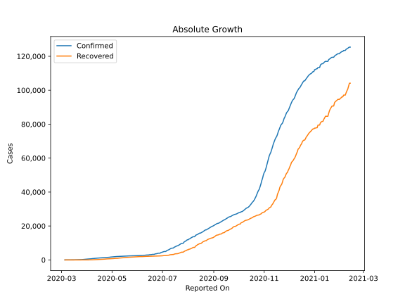
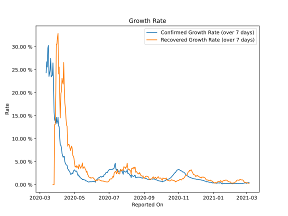

# Country Figures: Growth Rate for Bosniaand Herzegovina 

The growth rates below are calculated based on
* an exponential growth assumption
* for time difference of past seven (7) days.
The growth rate is to be understood as on "growth per day".

The first growth rate indicates the increase of confirmed (infected) cases.

The second growth rate indicates the increase of recovered (healed) cases.

| Reported On | Confirmed | Growth Rate (Confirmed) | Recovered | Growth Rate (Recovered) |
|-------------|-----------|-------------------------|-----------|-------------------------|
| 2020-05-09 | 2090 |  1.83 %  | 1059 |  4.387 %  | 
| 2020-05-08 | 2070 |  2.15 %  | 960 |  3.432 %  | 
| 2020-05-07 | 2027 |  2.04 %  | 954 |  3.882 %  | 
| 2020-05-06 | 1987 |  2.42 %  | 928 |  3.825 %  | 
| 2020-05-05 | 1946 |  2.93 %  | 911 |  4.136 %  | 
| 2020-05-04 | 1926 |  2.97 %  | 855 |  3.720 %  | 
| 2020-05-03 | 1857 |  2.90 %  | 825 |  3.989 %  | 
| 2020-05-02 | 1839 |  3.04 %  | 779 |  3.921 %  | 
| 2020-05-01 | 1781 |  3.23 %  | 755 |  4.841 %  | 
| 2020-04-30 | 1757 |  3.11 %  | 727 |  5.783 %  | 
| 2020-04-29 | 1677 |  2.91 %  | 710 |  6.201 %  | 
| 2020-04-28 | 1585 |  2.38 %  | 682 |  6.359 %  | 
| 2020-04-27 | 1565 |  2.55 %  | 659 |  7.827 %  | 
| 2020-04-26 | 1516 |  2.36 %  | 624 |  8.383 %  | 
| 2020-04-25 | 1486 |  2.27 %  | 592 |  8.007 %  | 
| 2020-04-24 | 1421 |  2.25 %  | 538 |  7.422 %  | 
| 2020-04-23 | 1413 |  2.73 %  | 485 |  8.002 %  | 
| 2020-04-22 | 1368 |  2.99 %  | 460 |  8.541 %  | 
| 2020-04-21 | 1342 |  3.06 %  | 437 |  8.801 %  | 
| 2020-04-20 | 1309 |  3.33 %  | 381 |  8.785 %  | 
| 2020-04-19 | 1285 |  3.45 %  | 347 |  8.380 %  | 
| 2020-04-18 | 1268 |  4.19 %  | 338 |  12.694 %  | 
| 2020-04-17 | 1214 |  4.26 %  | 320 |  12.979 %  | 
| 2020-04-16 | 1167 |  4.39 %  | 277 |  14.413 %  | 
| 2020-04-15 | 1110 |  4.61 %  | 253 |  16.628 %  | 
| 2020-04-14 | 1083 |  4.98 %  | 236 |  17.776 %  | 
| 2020-04-13 | 1037 |  6.16 %  | 206 |  21.110 %  | 
| 2020-04-12 | 1009 |  6.19 %  | 193 |  26.593 %  | 
| 2020-04-11 | 946 |  5.94 %  | 139 |  21.904 %  | 
| 2020-04-10 | 901 |  6.32 %  | 129 |  22.343 %  | 
| 2020-04-09 | 858 |  6.80 %  | 101 |  23.134 %  | 
| 2020-04-08 | 804 |  8.01 %  | 79 |  20.357 %  | 
| 2020-04-07 | 764 |  8.55 %  | 68 |  19.804 %  | 
| 2020-04-06 | 674 |  8.64 %  | 47 |  14.528 %  | 
| 2020-04-05 | 654 |  10.08 %  | 30 |  18.882 %  | 
| 2020-04-04 | 624 |  12.62 %  | 30 |  25.597 %  | 
| 2020-04-03 | 579 |  12.76 %  | 27 |  24.091 %  | 
| 2020-04-02 | 533 |  14.66 %  | 20 |  32.894 %  | 
| 2020-04-01 | 459 |  13.69 %  | 19 |  32.161 %  | 
| 2020-03-31 | 420 |  13.26 %  | 17 |  30.572 %  | 
| 2020-03-30 | 368 |  14.65 %  | 17 |  30.572 %  | 
| 2020-03-29 | 323 |  13.45 %  | 8 |  19.804 %  | 
| 2020-03-28 | 258 |  14.58 %  | 5 |  13.090 %  | 
| 2020-03-27 | 237 |  13.99 %  | 5 |  13.090 %  | 
| 2020-03-26 | 191 |  15.84 %  | 2 |  None  | 
| 2020-03-25 | 176 |  21.90 %  | 2 |  None  | 
| 2020-03-24 | 166 |  26.48 %  | 2 |  None  | 
| 2020-03-23 | 132 |  23.77 %  | 2 |  None  | 
| 2020-03-22 | 126 |  23.69 %  | 2 |  None  | 
| 2020-03-21 | 93 |  23.46 %  | 2 |  None  | 
| 2020-03-20 | 89 |  27.48 %  | 2 |  None  | 
| 2020-03-19 | 63 |  24.93 %  | 2 |  None  | 
| 2020-03-18 | 38 |  24.17 %  | 2 |  None  | 
| 2020-03-17 | 26 |  23.55 %  | 2 |  None  | 
| 2020-03-16 | 25 |  30.29 %  | 0 |  None  | 
| 2020-03-15 | 24 |  29.71 %  | 0 |  None  | 
| 2020-03-14 | 18 |  25.60 %  | 0 |  None  | 
| 2020-03-13 | 13 |  26.74 %  | 0 |  None  | 
| 2020-03-12 | 11 |  24.35 %  | 0 |  None  | 
| 2020-03-11 | 7 |  None  | 0 |  None  | 
| 2020-03-10 | 5 |  None  | 0 |  None  | 
| 2020-03-09 | 3 |  None  | 0 |  None  | 
| 2020-03-08 | 3 |  None  | 0 |  None  | 
| 2020-03-07 | 3 |  None  | 0 |  None  | 
| 2020-03-06 | 2 |  None  | 0 |  None  | 
| 2020-03-05 | 2 |  None  | 0 |  None  | 

