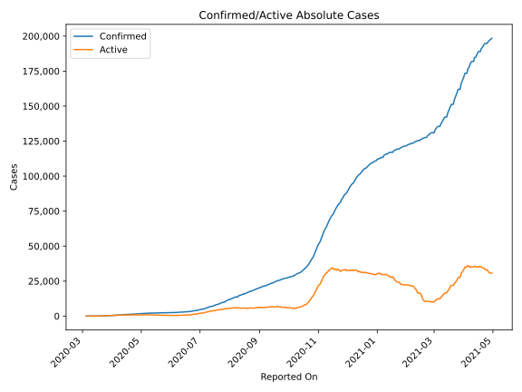
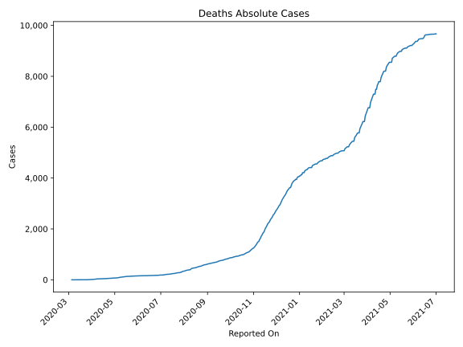
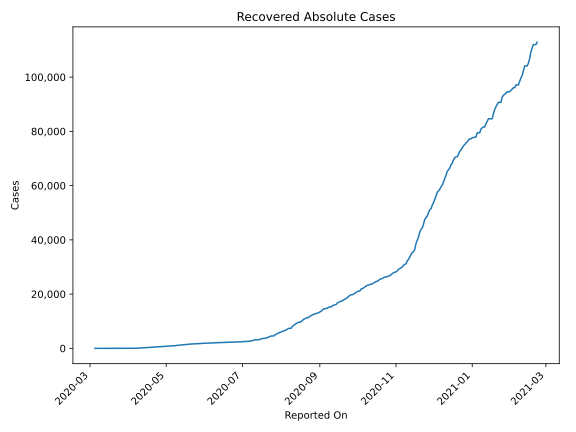
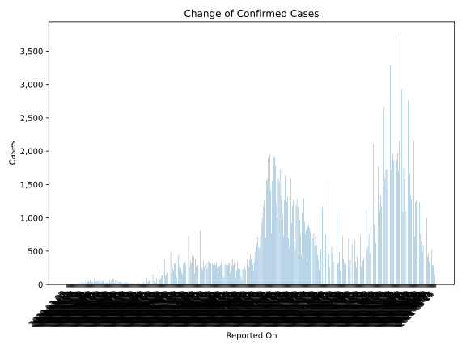
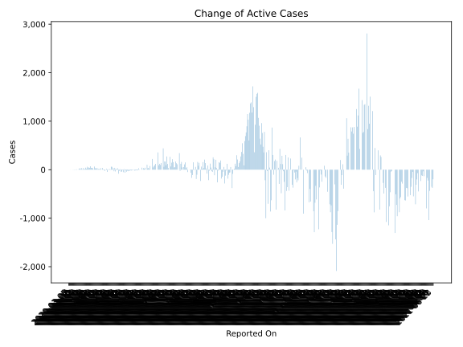
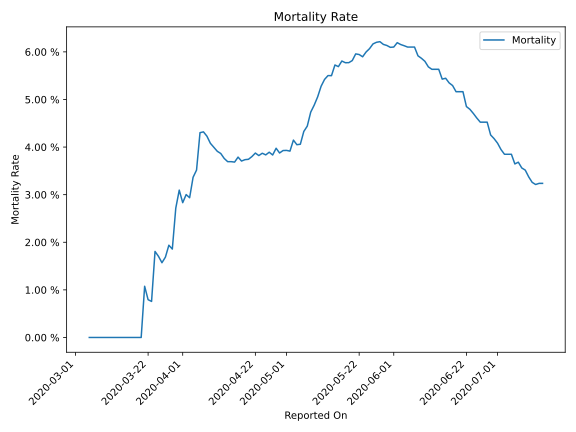

# Country Figures: Time Series for Bosniaand Herzegovina 

| Reported On | Confirmed | Deaths | Recovered | Active | Mortality | &Delta; Confirmed | &Delta; Deaths | &Delta; Active | % Active of Population |
|-------------|-----------|--------|-----------|--------|-----------|-------------------|----------------|----------------|------------------------|
| 2020-04-09 | 858 | 35 | 101 | 722 |  4.08 %  | 54 | 1 | 31 |  0.022 %  | 
| 2020-04-08 | 804 | 34 | 79 | 691 |  4.23 %  | 40 | 1 | 28 |  0.021 %  | 
| 2020-04-07 | 764 | 33 | 68 | 663 |  4.32 %  | 90 | 4 | 65 |  0.020 %  | 
| 2020-04-06 | 674 | 29 | 47 | 598 |  4.30 %  | 20 | 6 | -3 |  0.018 %  | 
| 2020-04-05 | 654 | 23 | 30 | 601 |  3.52 %  | 30 | 2 | 28 |  0.018 %  | 
| 2020-04-04 | 624 | 21 | 30 | 573 |  3.37 %  | 45 | 4 | 38 |  0.017 %  | 
| 2020-04-03 | 579 | 17 | 27 | 535 |  2.94 %  | 46 | 1 | 38 |  0.016 %  | 
| 2020-04-02 | 533 | 16 | 20 | 497 |  3.00 %  | 74 | 3 | 70 |  0.015 %  | 
| 2020-04-01 | 459 | 13 | 19 | 427 |  2.83 %  | 39 | 0 | 37 |  0.013 %  | 
| 2020-03-31 | 420 | 13 | 17 | 390 |  3.10 %  | 52 | 3 | 49 |  0.012 %  | 
| 2020-03-30 | 368 | 10 | 17 | 341 |  2.72 %  | 45 | 4 | 32 |  0.010 %  | 
| 2020-03-29 | 323 | 6 | 8 | 309 |  1.86 %  | 65 | 1 | 61 |  0.009 %  | 
| 2020-03-28 | 258 | 5 | 5 | 248 |  1.94 %  | 21 | 1 | 20 |  0.007 %  | 
| 2020-03-27 | 237 | 4 | 5 | 228 |  1.69 %  | 46 | 1 | 42 |  0.007 %  | 
| 2020-03-26 | 191 | 3 | 2 | 186 |  1.57 %  | 15 | 0 | 15 |  0.006 %  | 
| 2020-03-25 | 176 | 3 | 2 | 171 |  1.70 %  | 10 | 0 | 10 |  0.005 %  | 
| 2020-03-24 | 166 | 3 | 2 | 161 |  1.81 %  | 34 | 2 | 32 |  0.005 %  | 
| 2020-03-23 | 132 | 1 | 2 | 129 |  0.76 %  | 6 | 0 | 6 |  0.004 %  | 
| 2020-03-22 | 126 | 1 | 2 | 123 |  0.79 %  | 33 | 0 | 33 |  0.004 %  | 
| 2020-03-21 | 93 | 1 | 2 | 90 |  1.08 %  | 4 | 1 | 3 |  0.003 %  | 
| 2020-03-20 | 89 | 0 | 2 | 87 |  None  | 26 | 0 | 26 |  0.003 %  | 
| 2020-03-19 | 63 | 0 | 2 | 61 |  None  | 25 | 0 | 25 |  0.002 %  | 
| 2020-03-18 | 38 | 0 | 2 | 36 |  None  | 12 | 0 | 12 |  0.001 %  | 
| 2020-03-17 | 26 | 0 | 2 | 24 |  None  | 1 | 0 | -1 |  0.001 %  | 
| 2020-03-16 | 25 | 0 | 0 | 25 |  None  | 1 | 0 | 1 |  0.001 %  | 
| 2020-03-15 | 24 | 0 | 0 | 24 |  None  | 6 | 0 | 6 |  0.001 %  | 
| 2020-03-14 | 18 | 0 | 0 | 18 |  None  | 5 | 0 | 5 |  0.001 %  | 
| 2020-03-13 | 13 | 0 | 0 | 13 |  None  | 2 | 0 | 2 |  0.000 %  | 
| 2020-03-12 | 11 | 0 | 0 | 11 |  None  | 4 | 0 | 4 |  0.000 %  | 
| 2020-03-11 | 7 | 0 | 0 | 7 |  None  | 2 | 0 | 2 |  0.000 %  | 
| 2020-03-10 | 5 | 0 | 0 | 5 |  None  | 2 | 0 | 2 |  0.000 %  | 
| 2020-03-09 | 3 | 0 | 0 | 3 |  None  | 0 | 0 | 0 |  0.000 %  | 
| 2020-03-08 | 3 | 0 | 0 | 3 |  None  | 0 | 0 | 0 |  0.000 %  | 
| 2020-03-07 | 3 | 0 | 0 | 3 |  None  | 1 | 0 | 1 |  0.000 %  | 
| 2020-03-06 | 2 | 0 | 0 | 2 |  None  | 0 | 0 | 0 |  0.000 %  | 
| 2020-03-05 | 2 | 0 | 0 | 2 |  None  | None | None | None |  0.000 %  | 

