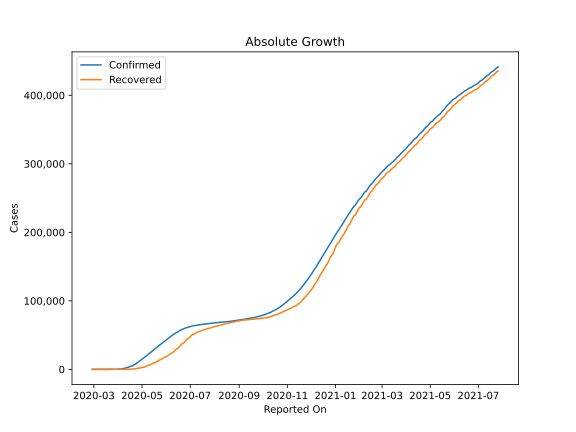
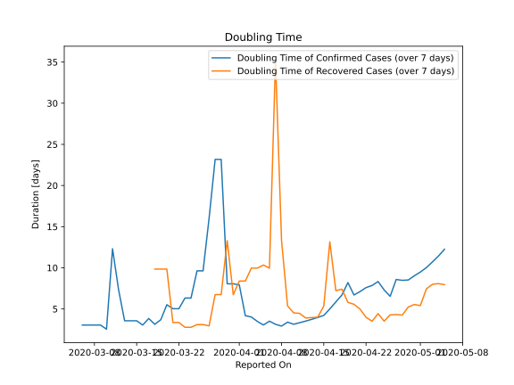

# Country Figures: Doubling Time of Infections for Belarus 

The doubling time below are calculated based on
* an exponential growth assumption
* for time difference of past seven (7) days.
The doubling time's unit is "days".

The first doubling time indicates the increase of confirmed (infected)
cases. There, the *higher* the number is, the better is to take control
of the disease.

The second doubling time indicates the increase of recovered (healed)
cases. There, the *lower* the number is, the better it is to take
control of the disease.

| Reported On | Confirmed | Doubling Time (Confirmed) | Recovered | Doubling Time (Recovered) |
|-------------|-----------|---------------------------|-----------|---------------------------|
| 2020-04-09 | 1486 |  3.4 days  | 139 |  5.4 days  | 
| 2020-04-08 | 1066 |  2.9 days  | 77 |  13.3 days  | 
| 2020-04-07 | 861 |  3.1 days  | 54 |  35.3 days  | 
| 2020-04-06 | 700 |  3.5 days  | 53 |  10.0 days  | 
| 2020-04-05 | 562 |  3.0 days  | 52 |  10.3 days  | 
| 2020-04-04 | 440 |  3.5 days  | 53 |  10.0 days  | 
| 2020-04-03 | 351 |  4.0 days  | 53 |  10.0 days  | 
| 2020-04-02 | 304 |  4.2 days  | 53 |  8.4 days  | 
| 2020-04-01 | 163 |  7.9 days  | 53 |  8.4 days  | 
| 2020-03-31 | 152 |  8.1 days  | 47 |  6.7 days  | 
| 2020-03-30 | 152 |  8.1 days  | 32 |  13.3 days  | 
| 2020-03-29 | 94 |  23.2 days  | 32 |  6.7 days  | 
| 2020-03-28 | 94 |  23.2 days  | 32 |  6.7 days  | 
| 2020-03-27 | 94 |  16.0 days  | 32 |  2.9 days  | 
| 2020-03-26 | 86 |  9.6 days  | 29 |  3.1 days  | 
| 2020-03-25 | 86 |  9.6 days  | 29 |  3.1 days  | 
| 2020-03-24 | 81 |  6.3 days  | 22 |  2.8 days  | 
| 2020-03-23 | 81 |  6.3 days  | 22 |  2.8 days  | 
| 2020-03-22 | 76 |  5.0 days  | 15 |  3.3 days  | 
| 2020-03-21 | 76 |  5.0 days  | 15 |  3.3 days  | 
| 2020-03-20 | 69 |  5.5 days  | 5 |  9.8 days  | 
| 2020-03-19 | 51 |  3.7 days  | 5 |  9.8 days  | 
| 2020-03-18 | 51 |  3.1 days  | 5 |  9.8 days  | 
| 2020-03-17 | 36 |  3.8 days  | 3 |  None  | 
| 2020-03-16 | 36 |  3.0 days  | 3 |  4.8 days  | 
| 2020-03-15 | 27 |  3.6 days  | 3 |  None  | 
| 2020-03-14 | 27 |  3.6 days  | 3 |  None  | 
| 2020-03-13 | 27 |  3.6 days  | 3 |  None  | 
| 2020-03-12 | 12 |  7.3 days  | 3 |  None  | 
| 2020-03-11 | 9 |  12.3 days  | 3 |  None  | 
| 2020-03-10 | 9 |  2.5 days  | 3 |  None  | 
| 2020-03-09 | 6 |  3.0 days  | 1 |  None  | 
| 2020-03-08 | 6 |  3.0 days  | 0 |  None  | 
| 2020-03-07 | 6 |  3.0 days  | 0 |  None  | 
| 2020-03-06 | 6 |  3.0 days  | 0 |  None  | 
| 2020-03-05 | 6 |  None  | 0 |  None  | 
| 2020-03-04 | 6 |  None  | 0 |  None  | 
| 2020-03-03 | 1 |  None  | 0 |  None  | 
| 2020-03-02 | 1 |  None  | 0 |  None  | 
| 2020-03-01 | 1 |  None  | 0 |  None  | 
| 2020-02-29 | 1 |  None  | 0 |  None  | 
| 2020-02-28 | 1 |  None  | 0 |  None  | 

