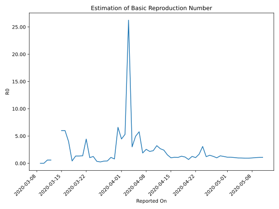

# Country Figures: Time Series for Basic Reproduction Number of Belarus 

| Reported On | &Delta; Confirmed | Total &Delta; Confirmed First Interval | Total &Delta; Confirmed Second Interval | Estimated Basic Reproduction Number R0 | 
|-------------|-------------------|----------------------------------------|-----------------------------------------|---------------------------------------------------|
| 2020-05-09 | 951 |  3612  |  3462  |  1.04  | 
| 2020-05-08 | 933 |  3463  |  3524  |  0.98  | 
| 2020-05-07 | 913 |  3427  |  3620  |  0.95  | 
| 2020-05-06 | 905 |  3433  |  3628  |  0.95  | 
| 2020-05-05 | 861 |  3462  |  3564  |  0.97  | 
| 2020-05-04 | 784 |  3524  |  3591  |  0.98  | 
| 2020-05-03 | 877 |  3620  |  3435  |  1.05  | 
| 2020-05-02 | 911 |  3628  |  3267  |  1.11  | 
| 2020-05-01 | 890 |  3564  |  3182  |  1.12  | 
| 2020-04-30 | 846 |  3591  |  2867  |  1.25  | 
| 2020-04-29 | 973 |  3435  |  2509  |  1.37  | 
| 2020-04-28 | 919 |  3267  |  3243  |  1.01  | 
| 2020-04-27 | 826 |  3182  |  2502  |  1.27  | 
| 2020-04-26 | 873 |  2867  |  1944  |  1.47  | 
| 2020-04-25 | 817 |  2509  |  2060  |  1.22  | 
| 2020-04-24 | 751 |  3243  |  1051  |  3.09  | 
| 2020-04-23 | 741 |  2502  |  1498  |  1.67  | 
| 2020-04-22 | 558 |  1944  |  1860  |  1.05  | 
| 2020-04-21 | 459 |  2060  |  1626  |  1.27  | 
| 2020-04-20 | 1485 |  1051  |  1502  |  0.70  | 
| 2020-04-19 | 0 |  1498  |  1300  |  1.15  | 
| 2020-04-18 | 0 |  1860  |  1433  |  1.30  | 
| 2020-04-17 | 575 |  1626  |  1512  |  1.08  | 
| 2020-04-16 | 476 |  1502  |  1365  |  1.10  | 
| 2020-04-15 | 447 |  1300  |  1281  |  1.01  | 
| 2020-04-14 | 362 |  1433  |  924  |  1.55  | 
| 2020-04-13 | 341 |  1512  |  626  |  2.42  | 
| 2020-04-12 | 352 |  1365  |  510  |  2.68  | 
| 2020-04-11 | 245 |  1281  |  396  |  3.23  | 
| 2020-04-10 | 495 |  924  |  399  |  2.32  | 
| 2020-04-09 | 420 |  626  |  288  |  2.17  | 
| 2020-04-08 | 205 |  510  |  199  |  2.56  | 
| 2020-04-07 | 161 |  396  |  210  |  1.89  | 
| 2020-04-06 | 138 |  399  |  69  |  5.78  | 
| 2020-04-05 | 122 |  288  |  58  |  4.97  | 
| 2020-04-04 | 89 |  199  |  66  |  3.02  | 
| 2020-04-03 | 47 |  210  |  8  |  26.25  | 
| 2020-04-02 | 141 |  69  |  13  |  5.31  | 
| 2020-04-01 | 11 |  58  |  13  |  4.46  | 
| 2020-03-31 | 0 |  66  |  10  |  6.60  | 
| 2020-03-30 | 58 |  8  |  10  |  0.80  | 
| 2020-03-29 | 0 |  13  |  12  |  1.08  | 
| 2020-03-28 | 0 |  13  |  30  |  0.43  | 
| 2020-03-27 | 8 |  10  |  25  |  0.40  | 
| 2020-03-26 | 0 |  10  |  40  |  0.25  | 
| 2020-03-25 | 5 |  12  |  33  |  0.36  | 
| 2020-03-24 | 0 |  30  |  24  |  1.25  | 
| 2020-03-23 | 5 |  25  |  24  |  1.04  | 
| 2020-03-22 | 0 |  40  |  9  |  4.44  | 
| 2020-03-21 | 7 |  33  |  24  |  1.38  | 
| 2020-03-20 | 18 |  24  |  18  |  1.33  | 
| 2020-03-19 | 0 |  24  |  18  |  1.33  | 
| 2020-03-18 | 15 |  9  |  21  |  0.43  | 
| 2020-03-17 | 0 |  24  |  6  |  4.00  | 
| 2020-03-16 | 9 |  18  |  3  |  6.00  | 
| 2020-03-15 | 0 |  18  |  3  |  6.00  | 
| 2020-03-14 | 0 |  21  |  None  |  None  | 
| 2020-03-13 | 15 |  6  |  None  |  None  | 
| 2020-03-12 | 3 |  3  |  5  |  0.60  | 
| 2020-03-11 | 0 |  3  |  5  |  0.60  | 
| 2020-03-10 | 3 |  None  |  5  |  None  | 
| 2020-03-09 | 0 |  None  |  5  |  None  | 
| 2020-03-08 | 0 |  5  |  None  |  None  | 
| 2020-03-07 | 0 |  5  |  None  |  None  | 
| 2020-03-06 | 0 |  5  |  None  |  None  | 
| 2020-03-05 | 0 |  5  |  None  |  None  | 
| 2020-03-04 | 5 |  None  |  None  |  None  | 
| 2020-03-03 | 0 |  None  |  None  |  None  | 
| 2020-03-02 | 0 |  None  |  None  |  None  | 
| 2020-03-01 | 0 |  None  |  None  |  None  | 
| 2020-02-29 | 0 |  None  |  None  |  None  | 
| 2020-02-28 | None |  None  |  None  |  None  | 

