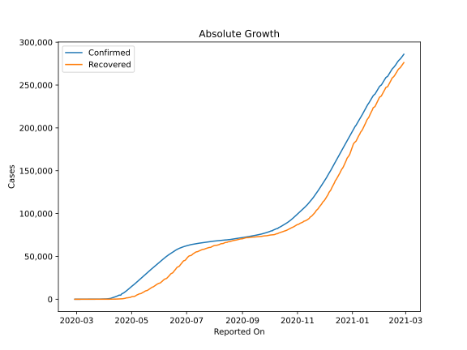
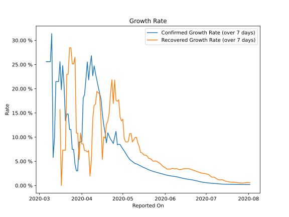

# Country Figures: Growth Rate for Belarus 

The growth rates below are calculated based on
* an exponential growth assumption
* for time difference of past seven (7) days.
The growth rate is to be understood as on "growth per day".

The first growth rate indicates the increase of confirmed (infected) cases.

The second growth rate indicates the increase of recovered (healed) cases.

| Reported On | Confirmed | Growth Rate (Confirmed) | Recovered | Growth Rate (Recovered) |
|-------------|-----------|-------------------------|-----------|-------------------------|
| 2020-04-29 | 13181 |  8.48 %  | 2072 |  14.160 %  | 
| 2020-04-28 | 12208 |  8.52 %  | 1993 |  17.708 %  | 
| 2020-04-27 | 11289 |  8.41 %  | 1740 |  17.420 %  | 
| 2020-04-26 | 10463 |  11.19 %  | 1695 |  17.613 %  | 
| 2020-04-25 | 9590 |  9.95 %  | 1573 |  21.799 %  | 
| 2020-04-24 | 8773 |  8.68 %  | 1120 |  16.947 %  | 
| 2020-04-23 | 8022 |  9.23 %  | 938 |  21.865 %  | 
| 2020-04-22 | 7281 |  9.56 %  | 769 |  19.027 %  | 
| 2020-04-21 | 6723 |  10.25 %  | 577 |  14.923 %  | 
| 2020-04-20 | 6264 |  10.91 %  | 514 |  13.272 %  | 
| 2020-04-19 | 4779 |  8.82 %  | 494 |  12.705 %  | 
| 2020-04-18 | 4779 |  10.91 %  | 342 |  9.819 %  | 
| 2020-04-17 | 4779 |  12.58 %  | 342 |  10.070 %  | 
| 2020-04-16 | 4204 |  14.86 %  | 203 |  5.410 %  | 
| 2020-04-15 | 3728 |  17.89 %  | 203 |  13.849 %  | 
| 2020-04-14 | 3281 |  19.11 %  | 203 |  18.917 %  | 
| 2020-04-13 | 2919 |  20.40 %  | 203 |  19.184 %  | 
| 2020-04-12 | 2578 |  21.76 %  | 203 |  19.457 %  | 
| 2020-04-11 | 2226 |  23.16 %  | 172 |  16.817 %  | 
| 2020-04-10 | 1981 |  24.72 %  | 169 |  16.566 %  | 
| 2020-04-09 | 1486 |  22.67 %  | 139 |  13.774 %  | 
| 2020-04-08 | 1066 |  26.83 %  | 77 |  5.336 %  | 
| 2020-04-07 | 861 |  24.77 %  | 54 |  1.983 %  | 
| 2020-04-06 | 700 |  21.82 %  | 53 |  7.208 %  | 
| 2020-04-05 | 562 |  25.55 %  | 52 |  6.936 %  | 
| 2020-04-04 | 440 |  22.05 %  | 53 |  7.208 %  | 
| 2020-04-03 | 351 |  18.82 %  | 53 |  7.208 %  | 
| 2020-04-02 | 304 |  18.04 %  | 53 |  8.614 %  | 
| 2020-04-01 | 163 |  9.13 %  | 53 |  8.614 %  | 
| 2020-03-31 | 152 |  8.99 %  | 47 |  10.844 %  | 
| 2020-03-30 | 152 |  8.99 %  | 32 |  5.353 %  | 
| 2020-03-29 | 94 |  3.04 %  | 32 |  10.824 %  | 
| 2020-03-28 | 94 |  3.04 %  | 32 |  10.824 %  | 
| 2020-03-27 | 94 |  4.42 %  | 32 |  26.519 %  | 
| 2020-03-26 | 86 |  7.46 %  | 29 |  25.112 %  | 
| 2020-03-25 | 86 |  7.46 %  | 29 |  25.112 %  | 
| 2020-03-24 | 81 |  11.58 %  | 22 |  28.463 %  | 
| 2020-03-23 | 81 |  11.58 %  | 22 |  28.463 %  | 
| 2020-03-22 | 76 |  14.78 %  | 15 |  22.992 %  | 
| 2020-03-21 | 76 |  14.78 %  | 15 |  22.992 %  | 
| 2020-03-20 | 69 |  13.40 %  | 5 |  7.298 %  | 
| 2020-03-19 | 51 |  20.67 %  | 5 |  7.298 %  | 
| 2020-03-18 | 51 |  24.78 %  | 5 |  7.298 %  | 
| 2020-03-17 | 36 |  19.80 %  | 3 |  None  | 
| 2020-03-16 | 36 |  25.60 %  | 3 |  15.694 %  | 
| 2020-03-15 | 27 |  21.49 %  | 3 |  None  | 
| 2020-03-14 | 27 |  21.49 %  | 3 |  None  | 
| 2020-03-13 | 27 |  21.49 %  | 3 |  None  | 
| 2020-03-12 | 12 |  9.90 %  | 3 |  None  | 
| 2020-03-11 | 9 |  5.79 %  | 3 |  None  | 
| 2020-03-10 | 9 |  31.39 %  | 3 |  None  | 
| 2020-03-09 | 6 |  25.60 %  | 1 |  None  | 
| 2020-03-08 | 6 |  25.60 %  | 0 |  None  | 
| 2020-03-07 | 6 |  25.60 %  | 0 |  None  | 
| 2020-03-06 | 6 |  25.60 %  | 0 |  None  | 
| 2020-03-05 | 6 |  None  | 0 |  None  | 
| 2020-03-04 | 6 |  None  | 0 |  None  | 
| 2020-03-03 | 1 |  None  | 0 |  None  | 
| 2020-03-02 | 1 |  None  | 0 |  None  | 
| 2020-03-01 | 1 |  None  | 0 |  None  | 
| 2020-02-29 | 1 |  None  | 0 |  None  | 
| 2020-02-28 | 1 |  None  | 0 |  None  | 

