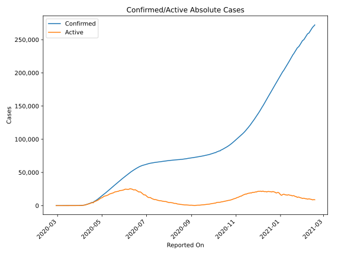
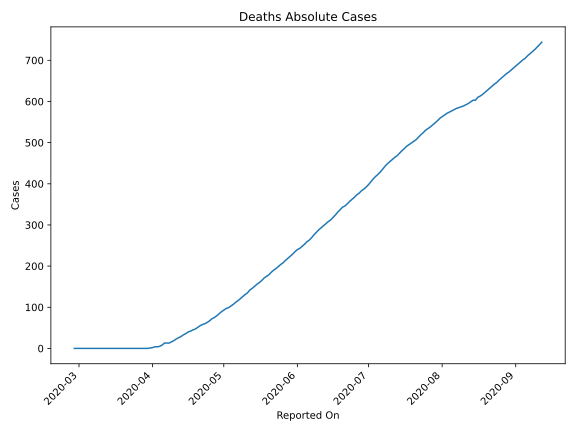
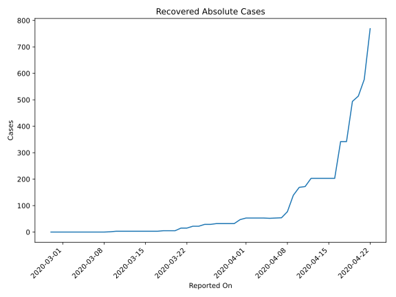
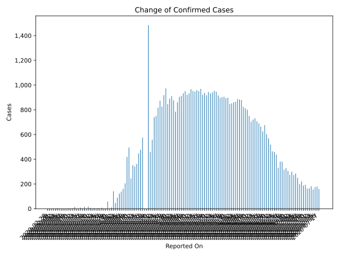
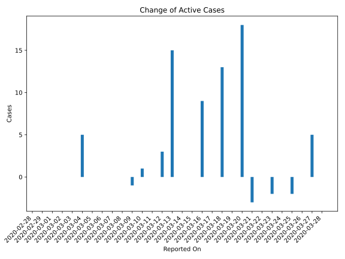
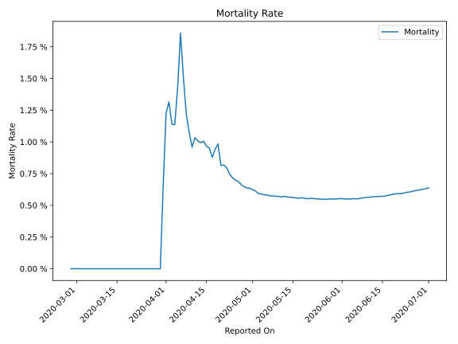

# Country Figures: Time Series for Belarus 

| Reported On | Confirmed | Deaths | Recovered | Active | Mortality | &Delta; Confirmed | &Delta; Deaths | &Delta; Active | % Active of Population |
|-------------|-----------|--------|-----------|--------|-----------|-------------------|----------------|----------------|------------------------|
| 2020-03-23 | 81 | 0 | 22 | 59 |  None  | 5 | 0 | -2 |  0.001 %  | 
| 2020-03-22 | 76 | 0 | 15 | 61 |  None  | 0 | 0 | 0 |  0.001 %  | 
| 2020-03-21 | 76 | 0 | 15 | 61 |  None  | 7 | 0 | -3 |  0.001 %  | 
| 2020-03-20 | 69 | 0 | 5 | 64 |  None  | 18 | 0 | 18 |  0.001 %  | 
| 2020-03-19 | 51 | 0 | 5 | 46 |  None  | 0 | 0 | 0 |  0.000 %  | 
| 2020-03-18 | 51 | 0 | 5 | 46 |  None  | 15 | 0 | 13 |  0.000 %  | 
| 2020-03-17 | 36 | 0 | 3 | 33 |  None  | 0 | 0 | 0 |  0.000 %  | 
| 2020-03-16 | 36 | 0 | 3 | 33 |  None  | 9 | 0 | 9 |  0.000 %  | 
| 2020-03-15 | 27 | 0 | 3 | 24 |  None  | 0 | 0 | 0 |  0.000 %  | 
| 2020-03-14 | 27 | 0 | 3 | 24 |  None  | 0 | 0 | 0 |  0.000 %  | 
| 2020-03-13 | 27 | 0 | 3 | 24 |  None  | 15 | 0 | 15 |  0.000 %  | 
| 2020-03-12 | 12 | 0 | 3 | 9 |  None  | 3 | 0 | 3 |  0.000 %  | 
| 2020-03-11 | 9 | 0 | 3 | 6 |  None  | 0 | 0 | 0 |  0.000 %  | 
| 2020-03-10 | 9 | 0 | 3 | 6 |  None  | 3 | 0 | 1 |  0.000 %  | 
| 2020-03-09 | 6 | 0 | 1 | 5 |  None  | 0 | 0 | -1 |  0.000 %  | 
| 2020-03-08 | 6 | 0 | 0 | 6 |  None  | 0 | 0 | 0 |  0.000 %  | 
| 2020-03-07 | 6 | 0 | 0 | 6 |  None  | 0 | 0 | 0 |  0.000 %  | 
| 2020-03-06 | 6 | 0 | 0 | 6 |  None  | 0 | 0 | 0 |  0.000 %  | 
| 2020-03-05 | 6 | 0 | 0 | 6 |  None  | 0 | 0 | 0 |  0.000 %  | 
| 2020-03-04 | 6 | 0 | 0 | 6 |  None  | 5 | 0 | 5 |  0.000 %  | 
| 2020-03-03 | 1 | 0 | 0 | 1 |  None  | 0 | 0 | 0 |  0.000 %  | 
| 2020-03-02 | 1 | 0 | 0 | 1 |  None  | 0 | 0 | 0 |  0.000 %  | 
| 2020-03-01 | 1 | 0 | 0 | 1 |  None  | 0 | 0 | 0 |  0.000 %  | 
| 2020-02-29 | 1 | 0 | 0 | 1 |  None  | 0 | 0 | 0 |  0.000 %  | 
| 2020-02-28 | 1 | 0 | 0 | 1 |  None  | None | None | None |  0.000 %  | 

