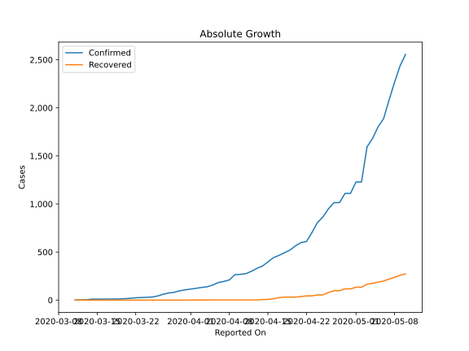
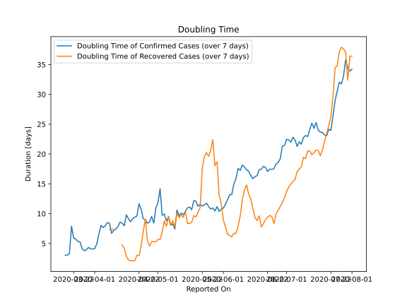

# Country Figures: Doubling Time of Infections for Bolivia 

The doubling time below are calculated based on
* an exponential growth assumption
* for time difference of past seven (7) days.
The doubling time's unit is "days".

The first doubling time indicates the increase of confirmed (infected)
cases. There, the *higher* the number is, the better is to take control
of the disease.

The second doubling time indicates the increase of recovered (healed)
cases. There, the *lower* the number is, the better it is to take
control of the disease.

| Reported On | Confirmed | Doubling Time (Confirmed) | Recovered | Doubling Time (Recovered) |
|-------------|-----------|---------------------------|-----------|---------------------------|
| 2020-05-07 | 2081 |  8.1 days  | 219 |  8.1 days  | 
| 2020-05-06 | 1886 |  9.5 days  | 198 |  9.6 days  | 
| 2020-05-05 | 1802 |  8.8 days  | 187 |  7.9 days  | 
| 2020-05-04 | 1681 |  9.9 days  | 174 |  8.8 days  | 
| 2020-05-03 | 1594 |  9.7 days  | 166 |  7.0 days  | 
| 2020-05-02 | 1229 |  14.2 days  | 134 |  5.7 days  | 
| 2020-05-01 | 1229 |  11.9 days  | 134 |  5.7 days  | 
| 2020-04-30 | 1110 |  11.0 days  | 117 |  5.3 days  | 
| 2020-04-29 | 1110 |  8.4 days  | 117 |  5.3 days  | 
| 2020-04-28 | 1014 |  9.5 days  | 98 |  5.3 days  | 
| 2020-04-27 | 1014 |  8.6 days  | 98 |  4.6 days  | 
| 2020-04-26 | 950 |  8.4 days  | 80 |  5.5 days  | 
| 2020-04-25 | 866 |  9.0 days  | 54 |  9.1 days  | 
| 2020-04-24 | 807 |  9.1 days  | 54 |  7.0 days  | 
| 2020-04-23 | 703 |  10.7 days  | 44 |  4.6 days  | 
| 2020-04-22 | 609 |  11.7 days  | 44 |  3.0 days  | 
| 2020-04-21 | 598 |  9.6 days  | 37 |  3.0 days  | 
| 2020-04-20 | 564 |  9.4 days  | 31 |  2.1 days  | 
| 2020-04-19 | 520 |  9.2 days  | 31 |  2.1 days  | 
| 2020-04-18 | 493 |  8.7 days  | 31 |  2.1 days  | 
| 2020-04-17 | 465 |  9.1 days  | 26 |  2.2 days  | 
| 2020-04-16 | 441 |  9.8 days  | 14 |  2.8 days  | 
| 2020-04-15 | 397 |  8.0 days  | 7 |  4.2 days  | 
| 2020-04-14 | 354 |  8.4 days  | 6 |  4.8 days  | 
| 2020-04-13 | 330 |  8.6 days  | 2 |  None  | 
| 2020-04-12 | 300 |  7.8 days  | 2 |  None  | 
| 2020-04-11 | 275 |  7.5 days  | 2 |  7.3 days  | 
| 2020-04-10 | 268 |  7.2 days  | 2 |  7.3 days  | 
| 2020-04-09 | 264 |  6.7 days  | 2 |  7.3 days  | 
| 2020-04-08 | 210 |  8.4 days  | 2 |  7.3 days  | 
| 2020-04-07 | 194 |  8.5 days  | 2 |  None  | 
| 2020-04-06 | 183 |  8.0 days  | 2 |  None  | 
| 2020-04-05 | 157 |  7.7 days  | 2 |  None  | 
| 2020-04-04 | 139 |  8.0 days  | 1 |  None  | 
| 2020-04-03 | 132 |  6.6 days  | 1 |  None  | 
| 2020-04-02 | 123 |  5.0 days  | 1 |  None  | 
| 2020-04-01 | 115 |  4.1 days  | 1 |  None  | 
| 2020-03-31 | 107 |  4.1 days  | 0 |  None  | 
| 2020-03-30 | 97 |  4.1 days  | 0 |  None  | 
| 2020-03-29 | 81 |  4.3 days  | 0 |  None  | 
| 2020-03-28 | 74 |  3.9 days  | 0 |  None  | 
| 2020-03-27 | 61 |  3.8 days  | 0 |  None  | 
| 2020-03-26 | 43 |  4.1 days  | 0 |  None  | 
| 2020-03-25 | 32 |  5.3 days  | 0 |  None  | 
| 2020-03-24 | 29 |  5.3 days  | 0 |  None  | 
| 2020-03-23 | 27 |  5.7 days  | 0 |  None  | 
| 2020-03-22 | 24 |  5.9 days  | 0 |  None  | 
| 2020-03-21 | 19 |  7.9 days  | 0 |  None  | 
| 2020-03-20 | 15 |  3.3 days  | 0 |  None  | 
| 2020-03-19 | 12 |  3.0 days  | 0 |  None  | 
| 2020-03-18 | 12 |  3.0 days  | 0 |  None  | 
| 2020-03-17 | 11 |  None  | 0 |  None  | 
| 2020-03-16 | 11 |  None  | 0 |  None  | 
| 2020-03-15 | 10 |  None  | 0 |  None  | 
| 2020-03-14 | 10 |  None  | 0 |  None  | 
| 2020-03-13 | 3 |  None  | 0 |  None  | 
| 2020-03-12 | 2 |  None  | 0 |  None  | 
| 2020-03-11 | 2 |  None  | 0 |  None  | 

