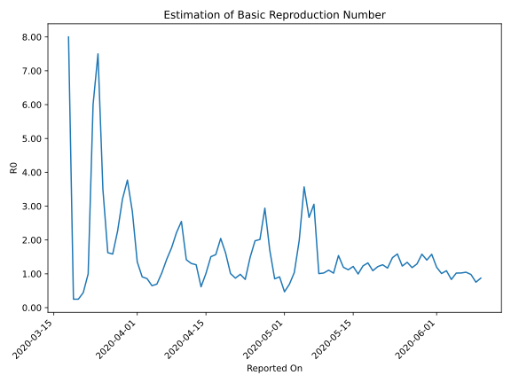

# Country Figures: Time Series for Basic Reproduction Number of Bolivia 

| Reported On | &Delta; Confirmed | Total &Delta; Confirmed First Interval | Total &Delta; Confirmed Second Interval | Estimated Basic Reproduction Number R0 | 
|-------------|-------------------|----------------------------------------|-----------------------------------------|---------------------------------------------------|
| 2020-05-07 | 195 |  657  |  215  |  3.06  | 
| 2020-05-06 | 84 |  573  |  215  |  2.67  | 
| 2020-05-05 | 121 |  571  |  160  |  3.57  | 
| 2020-05-04 | 87 |  484  |  244  |  1.98  | 
| 2020-05-03 | 365 |  215  |  207  |  1.04  | 
| 2020-05-02 | 0 |  215  |  311  |  0.69  | 
| 2020-05-01 | 119 |  160  |  341  |  0.47  | 
| 2020-04-30 | 0 |  244  |  268  |  0.91  | 
| 2020-04-29 | 96 |  207  |  243  |  0.85  | 
| 2020-04-28 | 0 |  311  |  183  |  1.70  | 
| 2020-04-27 | 64 |  341  |  116  |  2.94  | 
| 2020-04-26 | 84 |  268  |  133  |  2.02  | 
| 2020-04-25 | 59 |  243  |  123  |  1.98  | 
| 2020-04-24 | 104 |  183  |  123  |  1.49  | 
| 2020-04-23 | 94 |  116  |  139  |  0.83  | 
| 2020-04-22 | 11 |  133  |  135  |  0.99  | 
| 2020-04-21 | 34 |  123  |  141  |  0.87  | 
| 2020-04-20 | 44 |  123  |  122  |  1.01  | 
| 2020-04-19 | 27 |  139  |  86  |  1.62  | 
| 2020-04-18 | 28 |  135  |  66  |  2.05  | 
| 2020-04-17 | 24 |  141  |  90  |  1.57  | 
| 2020-04-16 | 44 |  122  |  81  |  1.51  | 
| 2020-04-15 | 43 |  86  |  85  |  1.01  | 
| 2020-04-14 | 24 |  66  |  107  |  0.62  | 
| 2020-04-13 | 30 |  90  |  71  |  1.27  | 
| 2020-04-12 | 25 |  81  |  62  |  1.31  | 
| 2020-04-11 | 7 |  85  |  60  |  1.42  | 
| 2020-04-10 | 4 |  107  |  42  |  2.55  | 
| 2020-04-09 | 54 |  71  |  32  |  2.22  | 
| 2020-04-08 | 16 |  62  |  35  |  1.77  | 
| 2020-04-07 | 11 |  60  |  42  |  1.43  | 
| 2020-04-06 | 26 |  42  |  41  |  1.02  | 
| 2020-04-05 | 18 |  32  |  46  |  0.70  | 
| 2020-04-04 | 7 |  35  |  54  |  0.65  | 
| 2020-04-03 | 9 |  42  |  49  |  0.86  | 
| 2020-04-02 | 8 |  41  |  45  |  0.91  | 
| 2020-04-01 | 8 |  46  |  34  |  1.35  | 
| 2020-03-31 | 10 |  54  |  19  |  2.84  | 
| 2020-03-30 | 16 |  49  |  13  |  3.77  | 
| 2020-03-29 | 7 |  45  |  14  |  3.21  | 
| 2020-03-28 | 13 |  34  |  15  |  2.27  | 
| 2020-03-27 | 18 |  19  |  12  |  1.58  | 
| 2020-03-26 | 11 |  13  |  8  |  1.62  | 
| 2020-03-25 | 3 |  14  |  4  |  3.50  | 
| 2020-03-24 | 2 |  15  |  2  |  7.50  | 
| 2020-03-23 | 3 |  12  |  2  |  6.00  | 
| 2020-03-22 | 5 |  8  |  8  |  1.00  | 
| 2020-03-21 | 4 |  4  |  9  |  0.44  | 
| 2020-03-20 | 3 |  2  |  8  |  0.25  | 
| 2020-03-19 | 0 |  2  |  8  |  0.25  | 
| 2020-03-18 | 1 |  8  |  1  |  8.00  | 
| 2020-03-17 | 0 |  9  |  None  |  None  | 
| 2020-03-16 | 1 |  8  |  None  |  None  | 
| 2020-03-15 | 0 |  8  |  None  |  None  | 
| 2020-03-14 | 7 |  1  |  None  |  None  | 
| 2020-03-13 | 1 |  None  |  None  |  None  | 
| 2020-03-12 | 0 |  None  |  None  |  None  | 
| 2020-03-11 | None |  None  |  None  |  None  | 

