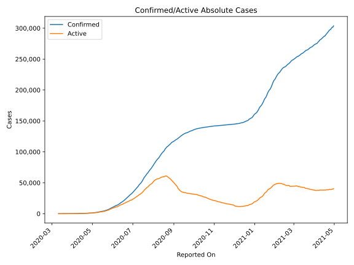
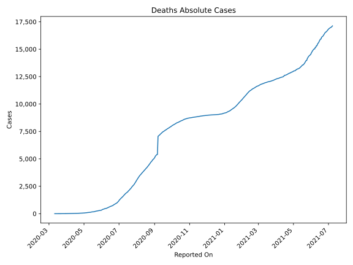
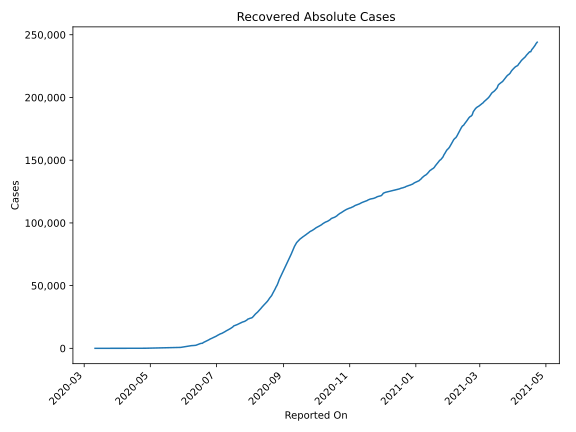
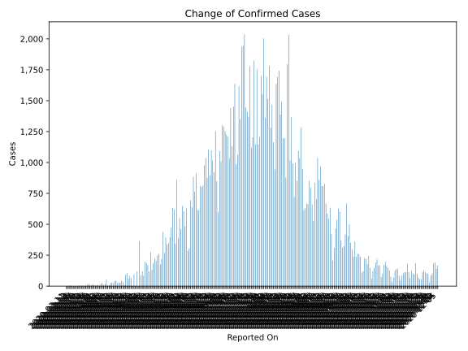
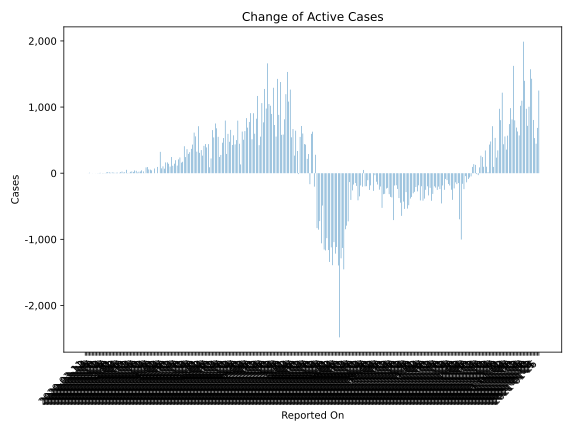
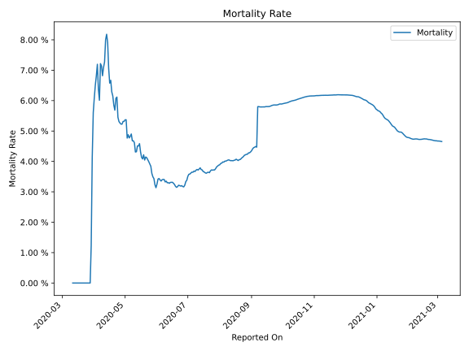

# Country Figures: Time Series for Bolivia 

| Reported On | Confirmed | Deaths | Recovered | Active | Mortality | &Delta; Confirmed | &Delta; Deaths | &Delta; Active | % Active of Population |
|-------------|-----------|--------|-----------|--------|-----------|-------------------|----------------|----------------|------------------------|
| 2020-03-31 | 107 | 6 | 0 | 101 |  5.61 %  | 10 | 2 | 8 |  0.001 %  | 
| 2020-03-30 | 97 | 4 | 0 | 93 |  4.12 %  | 16 | 3 | 13 |  0.001 %  | 
| 2020-03-29 | 81 | 1 | 0 | 80 |  1.23 %  | 7 | 1 | 6 |  0.001 %  | 
| 2020-03-28 | 74 | 0 | 0 | 74 |  None  | 13 | 0 | 13 |  0.001 %  | 
| 2020-03-27 | 61 | 0 | 0 | 61 |  None  | 18 | 0 | 18 |  0.001 %  | 
| 2020-03-26 | 43 | 0 | 0 | 43 |  None  | 11 | 0 | 11 |  0.000 %  | 
| 2020-03-25 | 32 | 0 | 0 | 32 |  None  | 3 | 0 | 3 |  0.000 %  | 
| 2020-03-24 | 29 | 0 | 0 | 29 |  None  | 2 | 0 | 2 |  0.000 %  | 
| 2020-03-23 | 27 | 0 | 0 | 27 |  None  | 3 | 0 | 3 |  0.000 %  | 
| 2020-03-22 | 24 | 0 | 0 | 24 |  None  | 5 | 0 | 5 |  0.000 %  | 
| 2020-03-21 | 19 | 0 | 0 | 19 |  None  | 4 | 0 | 4 |  0.000 %  | 
| 2020-03-20 | 15 | 0 | 0 | 15 |  None  | 3 | 0 | 3 |  0.000 %  | 
| 2020-03-19 | 12 | 0 | 0 | 12 |  None  | 0 | 0 | 0 |  0.000 %  | 
| 2020-03-18 | 12 | 0 | 0 | 12 |  None  | 1 | 0 | 1 |  0.000 %  | 
| 2020-03-17 | 11 | 0 | 0 | 11 |  None  | 0 | 0 | 0 |  0.000 %  | 
| 2020-03-16 | 11 | 0 | 0 | 11 |  None  | 1 | 0 | 1 |  0.000 %  | 
| 2020-03-15 | 10 | 0 | 0 | 10 |  None  | 0 | 0 | 0 |  0.000 %  | 
| 2020-03-14 | 10 | 0 | 0 | 10 |  None  | 7 | 0 | 7 |  0.000 %  | 
| 2020-03-13 | 3 | 0 | 0 | 3 |  None  | 1 | 0 | 1 |  0.000 %  | 
| 2020-03-12 | 2 | 0 | 0 | 2 |  None  | 0 | 0 | 0 |  0.000 %  | 
| 2020-03-11 | 2 | 0 | 0 | 2 |  None  | None | None | None |  0.000 %  | 

