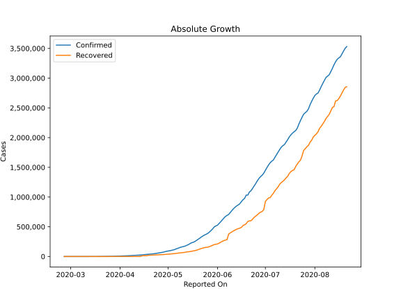
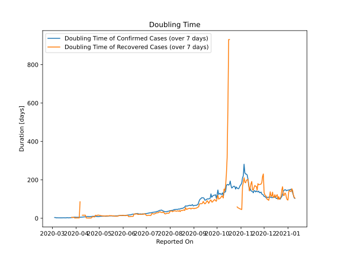

# Country Figures: Doubling Time of Infections for Brazil 

The doubling time below are calculated based on
* an exponential growth assumption
* for time difference of past seven (7) days.
The doubling time's unit is "days".

The first doubling time indicates the increase of confirmed (infected)
cases. There, the *higher* the number is, the better is to take control
of the disease.

The second doubling time indicates the increase of recovered (healed)
cases. There, the *lower* the number is, the better it is to take
control of the disease.

| Reported On | Confirmed | Doubling Time (Confirmed) | Recovered | Doubling Time (Recovered) |
|-------------|-----------|---------------------------|-----------|---------------------------|
| 2020-04-05 | 11130 |  5.4 days  | 127 |  1.9 days  | 
| 2020-04-04 | 10360 |  5.3 days  | 127 |  1.9 days  | 
| 2020-04-03 | 9056 |  5.3 days  | 127 |  1.9 days  | 
| 2020-04-02 | 8044 |  5.2 days  | 127 |  1.9 days  | 
| 2020-04-01 | 6836 |  5.3 days  | 127 |  1.5 days  | 
| 2020-03-31 | 5717 |  5.5 days  | 127 |  1.5 days  | 
| 2020-03-30 | 4579 |  5.9 days  | 120 |  1.5 days  | 
| 2020-03-29 | 4256 |  5.1 days  | 6 |  4.8 days  | 
| 2020-03-28 | 3904 |  4.0 days  | 6 |  4.8 days  | 
| 2020-03-27 | 3417 |  3.7 days  | 6 |  4.8 days  | 
| 2020-03-26 | 2985 |  3.4 days  | 6 |  4.8 days  | 
| 2020-03-25 | 2554 |  2.9 days  | 2 |  None  | 
| 2020-03-24 | 2247 |  2.8 days  | 2 |  None  | 
| 2020-03-23 | 1924 |  2.5 days  | 2 |  7.3 days  | 
| 2020-03-22 | 1546 |  2.5 days  | 2 |  None  | 
| 2020-03-21 | 1021 |  2.9 days  | 2 |  None  | 
| 2020-03-20 | 793 |  3.3 days  | 2 |  None  | 
| 2020-03-19 | 621 |  2.3 days  | 2 |  None  | 
| 2020-03-18 | 372 |  2.5 days  | 2 |  None  | 
| 2020-03-17 | 321 |  2.4 days  | 2 |  None  | 
| 2020-03-16 | 200 |  2.7 days  | 1 |  None  | 
| 2020-03-15 | 162 |  2.7 days  | 0 |  None  | 
| 2020-03-14 | 151 |  2.3 days  | 0 |  None  | 
| 2020-03-13 | 151 |  2.3 days  | 0 |  None  | 
| 2020-03-12 | 52 |  2.2 days  | 0 |  None  | 
| 2020-03-11 | 38 |  2.5 days  | 0 |  None  | 
| 2020-03-10 | 31 |  2.1 days  | 0 |  None  | 
| 2020-03-09 | 25 |  2.2 days  | 0 |  None  | 
| 2020-03-08 | 20 |  2.4 days  | 0 |  None  | 
| 2020-03-07 | 13 |  2.9 days  | 0 |  None  | 
| 2020-03-06 | 13 |  2.2 days  | 0 |  None  | 
| 2020-03-05 | 4 |  3.8 days  | 0 |  None  | 
| 2020-03-04 | 4 |  3.8 days  | 0 |  None  | 
| 2020-03-03 | 2 |  None  | 0 |  None  | 
| 2020-03-02 | 2 |  None  | 0 |  None  | 
| 2020-03-01 | 2 |  None  | 0 |  None  | 
| 2020-02-29 | 2 |  None  | 0 |  None  | 
| 2020-02-28 | 1 |  None  | 0 |  None  | 
| 2020-02-27 | 1 |  None  | 0 |  None  | 
| 2020-02-26 | 1 |  None  | 0 |  None  | 

