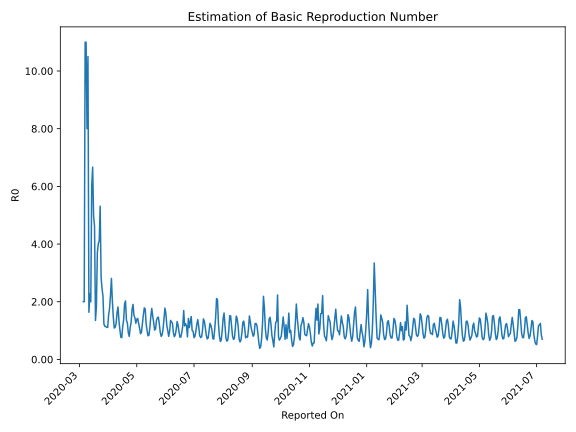

# Country Figures: Time Series for Basic Reproduction Number of Brazil 

| Reported On | &Delta; Confirmed | Total &Delta; Confirmed First Interval | Total &Delta; Confirmed Second Interval | Estimated Basic Reproduction Number R0 | 
|-------------|-------------------|----------------------------------------|-----------------------------------------|---------------------------------------------------|
| 2020-05-06 | 11156 |  23253  |  24756  |  0.94  | 
| 2020-05-05 | 6835 |  21433  |  24087  |  0.89  | 
| 2020-05-04 | 6794 |  22141  |  20361  |  1.09  | 
| 2020-05-03 | 4726 |  23865  |  19192  |  1.24  | 
| 2020-05-02 | 4898 |  24756  |  17410  |  1.42  | 
| 2020-05-01 | 5015 |  24087  |  17343  |  1.39  | 
| 2020-04-30 | 7502 |  20361  |  16245  |  1.25  | 
| 2020-04-29 | 6450 |  19192  |  13300  |  1.44  | 
| 2020-04-28 | 5789 |  17410  |  11382  |  1.53  | 
| 2020-04-27 | 4346 |  17343  |  9099  |  1.91  | 
| 2020-04-26 | 3776 |  16245  |  9397  |  1.73  | 
| 2020-04-25 | 5281 |  13300  |  10318  |  1.29  | 
| 2020-04-24 | 4007 |  11382  |  10334  |  1.10  | 
| 2020-04-23 | 4279 |  9099  |  11396  |  0.80  | 
| 2020-04-22 | 2678 |  9397  |  10252  |  0.92  | 
| 2020-04-21 | 2336 |  10318  |  8233  |  1.25  | 
| 2020-04-20 | 2089 |  10334  |  7593  |  1.36  | 
| 2020-04-19 | 1996 |  11396  |  5624  |  2.03  | 
| 2020-04-18 | 2976 |  10252  |  5338  |  1.92  | 
| 2020-04-17 | 3257 |  8233  |  6022  |  1.37  | 
| 2020-04-16 | 2105 |  7593  |  6693  |  1.13  | 
| 2020-04-15 | 3058 |  5624  |  7477  |  0.75  | 
| 2020-04-14 | 1832 |  5338  |  6962  |  0.77  | 
| 2020-04-13 | 1238 |  6022  |  5810  |  1.04  | 
| 2020-04-12 | 1465 |  6693  |  4978  |  1.34  | 
| 2020-04-11 | 1089 |  7477  |  4117  |  1.82  | 
| 2020-04-10 | 1546 |  6962  |  4294  |  1.62  | 
| 2020-04-09 | 1922 |  5810  |  4643  |  1.25  | 
| 2020-04-08 | 2136 |  4978  |  4477  |  1.11  | 
| 2020-04-07 | 1873 |  4117  |  3788  |  1.09  | 
| 2020-04-06 | 1031 |  4294  |  2932  |  1.46  | 
| 2020-04-05 | 770 |  4643  |  2300  |  2.02  | 
| 2020-04-04 | 1304 |  4477  |  1594  |  2.81  | 
| 2020-04-03 | 1012 |  3788  |  1702  |  2.23  | 
| 2020-04-02 | 1208 |  2932  |  1657  |  1.77  | 
| 2020-04-01 | 1119 |  2300  |  1493  |  1.54  | 
| 2020-03-31 | 1138 |  1594  |  1439  |  1.11  | 
| 2020-03-30 | 323 |  1702  |  1533  |  1.11  | 
| 2020-03-29 | 352 |  1657  |  1454  |  1.14  | 
| 2020-03-28 | 487 |  1493  |  1303  |  1.15  | 
| 2020-03-27 | 432 |  1439  |  1174  |  1.23  | 
| 2020-03-26 | 431 |  1533  |  700  |  2.19  | 
| 2020-03-25 | 307 |  1454  |  593  |  2.45  | 
| 2020-03-24 | 323 |  1303  |  459  |  2.84  | 
| 2020-03-23 | 378 |  1174  |  221  |  5.31  | 
| 2020-03-22 | 525 |  700  |  170  |  4.12  | 
| 2020-03-21 | 228 |  593  |  148  |  4.01  | 
| 2020-03-20 | 172 |  459  |  124  |  3.70  | 
| 2020-03-19 | 249 |  221  |  120  |  1.84  | 
| 2020-03-18 | 51 |  170  |  126  |  1.35  | 
| 2020-03-17 | 121 |  148  |  32  |  4.62  | 
| 2020-03-16 | 38 |  124  |  25  |  4.96  | 
| 2020-03-15 | 11 |  120  |  18  |  6.67  | 
| 2020-03-14 | 0 |  126  |  21  |  6.00  | 
| 2020-03-13 | 99 |  32  |  16  |  2.00  | 
| 2020-03-12 | 14 |  25  |  11  |  2.27  | 
| 2020-03-11 | 7 |  18  |  11  |  1.64  | 
| 2020-03-10 | 6 |  21  |  2  |  10.50  | 
| 2020-03-09 | 5 |  16  |  2  |  8.00  | 
| 2020-03-08 | 7 |  11  |  1  |  11.00  | 
| 2020-03-07 | 0 |  11  |  1  |  11.00  | 
| 2020-03-06 | 9 |  2  |  1  |  2.00  | 
| 2020-03-05 | 0 |  2  |  1  |  2.00  | 
| 2020-03-04 | 2 |  1  |  None  |  None  | 
| 2020-03-03 | 0 |  1  |  None  |  None  | 
| 2020-03-02 | 0 |  1  |  None  |  None  | 
| 2020-03-01 | 0 |  1  |  None  |  None  | 
| 2020-02-29 | 1 |  None  |  None  |  None  | 
| 2020-02-28 | 0 |  None  |  None  |  None  | 
| 2020-02-27 | 0 |  None  |  None  |  None  | 
| 2020-02-26 | None |  None  |  None  |  None  | 
| 2020-01-23 | None |  None  |  None  |  None  | 

