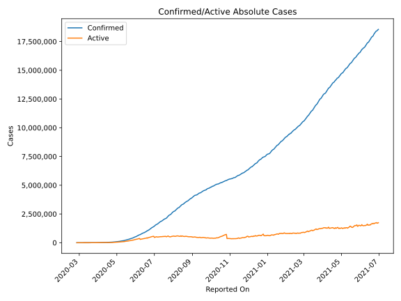
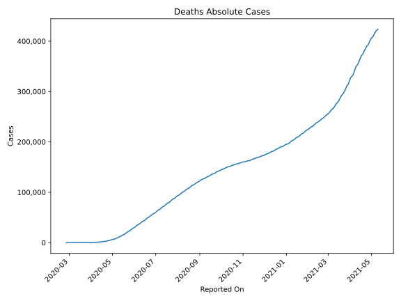
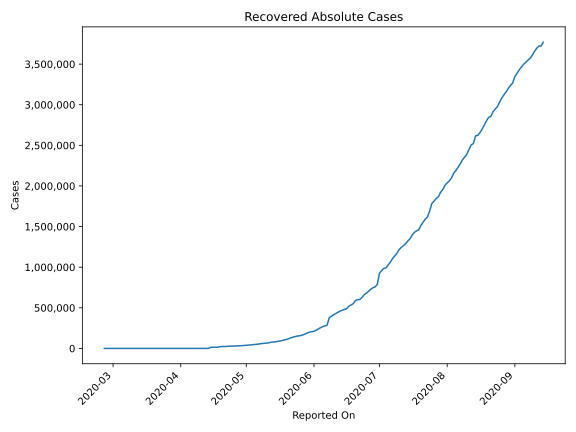
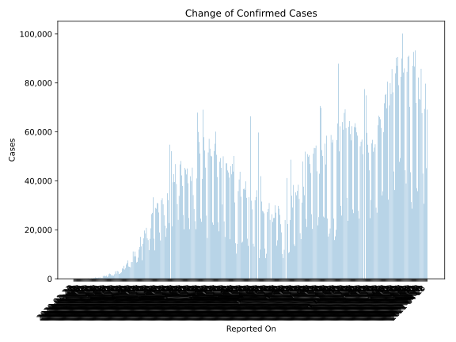
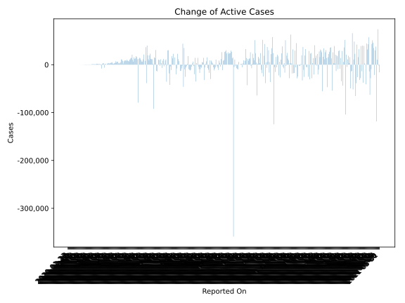
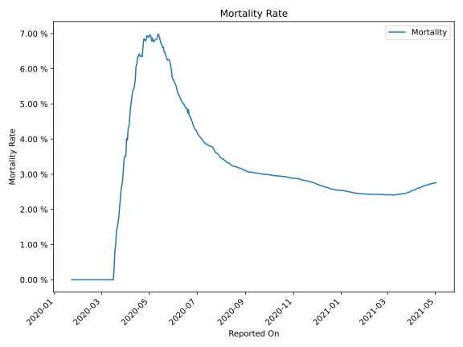

# Country Figures: Time Series for Brazil 

| Reported On | Confirmed | Deaths | Recovered | Active | Mortality | &Delta; Confirmed | &Delta; Deaths | &Delta; Recovered | &Delta; Active | % Active of Population |
|-------------|-----------|--------|-----------|--------|-----------|-------------------|----------------|-------------------|----------------|------------------------|
| 2020-04-12 | 22192 | 1223 | 173 | 20796 |  5.51 %  | 1465 | 99 | 0 | 1366 |  0.010 %  | 
| 2020-04-11 | 20727 | 1124 | 173 | 19430 |  5.42 %  | 1089 | 67 | 0 | 1022 |  0.009 %  | 
| 2020-04-10 | 19638 | 1057 | 173 | 18408 |  5.38 %  | 1546 | 107 | 0 | 1439 |  0.009 %  | 
| 2020-04-09 | 18092 | 950 | 173 | 16969 |  5.25 %  | 1922 | 131 | 46 | 1745 |  0.008 %  | 
| 2020-04-08 | 16170 | 819 | 127 | 15224 |  5.06 %  | 2136 | 133 | 0 | 2003 |  0.007 %  | 
| 2020-04-07 | 14034 | 686 | 127 | 13221 |  4.89 %  | 1873 | 122 | 0 | 1751 |  0.006 %  | 
| 2020-04-06 | 12161 | 564 | 127 | 11470 |  4.64 %  | 1031 | 78 | 0 | 953 |  0.005 %  | 
| 2020-04-05 | 11130 | 486 | 127 | 10517 |  4.37 %  | 770 | 41 | 0 | 729 |  0.005 %  | 
| 2020-04-04 | 10360 | 445 | 127 | 9788 |  4.30 %  | 1304 | 86 | 0 | 1218 |  0.005 %  | 
| 2020-04-03 | 9056 | 359 | 127 | 8570 |  3.96 %  | 1012 | 35 | 0 | 977 |  0.004 %  | 
| 2020-04-02 | 8044 | 324 | 127 | 7593 |  4.03 %  | 1208 | 84 | 0 | 1124 |  0.004 %  | 
| 2020-04-01 | 6836 | 240 | 127 | 6469 |  3.51 %  | 1119 | 39 | 0 | 1080 |  0.003 %  | 
| 2020-03-31 | 5717 | 201 | 127 | 5389 |  3.52 %  | 1138 | 42 | 7 | 1089 |  0.003 %  | 
| 2020-03-30 | 4579 | 159 | 120 | 4300 |  3.47 %  | 323 | 23 | 114 | 186 |  0.002 %  | 
| 2020-03-29 | 4256 | 136 | 6 | 4114 |  3.20 %  | 352 | 25 | 0 | 327 |  0.002 %  | 
| 2020-03-28 | 3904 | 111 | 6 | 3787 |  2.84 %  | 487 | 19 | 0 | 468 |  0.002 %  | 
| 2020-03-27 | 3417 | 92 | 6 | 3319 |  2.69 %  | 432 | 15 | 0 | 417 |  0.002 %  | 
| 2020-03-26 | 2985 | 77 | 6 | 2902 |  2.58 %  | 431 | 18 | 4 | 409 |  0.001 %  | 
| 2020-03-25 | 2554 | 59 | 2 | 2493 |  2.31 %  | 307 | 13 | 0 | 294 |  0.001 %  | 
| 2020-03-24 | 2247 | 46 | 2 | 2199 |  2.05 %  | 323 | 12 | 0 | 311 |  0.001 %  | 
| 2020-03-23 | 1924 | 34 | 2 | 1888 |  1.77 %  | 378 | 9 | 0 | 369 |  0.001 %  | 
| 2020-03-22 | 1546 | 25 | 2 | 1519 |  1.62 %  | 525 | 10 | 0 | 515 |  0.001 %  | 
| 2020-03-21 | 1021 | 15 | 2 | 1004 |  1.47 %  | 228 | 4 | 0 | 224 |  0.000 %  | 
| 2020-03-20 | 793 | 11 | 2 | 780 |  1.39 %  | 172 | 5 | 0 | 167 |  0.000 %  | 
| 2020-03-19 | 621 | 6 | 2 | 613 |  0.97 %  | 249 | 3 | 0 | 246 |  0.000 %  | 
| 2020-03-18 | 372 | 3 | 2 | 367 |  0.81 %  | 51 | 2 | 0 | 49 |  0.000 %  | 
| 2020-03-17 | 321 | 1 | 2 | 318 |  0.31 %  | 121 | 1 | 1 | 119 |  0.000 %  | 
| 2020-03-16 | 200 | 0 | 1 | 199 |  None  | 38 | 0 | 1 | 37 |  0.000 %  | 
| 2020-03-15 | 162 | 0 | 0 | 162 |  None  | 11 | 0 | 0 | 11 |  0.000 %  | 
| 2020-03-14 | 151 | 0 | 0 | 151 |  None  | 0 | 0 | 0 | 0 |  0.000 %  | 
| 2020-03-13 | 151 | 0 | 0 | 151 |  None  | 99 | 0 | 0 | 99 |  0.000 %  | 
| 2020-03-12 | 52 | 0 | 0 | 52 |  None  | 14 | 0 | 0 | 14 |  0.000 %  | 
| 2020-03-11 | 38 | 0 | 0 | 38 |  None  | 7 | 0 | 0 | 7 |  0.000 %  | 
| 2020-03-10 | 31 | 0 | 0 | 31 |  None  | 6 | 0 | 0 | 6 |  0.000 %  | 
| 2020-03-09 | 25 | 0 | 0 | 25 |  None  | 5 | 0 | 0 | 5 |  0.000 %  | 
| 2020-03-08 | 20 | 0 | 0 | 20 |  None  | 7 | 0 | 0 | 7 |  0.000 %  | 
| 2020-03-07 | 13 | 0 | 0 | 13 |  None  | 0 | 0 | 0 | 0 |  0.000 %  | 
| 2020-03-06 | 13 | 0 | 0 | 13 |  None  | 9 | 0 | 0 | 9 |  0.000 %  | 
| 2020-03-05 | 4 | 0 | 0 | 4 |  None  | 0 | 0 | 0 | 0 |  0.000 %  | 
| 2020-03-04 | 4 | 0 | 0 | 4 |  None  | 2 | 0 | 0 | 2 |  0.000 %  | 
| 2020-03-03 | 2 | 0 | 0 | 2 |  None  | 0 | 0 | 0 | 0 |  0.000 %  | 
| 2020-03-02 | 2 | 0 | 0 | 2 |  None  | 0 | 0 | 0 | 0 |  0.000 %  | 
| 2020-03-01 | 2 | 0 | 0 | 2 |  None  | 0 | 0 | 0 | 0 |  0.000 %  | 
| 2020-02-29 | 2 | 0 | 0 | 2 |  None  | 1 | 0 | 0 | 1 |  0.000 %  | 
| 2020-02-28 | 1 | 0 | 0 | 1 |  None  | 0 | 0 | 0 | 0 |  0.000 %  | 
| 2020-02-27 | 1 | 0 | 0 | 1 |  None  | 0 | 0 | 0 | 0 |  0.000 %  | 
| 2020-02-26 | 1 | 0 | 0 | 1 |  None  | None | None | None | None |  0.000 %  | 
| 2020-01-23 | None | None | None | None |  None  | None | None | None | None |  n/a  | 

