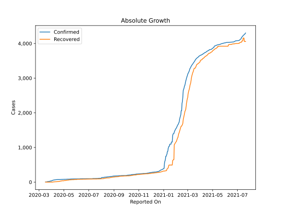
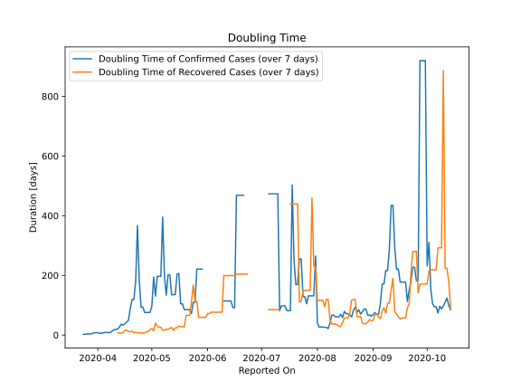

# Country Figures: Doubling Time of Infections for Barbados 

The doubling time below are calculated based on
* an exponential growth assumption
* for time difference of past seven (7) days.
The doubling time's unit is "days".

The first doubling time indicates the increase of confirmed (infected)
cases. There, the *higher* the number is, the better is to take control
of the disease.

The second doubling time indicates the increase of recovered (healed)
cases. There, the *lower* the number is, the better it is to take
control of the disease.

| Reported On | Confirmed | Doubling Time (Confirmed) | Recovered | Doubling Time (Recovered) |
|-------------|-----------|---------------------------|-----------|---------------------------|
| 2020-04-26 | 79 |  93.7 days  | 39 |  6.2 days  | 
| 2020-04-25 | 79 |  93.7 days  | 31 |  8.4 days  | 
| 2020-04-24 | 77 |  184.7 days  | 31 |  7.0 days  | 
| 2020-04-23 | 76 |  366.7 days  | 30 |  7.3 days  | 
| 2020-04-22 | 75 |  179.9 days  | 25 |  9.8 days  | 
| 2020-04-21 | 75 |  119.2 days  | 25 |  7.8 days  | 
| 2020-04-20 | 75 |  119.2 days  | 19 |  13.1 days  | 
| 2020-04-19 | 75 |  88.9 days  | 17 |  11.5 days  | 
| 2020-04-18 | 75 |  49.9 days  | 17 |  11.5 days  | 
| 2020-04-17 | 75 |  43.4 days  | 15 |  16.0 days  | 
| 2020-04-16 | 75 |  38.3 days  | 15 |  16.0 days  | 
| 2020-04-15 | 73 |  33.3 days  | 15 |  8.1 days  | 
| 2020-04-14 | 72 |  36.7 days  | 13 |  6.6 days  | 
| 2020-04-13 | 72 |  27.0 days  | 13 |  6.6 days  | 
| 2020-04-12 | 71 |  20.8 days  | 11 |  8.3 days  | 
| 2020-04-11 | 68 |  18.4 days  | 11 |  None  | 
| 2020-04-10 | 67 |  18.1 days  | 11 |  None  | 
| 2020-04-09 | 66 |  13.8 days  | 11 |  None  | 
| 2020-04-08 | 63 |  8.2 days  | 8 |  None  | 
| 2020-04-07 | 63 |  8.2 days  | 6 |  None  | 
| 2020-04-06 | 60 |  8.5 days  | 6 |  None  | 
| 2020-04-05 | 56 |  9.5 days  | 6 |  None  | 
| 2020-04-04 | 52 |  7.3 days  | 0 |  None  | 
| 2020-04-03 | 51 |  6.8 days  | 0 |  None  | 
| 2020-04-02 | 46 |  5.5 days  | 0 |  None  | 
| 2020-04-01 | 34 |  8.0 days  | 0 |  None  | 
| 2020-03-31 | 34 |  8.0 days  | 0 |  None  | 
| 2020-03-30 | 33 |  7.7 days  | 0 |  None  | 
| 2020-03-29 | 33 |  6.0 days  | 0 |  None  | 
| 2020-03-28 | 26 |  3.6 days  | 0 |  None  | 
| 2020-03-27 | 24 |  3.4 days  | 0 |  None  | 
| 2020-03-26 | 18 |  4.1 days  | 0 |  None  | 
| 2020-03-25 | 18 |  2.5 days  | 0 |  None  | 
| 2020-03-24 | 18 |  2.5 days  | 0 |  None  | 
| 2020-03-23 | 17 |  None  | 0 |  None  | 
| 2020-03-22 | 14 |  None  | 0 |  None  | 
| 2020-03-21 | 6 |  None  | 0 |  None  | 
| 2020-03-20 | 5 |  None  | 0 |  None  | 
| 2020-03-19 | 5 |  None  | 0 |  None  | 
| 2020-03-18 | 2 |  None  | 0 |  None  | 
| 2020-03-17 | 2 |  None  | 0 |  None  | 

