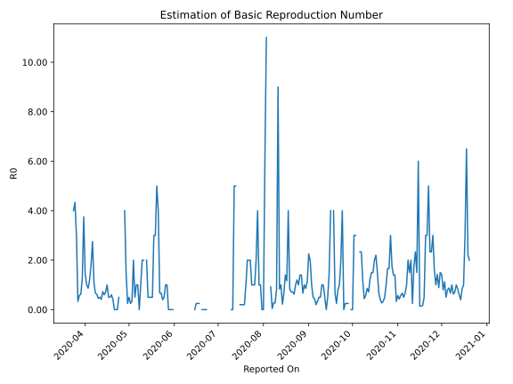

# Country Figures: Time Series for Basic Reproduction Number of Barbados 

| Reported On | &Delta; Confirmed | Total &Delta; Confirmed First Interval | Total &Delta; Confirmed Second Interval | Estimated Basic Reproduction Number R0 | 
|-------------|-------------------|----------------------------------------|-----------------------------------------|---------------------------------------------------|
| 2020-04-30 | 1 |  1  |  4  |  0.25  | 
| 2020-04-29 | 0 |  3  |  2  |  1.50  | 
| 2020-04-28 | 0 |  4  |  1  |  4.00  | 
| 2020-04-27 | 1 |  4  |  None  |  None  | 
| 2020-04-26 | 0 |  4  |  None  |  None  | 
| 2020-04-25 | 2 |  2  |  None  |  None  | 
| 2020-04-24 | 1 |  1  |  2  |  0.50  | 
| 2020-04-23 | 1 |  None  |  3  |  None  | 
| 2020-04-22 | 0 |  None  |  3  |  None  | 
| 2020-04-21 | 0 |  None  |  4  |  None  | 
| 2020-04-20 | 0 |  2  |  5  |  0.40  | 
| 2020-04-19 | 0 |  3  |  5  |  0.60  | 
| 2020-04-18 | 0 |  3  |  6  |  0.50  | 
| 2020-04-17 | 0 |  4  |  8  |  0.50  | 
| 2020-04-16 | 2 |  5  |  5  |  1.00  | 
| 2020-04-15 | 1 |  5  |  7  |  0.71  | 
| 2020-04-14 | 0 |  6  |  10  |  0.60  | 
| 2020-04-13 | 1 |  8  |  11  |  0.73  | 
| 2020-04-12 | 3 |  5  |  12  |  0.42  | 
| 2020-04-11 | 1 |  7  |  14  |  0.50  | 
| 2020-04-10 | 1 |  10  |  22  |  0.45  | 
| 2020-04-09 | 3 |  11  |  18  |  0.61  | 
| 2020-04-08 | 0 |  12  |  18  |  0.67  | 
| 2020-04-07 | 3 |  14  |  13  |  1.08  | 
| 2020-04-06 | 4 |  22  |  8  |  2.75  | 
| 2020-04-05 | 4 |  18  |  10  |  1.80  | 
| 2020-04-04 | 1 |  18  |  15  |  1.20  | 
| 2020-04-03 | 5 |  13  |  15  |  0.87  | 
| 2020-04-02 | 12 |  8  |  8  |  1.00  | 
| 2020-04-01 | 0 |  10  |  7  |  1.43  | 
| 2020-03-31 | 1 |  15  |  4  |  3.75  | 
| 2020-03-30 | 0 |  15  |  12  |  1.25  | 
| 2020-03-29 | 7 |  8  |  13  |  0.62  | 
| 2020-03-28 | 2 |  7  |  12  |  0.58  | 
| 2020-03-27 | 6 |  4  |  12  |  0.33  | 
| 2020-03-26 | 0 |  12  |  4  |  3.00  | 
| 2020-03-25 | 0 |  13  |  3  |  4.33  | 
| 2020-03-24 | 1 |  12  |  3  |  4.00  | 
| 2020-03-23 | 3 |  12  |  None  |  None  | 
| 2020-03-22 | 8 |  4  |  None  |  None  | 
| 2020-03-21 | 1 |  3  |  None  |  None  | 
| 2020-03-20 | 0 |  3  |  None  |  None  | 
| 2020-03-19 | 3 |  None  |  None  |  None  | 
| 2020-03-18 | 0 |  None  |  None  |  None  | 
| 2020-03-17 | None |  None  |  None  |  None  | 

