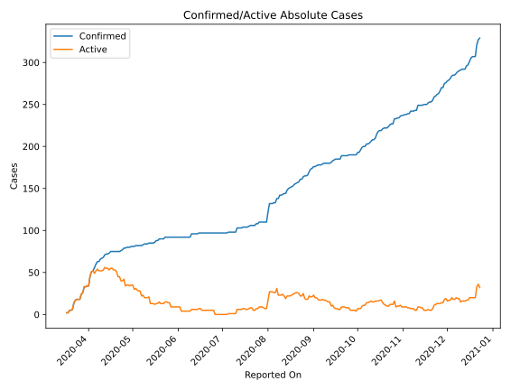
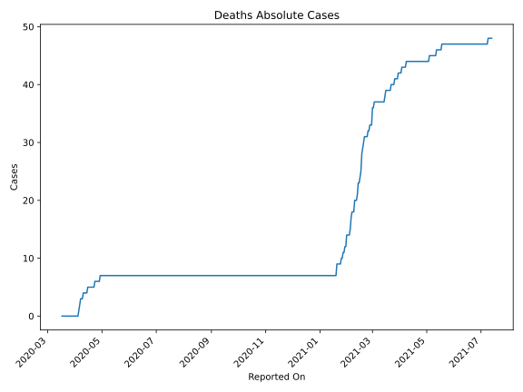
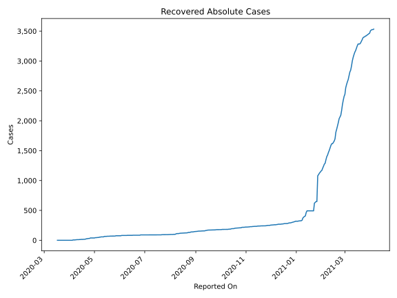
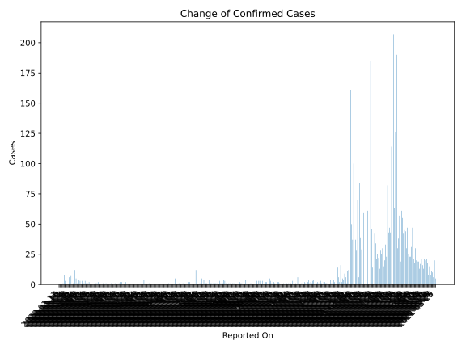
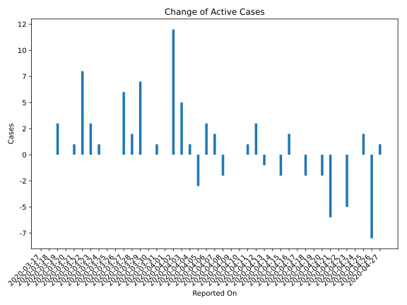
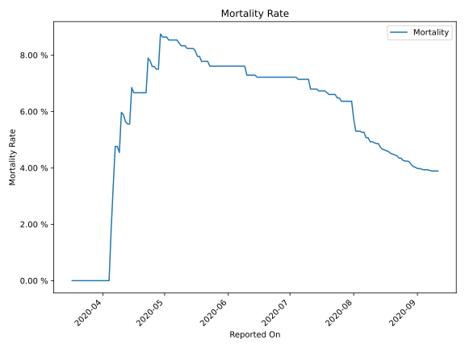

# Country Figures: Time Series for Barbados 

| Reported On | Confirmed | Deaths | Recovered | Active | Mortality | &Delta; Confirmed | &Delta; Deaths | &Delta; Recovered | &Delta; Active | % Active of Population |
|-------------|-----------|--------|-----------|--------|-----------|-------------------|----------------|-------------------|----------------|------------------------|
| 2020-05-01 | 81 | 7 | 39 | 35 |  8.64 %  | 0 | 0 | 0 | 0 |  0.012 %  | 
| 2020-04-30 | 81 | 7 | 39 | 35 |  8.64 %  | 1 | 0 | 0 | 1 |  0.012 %  | 
| 2020-04-29 | 80 | 7 | 39 | 34 |  8.75 %  | 0 | 1 | 0 | -1 |  0.012 %  | 
| 2020-04-28 | 80 | 6 | 39 | 35 |  7.50 %  | 0 | 0 | 0 | 0 |  0.012 %  | 
| 2020-04-27 | 80 | 6 | 39 | 35 |  7.50 %  | 1 | 0 | 0 | 1 |  0.012 %  | 
| 2020-04-26 | 79 | 6 | 39 | 34 |  7.59 %  | 0 | 0 | 8 | -8 |  0.012 %  | 
| 2020-04-25 | 79 | 6 | 31 | 42 |  7.59 %  | 2 | 0 | 0 | 2 |  0.015 %  | 
| 2020-04-24 | 77 | 6 | 31 | 40 |  7.79 %  | 1 | 0 | 1 | 0 |  0.014 %  | 
| 2020-04-23 | 76 | 6 | 30 | 40 |  7.89 %  | 1 | 1 | 5 | -5 |  0.014 %  | 
| 2020-04-22 | 75 | 5 | 25 | 45 |  6.67 %  | 0 | 0 | 0 | 0 |  0.016 %  | 
| 2020-04-21 | 75 | 5 | 25 | 45 |  6.67 %  | 0 | 0 | 6 | -6 |  0.016 %  | 
| 2020-04-20 | 75 | 5 | 19 | 51 |  6.67 %  | 0 | 0 | 2 | -2 |  0.018 %  | 
| 2020-04-19 | 75 | 5 | 17 | 53 |  6.67 %  | 0 | 0 | 0 | 0 |  0.018 %  | 
| 2020-04-18 | 75 | 5 | 17 | 53 |  6.67 %  | 0 | 0 | 2 | -2 |  0.018 %  | 
| 2020-04-17 | 75 | 5 | 15 | 55 |  6.67 %  | 0 | 0 | 0 | 0 |  0.019 %  | 
| 2020-04-16 | 75 | 5 | 15 | 55 |  6.67 %  | 2 | 0 | 0 | 2 |  0.019 %  | 
| 2020-04-15 | 73 | 5 | 15 | 53 |  6.85 %  | 1 | 1 | 2 | -2 |  0.018 %  | 
| 2020-04-14 | 72 | 4 | 13 | 55 |  5.56 %  | 0 | 0 | 0 | 0 |  0.019 %  | 
| 2020-04-13 | 72 | 4 | 13 | 55 |  5.56 %  | 1 | 0 | 2 | -1 |  0.019 %  | 
| 2020-04-12 | 71 | 4 | 11 | 56 |  5.63 %  | 3 | 0 | 0 | 3 |  0.020 %  | 
| 2020-04-11 | 68 | 4 | 11 | 53 |  5.88 %  | 1 | 0 | 0 | 1 |  0.018 %  | 
| 2020-04-10 | 67 | 4 | 11 | 52 |  5.97 %  | 1 | 1 | 0 | 0 |  0.018 %  | 
| 2020-04-09 | 66 | 3 | 11 | 52 |  4.55 %  | 3 | 0 | 3 | 0 |  0.018 %  | 
| 2020-04-08 | 63 | 3 | 8 | 52 |  4.76 %  | 0 | 0 | 2 | -2 |  0.018 %  | 
| 2020-04-07 | 63 | 3 | 6 | 54 |  4.76 %  | 3 | 1 | 0 | 2 |  0.019 %  | 
| 2020-04-06 | 60 | 2 | 6 | 52 |  3.33 %  | 4 | 1 | 0 | 3 |  0.018 %  | 
| 2020-04-05 | 56 | 1 | 6 | 49 |  1.79 %  | 4 | 1 | 6 | -3 |  0.017 %  | 
| 2020-04-04 | 52 | 0 | 0 | 52 |  None  | 1 | 0 | 0 | 1 |  0.018 %  | 
| 2020-04-03 | 51 | 0 | 0 | 51 |  None  | 5 | 0 | 0 | 5 |  0.018 %  | 
| 2020-04-02 | 46 | 0 | 0 | 46 |  None  | 12 | 0 | 0 | 12 |  0.016 %  | 
| 2020-04-01 | 34 | 0 | 0 | 34 |  None  | 0 | 0 | 0 | 0 |  0.012 %  | 
| 2020-03-31 | 34 | 0 | 0 | 34 |  None  | 1 | 0 | 0 | 1 |  0.012 %  | 
| 2020-03-30 | 33 | 0 | 0 | 33 |  None  | 0 | 0 | 0 | 0 |  0.012 %  | 
| 2020-03-29 | 33 | 0 | 0 | 33 |  None  | 7 | 0 | 0 | 7 |  0.012 %  | 
| 2020-03-28 | 26 | 0 | 0 | 26 |  None  | 2 | 0 | 0 | 2 |  0.009 %  | 
| 2020-03-27 | 24 | 0 | 0 | 24 |  None  | 6 | 0 | 0 | 6 |  0.008 %  | 
| 2020-03-26 | 18 | 0 | 0 | 18 |  None  | 0 | 0 | 0 | 0 |  0.006 %  | 
| 2020-03-25 | 18 | 0 | 0 | 18 |  None  | 0 | 0 | 0 | 0 |  0.006 %  | 
| 2020-03-24 | 18 | 0 | 0 | 18 |  None  | 1 | 0 | 0 | 1 |  0.006 %  | 
| 2020-03-23 | 17 | 0 | 0 | 17 |  None  | 3 | 0 | 0 | 3 |  0.006 %  | 
| 2020-03-22 | 14 | 0 | 0 | 14 |  None  | 8 | 0 | 0 | 8 |  0.005 %  | 
| 2020-03-21 | 6 | 0 | 0 | 6 |  None  | 1 | 0 | 0 | 1 |  0.002 %  | 
| 2020-03-20 | 5 | 0 | 0 | 5 |  None  | 0 | 0 | 0 | 0 |  0.002 %  | 
| 2020-03-19 | 5 | 0 | 0 | 5 |  None  | 3 | 0 | 0 | 3 |  0.002 %  | 
| 2020-03-18 | 2 | 0 | 0 | 2 |  None  | 0 | 0 | 0 | 0 |  0.001 %  | 
| 2020-03-17 | 2 | 0 | 0 | 2 |  None  | None | None | None | None |  0.001 %  | 

