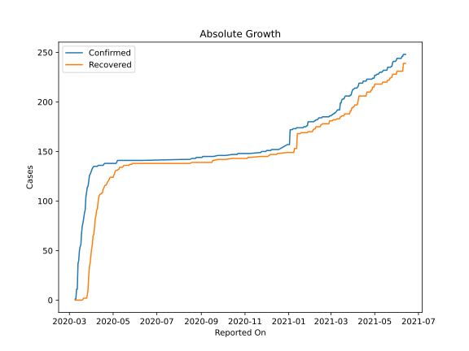

# Country Figures: Doubling Time of Infections for Brunei 

The doubling time below are calculated based on
* an exponential growth assumption
* for time difference of past seven (7) days.
The doubling time's unit is "days".

The first doubling time indicates the increase of confirmed (infected)
cases. There, the *higher* the number is, the better is to take control
of the disease.

The second doubling time indicates the increase of recovered (healed)
cases. There, the *lower* the number is, the better it is to take
control of the disease.

| Reported On | Confirmed | Doubling Time (Confirmed) | Recovered | Doubling Time (Recovered) |
|-------------|-----------|---------------------------|-----------|---------------------------|
| 2020-04-14 | 136 |  657.8 days  | 107 |  21.4 days  | 
| 2020-04-13 | 136 |  657.8 days  | 107 |  18.6 days  | 
| 2020-04-12 | 136 |  657.8 days  | 106 |  13.4 days  | 
| 2020-04-11 | 136 |  657.8 days  | 104 |  11.0 days  | 
| 2020-04-10 | 136 |  327.9 days  | 99 |  11.9 days  | 
| 2020-04-09 | 135 |  325.4 days  | 92 |  10.1 days  | 
| 2020-04-08 | 135 |  161.7 days  | 91 |  9.0 days  | 
| 2020-04-07 | 135 |  107.1 days  | 85 |  8.0 days  | 
| 2020-04-06 | 135 |  79.8 days  | 82 |  6.6 days  | 
| 2020-04-05 | 135 |  70.7 days  | 73 |  6.7 days  | 
| 2020-04-04 | 135 |  41.5 days  | 66 |  5.3 days  | 
| 2020-04-03 | 134 |  32.1 days  | 65 |  3.1 days  | 
| 2020-04-02 | 133 |  31.8 days  | 56 |  2.3 days  | 
| 2020-04-01 | 131 |  26.7 days  | 52 |  1.8 days  | 
| 2020-03-31 | 129 |  22.9 days  | 45 |  1.9 days  | 
| 2020-03-30 | 127 |  14.9 days  | 38 |  2.0 days  | 
| 2020-03-29 | 126 |  13.9 days  | 34 |  2.0 days  | 
| 2020-03-28 | 120 |  13.5 days  | 25 |  2.2 days  | 
| 2020-03-27 | 115 |  12.8 days  | 11 |  2.4 days  | 
| 2020-03-26 | 114 |  11.9 days  | 5 |  None  | 
| 2020-03-25 | 109 |  10.6 days  | 2 |  None  | 
| 2020-03-24 | 104 |  8.2 days  | 2 |  None  | 
| 2020-03-23 | 91 |  9.6 days  | 2 |  None  | 
| 2020-03-22 | 88 |  8.9 days  | 2 |  None  | 
| 2020-03-21 | 83 |  7.0 days  | 2 |  None  | 
| 2020-03-20 | 78 |  6.8 days  | 1 |  None  | 
| 2020-03-19 | 75 |  2.9 days  | 0 |  None  | 
| 2020-03-18 | 68 |  3.0 days  | 0 |  None  | 
| 2020-03-17 | 56 |  1.5 days  | 0 |  None  | 
| 2020-03-16 | 54 |  1.5 days  | 0 |  None  | 
| 2020-03-15 | 50 |  None  | 0 |  None  | 
| 2020-03-14 | 40 |  None  | 0 |  None  | 
| 2020-03-13 | 37 |  None  | 0 |  None  | 
| 2020-03-12 | 11 |  None  | 0 |  None  | 
| 2020-03-11 | 11 |  None  | 0 |  None  | 
| 2020-03-10 | 1 |  None  | 0 |  None  | 
| 2020-03-09 | 1 |  None  | 0 |  None  | 

