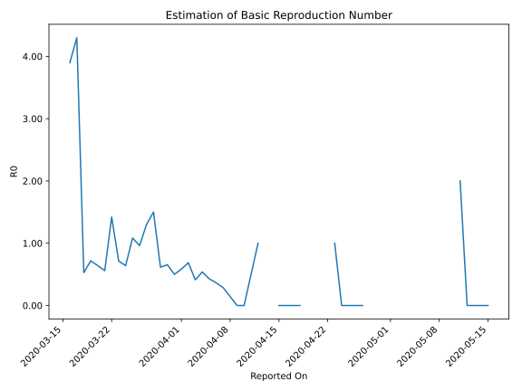

# Country Figures: Time Series for Basic Reproduction Number of Brunei 

| Reported On | &Delta; Confirmed | Total &Delta; Confirmed First Interval | Total &Delta; Confirmed Second Interval | Estimated Basic Reproduction Number R0 | 
|-------------|-------------------|----------------------------------------|-----------------------------------------|---------------------------------------------------|
| 2020-04-27 | 0 |  None  |  1  |  None  | 
| 2020-04-26 | 0 |  None  |  2  |  None  | 
| 2020-04-25 | 0 |  None  |  2  |  None  | 
| 2020-04-24 | 0 |  None  |  2  |  None  | 
| 2020-04-23 | 0 |  1  |  1  |  1.00  | 
| 2020-04-22 | 0 |  2  |  None  |  None  | 
| 2020-04-21 | 0 |  2  |  None  |  None  | 
| 2020-04-20 | 0 |  2  |  None  |  None  | 
| 2020-04-19 | 1 |  1  |  None  |  None  | 
| 2020-04-18 | 1 |  None  |  1  |  None  | 
| 2020-04-17 | 0 |  None  |  1  |  None  | 
| 2020-04-16 | 0 |  None  |  1  |  None  | 
| 2020-04-15 | 0 |  None  |  1  |  None  | 
| 2020-04-14 | 0 |  1  |  None  |  None  | 
| 2020-04-13 | 0 |  1  |  None  |  None  | 
| 2020-04-12 | 0 |  1  |  1  |  1.00  | 
| 2020-04-11 | 0 |  1  |  2  |  0.50  | 
| 2020-04-10 | 1 |  None  |  4  |  None  | 
| 2020-04-09 | 0 |  None  |  6  |  None  | 
| 2020-04-08 | 0 |  1  |  7  |  0.14  | 
| 2020-04-07 | 0 |  2  |  7  |  0.29  | 
| 2020-04-06 | 0 |  4  |  11  |  0.36  | 
| 2020-04-05 | 0 |  6  |  14  |  0.43  | 
| 2020-04-04 | 1 |  7  |  13  |  0.54  | 
| 2020-04-03 | 1 |  7  |  17  |  0.41  | 
| 2020-04-02 | 2 |  11  |  16  |  0.69  | 
| 2020-04-01 | 2 |  14  |  24  |  0.58  | 
| 2020-03-31 | 2 |  13  |  26  |  0.50  | 
| 2020-03-30 | 1 |  17  |  26  |  0.65  | 
| 2020-03-29 | 6 |  16  |  26  |  0.62  | 
| 2020-03-28 | 5 |  24  |  16  |  1.50  | 
| 2020-03-27 | 1 |  26  |  20  |  1.30  | 
| 2020-03-26 | 5 |  26  |  27  |  0.96  | 
| 2020-03-25 | 5 |  26  |  24  |  1.08  | 
| 2020-03-24 | 13 |  16  |  25  |  0.64  | 
| 2020-03-23 | 3 |  20  |  28  |  0.71  | 
| 2020-03-22 | 5 |  27  |  19  |  1.42  | 
| 2020-03-21 | 5 |  24  |  43  |  0.56  | 
| 2020-03-20 | 3 |  25  |  39  |  0.64  | 
| 2020-03-19 | 7 |  28  |  39  |  0.72  | 
| 2020-03-18 | 12 |  19  |  36  |  0.53  | 
| 2020-03-17 | 2 |  43  |  10  |  4.30  | 
| 2020-03-16 | 4 |  39  |  10  |  3.90  | 
| 2020-03-15 | 10 |  39  |  None  |  None  | 
| 2020-03-14 | 3 |  36  |  None  |  None  | 
| 2020-03-13 | 26 |  10  |  None  |  None  | 
| 2020-03-12 | 0 |  10  |  None  |  None  | 
| 2020-03-11 | 10 |  None  |  None  |  None  | 
| 2020-03-10 | 0 |  None  |  None  |  None  | 
| 2020-03-09 | None |  None  |  None  |  None  | 

