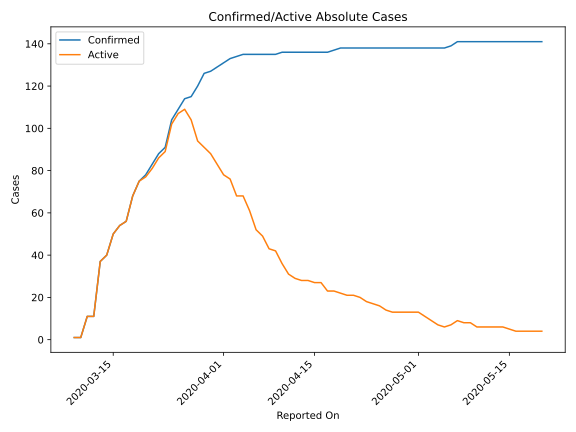
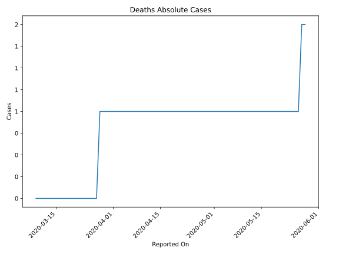
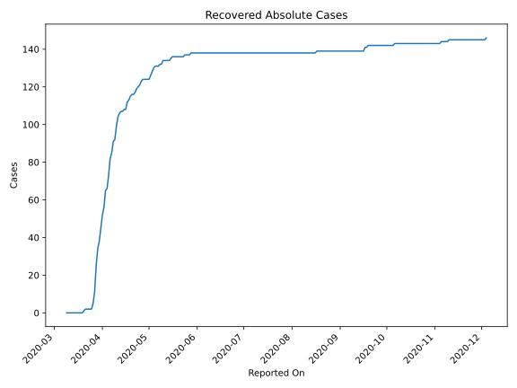
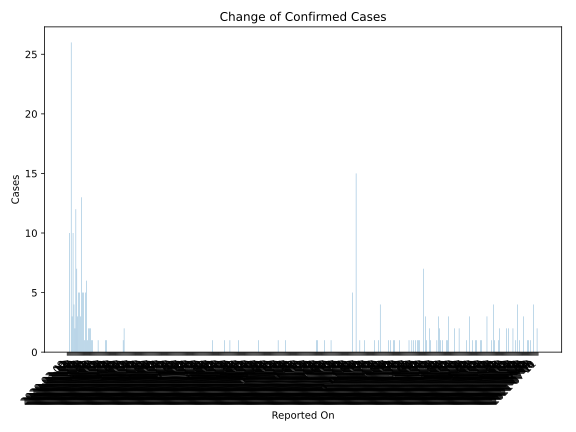
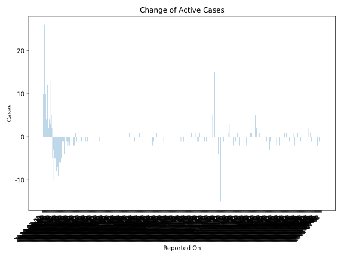
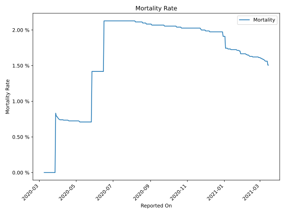

# Country Figures: Time Series for Brunei 

| Reported On | Confirmed | Deaths | Recovered | Active | Mortality | &Delta; Confirmed | &Delta; Deaths | &Delta; Recovered | &Delta; Active | % Active of Population |
|-------------|-----------|--------|-----------|--------|-----------|-------------------|----------------|-------------------|----------------|------------------------|
| 2020-05-03 | 138 | 1 | 128 | 9 |  0.72 %  | 0 | 0 | 2 | -2 |  0.002 %  | 
| 2020-05-02 | 138 | 1 | 126 | 11 |  0.72 %  | 0 | 0 | 2 | -2 |  0.003 %  | 
| 2020-05-01 | 138 | 1 | 124 | 13 |  0.72 %  | 0 | 0 | 0 | 0 |  0.003 %  | 
| 2020-04-30 | 138 | 1 | 124 | 13 |  0.72 %  | 0 | 0 | 0 | 0 |  0.003 %  | 
| 2020-04-29 | 138 | 1 | 124 | 13 |  0.72 %  | 0 | 0 | 0 | 0 |  0.003 %  | 
| 2020-04-28 | 138 | 1 | 124 | 13 |  0.72 %  | 0 | 0 | 0 | 0 |  0.003 %  | 
| 2020-04-27 | 138 | 1 | 124 | 13 |  0.72 %  | 0 | 0 | 1 | -1 |  0.003 %  | 
| 2020-04-26 | 138 | 1 | 123 | 14 |  0.72 %  | 0 | 0 | 2 | -2 |  0.003 %  | 
| 2020-04-25 | 138 | 1 | 121 | 16 |  0.72 %  | 0 | 0 | 1 | -1 |  0.004 %  | 
| 2020-04-24 | 138 | 1 | 120 | 17 |  0.72 %  | 0 | 0 | 1 | -1 |  0.004 %  | 
| 2020-04-23 | 138 | 1 | 119 | 18 |  0.72 %  | 0 | 0 | 2 | -2 |  0.004 %  | 
| 2020-04-22 | 138 | 1 | 117 | 20 |  0.72 %  | 0 | 0 | 1 | -1 |  0.005 %  | 
| 2020-04-21 | 138 | 1 | 116 | 21 |  0.72 %  | 0 | 0 | 0 | 0 |  0.005 %  | 
| 2020-04-20 | 138 | 1 | 116 | 21 |  0.72 %  | 0 | 0 | 1 | -1 |  0.005 %  | 
| 2020-04-19 | 138 | 1 | 115 | 22 |  0.72 %  | 1 | 0 | 2 | -1 |  0.005 %  | 
| 2020-04-18 | 137 | 1 | 113 | 23 |  0.73 %  | 1 | 0 | 1 | 0 |  0.005 %  | 
| 2020-04-17 | 136 | 1 | 112 | 23 |  0.74 %  | 0 | 0 | 4 | -4 |  0.005 %  | 
| 2020-04-16 | 136 | 1 | 108 | 27 |  0.74 %  | 0 | 0 | 0 | 0 |  0.006 %  | 
| 2020-04-15 | 136 | 1 | 108 | 27 |  0.74 %  | 0 | 0 | 1 | -1 |  0.006 %  | 
| 2020-04-14 | 136 | 1 | 107 | 28 |  0.74 %  | 0 | 0 | 0 | 0 |  0.007 %  | 
| 2020-04-13 | 136 | 1 | 107 | 28 |  0.74 %  | 0 | 0 | 1 | -1 |  0.007 %  | 
| 2020-04-12 | 136 | 1 | 106 | 29 |  0.74 %  | 0 | 0 | 2 | -2 |  0.007 %  | 
| 2020-04-11 | 136 | 1 | 104 | 31 |  0.74 %  | 0 | 0 | 5 | -5 |  0.007 %  | 
| 2020-04-10 | 136 | 1 | 99 | 36 |  0.74 %  | 1 | 0 | 7 | -6 |  0.008 %  | 
| 2020-04-09 | 135 | 1 | 92 | 42 |  0.74 %  | 0 | 0 | 1 | -1 |  0.010 %  | 
| 2020-04-08 | 135 | 1 | 91 | 43 |  0.74 %  | 0 | 0 | 6 | -6 |  0.010 %  | 
| 2020-04-07 | 135 | 1 | 85 | 49 |  0.74 %  | 0 | 0 | 3 | -3 |  0.011 %  | 
| 2020-04-06 | 135 | 1 | 82 | 52 |  0.74 %  | 0 | 0 | 9 | -9 |  0.012 %  | 
| 2020-04-05 | 135 | 1 | 73 | 61 |  0.74 %  | 0 | 0 | 7 | -7 |  0.014 %  | 
| 2020-04-04 | 135 | 1 | 66 | 68 |  0.74 %  | 1 | 0 | 1 | 0 |  0.016 %  | 
| 2020-04-03 | 134 | 1 | 65 | 68 |  0.75 %  | 1 | 0 | 9 | -8 |  0.016 %  | 
| 2020-04-02 | 133 | 1 | 56 | 76 |  0.75 %  | 2 | 0 | 4 | -2 |  0.018 %  | 
| 2020-04-01 | 131 | 1 | 52 | 78 |  0.76 %  | 2 | 0 | 7 | -5 |  0.018 %  | 
| 2020-03-31 | 129 | 1 | 45 | 83 |  0.78 %  | 2 | 0 | 7 | -5 |  0.019 %  | 
| 2020-03-30 | 127 | 1 | 38 | 88 |  0.79 %  | 1 | 0 | 4 | -3 |  0.021 %  | 
| 2020-03-29 | 126 | 1 | 34 | 91 |  0.79 %  | 6 | 0 | 9 | -3 |  0.021 %  | 
| 2020-03-28 | 120 | 1 | 25 | 94 |  0.83 %  | 5 | 1 | 14 | -10 |  0.022 %  | 
| 2020-03-27 | 115 | 0 | 11 | 104 |  None  | 1 | 0 | 6 | -5 |  0.024 %  | 
| 2020-03-26 | 114 | 0 | 5 | 109 |  None  | 5 | 0 | 3 | 2 |  0.025 %  | 
| 2020-03-25 | 109 | 0 | 2 | 107 |  None  | 5 | 0 | 0 | 5 |  0.025 %  | 
| 2020-03-24 | 104 | 0 | 2 | 102 |  None  | 13 | 0 | 0 | 13 |  0.024 %  | 
| 2020-03-23 | 91 | 0 | 2 | 89 |  None  | 3 | 0 | 0 | 3 |  0.021 %  | 
| 2020-03-22 | 88 | 0 | 2 | 86 |  None  | 5 | 0 | 0 | 5 |  0.020 %  | 
| 2020-03-21 | 83 | 0 | 2 | 81 |  None  | 5 | 0 | 1 | 4 |  0.019 %  | 
| 2020-03-20 | 78 | 0 | 1 | 77 |  None  | 3 | 0 | 1 | 2 |  0.018 %  | 
| 2020-03-19 | 75 | 0 | 0 | 75 |  None  | 7 | 0 | 0 | 7 |  0.017 %  | 
| 2020-03-18 | 68 | 0 | 0 | 68 |  None  | 12 | 0 | 0 | 12 |  0.016 %  | 
| 2020-03-17 | 56 | 0 | 0 | 56 |  None  | 2 | 0 | 0 | 2 |  0.013 %  | 
| 2020-03-16 | 54 | 0 | 0 | 54 |  None  | 4 | 0 | 0 | 4 |  0.013 %  | 
| 2020-03-15 | 50 | 0 | 0 | 50 |  None  | 10 | 0 | 0 | 10 |  0.012 %  | 
| 2020-03-14 | 40 | 0 | 0 | 40 |  None  | 3 | 0 | 0 | 3 |  0.009 %  | 
| 2020-03-13 | 37 | 0 | 0 | 37 |  None  | 26 | 0 | 0 | 26 |  0.009 %  | 
| 2020-03-12 | 11 | 0 | 0 | 11 |  None  | 0 | 0 | 0 | 0 |  0.003 %  | 
| 2020-03-11 | 11 | 0 | 0 | 11 |  None  | 10 | 0 | 0 | 10 |  0.003 %  | 
| 2020-03-10 | 1 | 0 | 0 | 1 |  None  | 0 | 0 | 0 | 0 |  0.000 %  | 
| 2020-03-09 | 1 | 0 | 0 | 1 |  None  | None | None | None | None |  0.000 %  | 

