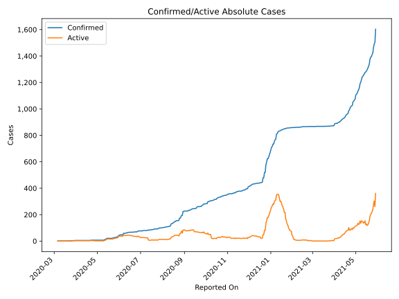
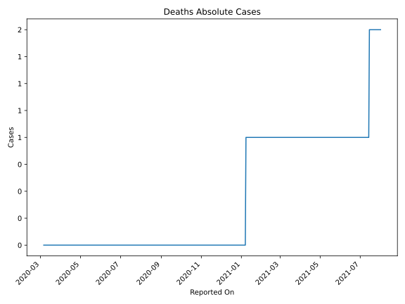
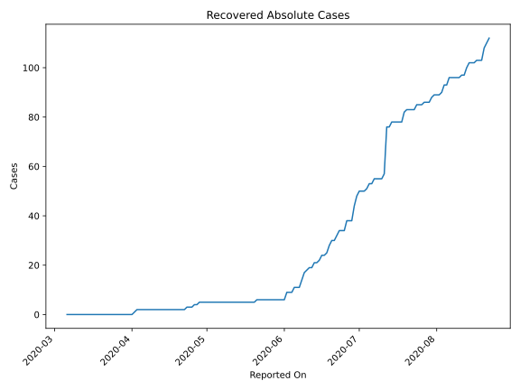
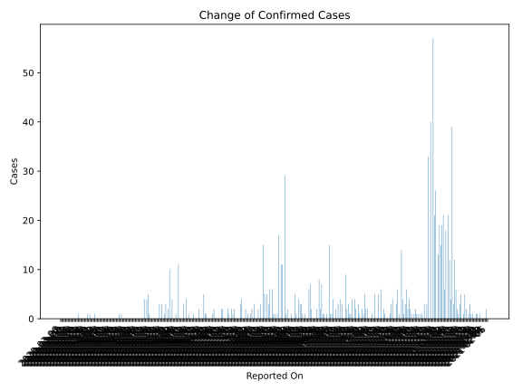
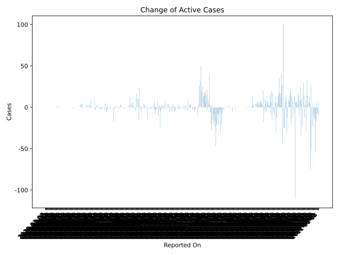
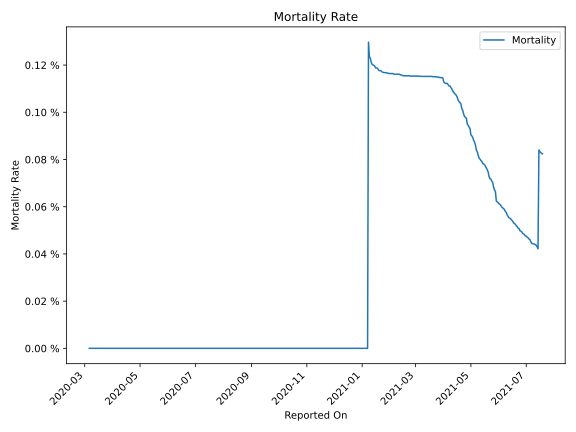

# Country Figures: Time Series for Bhutan 

| Reported On | Confirmed | Deaths | Recovered | Active | Mortality | &Delta; Confirmed | &Delta; Deaths | &Delta; Recovered | &Delta; Active | % Active of Population |
|-------------|-----------|--------|-----------|--------|-----------|-------------------|----------------|-------------------|----------------|------------------------|
| 2020-05-05 | 7 | 0 | 5 | 2 |  None  | 0 | 0 | 0 | 0 |  0.000 %  | 
| 2020-05-04 | 7 | 0 | 5 | 2 |  None  | 0 | 0 | 0 | 0 |  0.000 %  | 
| 2020-05-03 | 7 | 0 | 5 | 2 |  None  | 0 | 0 | 0 | 0 |  0.000 %  | 
| 2020-05-02 | 7 | 0 | 5 | 2 |  None  | 0 | 0 | 0 | 0 |  0.000 %  | 
| 2020-05-01 | 7 | 0 | 5 | 2 |  None  | 0 | 0 | 0 | 0 |  0.000 %  | 
| 2020-04-30 | 7 | 0 | 5 | 2 |  None  | 0 | 0 | 0 | 0 |  0.000 %  | 
| 2020-04-29 | 7 | 0 | 5 | 2 |  None  | 0 | 0 | 0 | 0 |  0.000 %  | 
| 2020-04-28 | 7 | 0 | 5 | 2 |  None  | 0 | 0 | 1 | -1 |  0.000 %  | 
| 2020-04-27 | 7 | 0 | 4 | 3 |  None  | 0 | 0 | 0 | 0 |  0.000 %  | 
| 2020-04-26 | 7 | 0 | 4 | 3 |  None  | 0 | 0 | 1 | -1 |  0.000 %  | 
| 2020-04-25 | 7 | 0 | 3 | 4 |  None  | 0 | 0 | 0 | 0 |  0.001 %  | 
| 2020-04-24 | 7 | 0 | 3 | 4 |  None  | 0 | 0 | 0 | 0 |  0.001 %  | 
| 2020-04-23 | 7 | 0 | 3 | 4 |  None  | 1 | 0 | 1 | 0 |  0.001 %  | 
| 2020-04-22 | 6 | 0 | 2 | 4 |  None  | 0 | 0 | 0 | 0 |  0.001 %  | 
| 2020-04-21 | 6 | 0 | 2 | 4 |  None  | 1 | 0 | 0 | 1 |  0.001 %  | 
| 2020-04-20 | 5 | 0 | 2 | 3 |  None  | 0 | 0 | 0 | 0 |  0.000 %  | 
| 2020-04-19 | 5 | 0 | 2 | 3 |  None  | 0 | 0 | 0 | 0 |  0.000 %  | 
| 2020-04-18 | 5 | 0 | 2 | 3 |  None  | 0 | 0 | 0 | 0 |  0.000 %  | 
| 2020-04-17 | 5 | 0 | 2 | 3 |  None  | 0 | 0 | 0 | 0 |  0.000 %  | 
| 2020-04-16 | 5 | 0 | 2 | 3 |  None  | 0 | 0 | 0 | 0 |  0.000 %  | 
| 2020-04-15 | 5 | 0 | 2 | 3 |  None  | 0 | 0 | 0 | 0 |  0.000 %  | 
| 2020-04-14 | 5 | 0 | 2 | 3 |  None  | 0 | 0 | 0 | 0 |  0.000 %  | 
| 2020-04-13 | 5 | 0 | 2 | 3 |  None  | 0 | 0 | 0 | 0 |  0.000 %  | 
| 2020-04-12 | 5 | 0 | 2 | 3 |  None  | 0 | 0 | 0 | 0 |  0.000 %  | 
| 2020-04-11 | 5 | 0 | 2 | 3 |  None  | 0 | 0 | 0 | 0 |  0.000 %  | 
| 2020-04-10 | 5 | 0 | 2 | 3 |  None  | 0 | 0 | 0 | 0 |  0.000 %  | 
| 2020-04-09 | 5 | 0 | 2 | 3 |  None  | 0 | 0 | 0 | 0 |  0.000 %  | 
| 2020-04-08 | 5 | 0 | 2 | 3 |  None  | 0 | 0 | 0 | 0 |  0.000 %  | 
| 2020-04-07 | 5 | 0 | 2 | 3 |  None  | 0 | 0 | 0 | 0 |  0.000 %  | 
| 2020-04-06 | 5 | 0 | 2 | 3 |  None  | 0 | 0 | 0 | 0 |  0.000 %  | 
| 2020-04-05 | 5 | 0 | 2 | 3 |  None  | 0 | 0 | 0 | 0 |  0.000 %  | 
| 2020-04-04 | 5 | 0 | 2 | 3 |  None  | 0 | 0 | 0 | 0 |  0.000 %  | 
| 2020-04-03 | 5 | 0 | 2 | 3 |  None  | 0 | 0 | 1 | -1 |  0.000 %  | 
| 2020-04-02 | 5 | 0 | 1 | 4 |  None  | 1 | 0 | 1 | 0 |  0.001 %  | 
| 2020-04-01 | 4 | 0 | 0 | 4 |  None  | 0 | 0 | 0 | 0 |  0.001 %  | 
| 2020-03-31 | 4 | 0 | 0 | 4 |  None  | 0 | 0 | 0 | 0 |  0.001 %  | 
| 2020-03-30 | 4 | 0 | 0 | 4 |  None  | 0 | 0 | 0 | 0 |  0.001 %  | 
| 2020-03-29 | 4 | 0 | 0 | 4 |  None  | 1 | 0 | 0 | 1 |  0.001 %  | 
| 2020-03-28 | 3 | 0 | 0 | 3 |  None  | 0 | 0 | 0 | 0 |  0.000 %  | 
| 2020-03-27 | 3 | 0 | 0 | 3 |  None  | 1 | 0 | 0 | 1 |  0.000 %  | 
| 2020-03-26 | 2 | 0 | 0 | 2 |  None  | 0 | 0 | 0 | 0 |  0.000 %  | 
| 2020-03-25 | 2 | 0 | 0 | 2 |  None  | 0 | 0 | 0 | 0 |  0.000 %  | 
| 2020-03-24 | 2 | 0 | 0 | 2 |  None  | 0 | 0 | 0 | 0 |  0.000 %  | 
| 2020-03-23 | 2 | 0 | 0 | 2 |  None  | 0 | 0 | 0 | 0 |  0.000 %  | 
| 2020-03-22 | 2 | 0 | 0 | 2 |  None  | 0 | 0 | 0 | 0 |  0.000 %  | 
| 2020-03-21 | 2 | 0 | 0 | 2 |  None  | 0 | 0 | 0 | 0 |  0.000 %  | 
| 2020-03-20 | 2 | 0 | 0 | 2 |  None  | 1 | 0 | 0 | 1 |  0.000 %  | 
| 2020-03-19 | 1 | 0 | 0 | 1 |  None  | 0 | 0 | 0 | 0 |  0.000 %  | 
| 2020-03-18 | 1 | 0 | 0 | 1 |  None  | 0 | 0 | 0 | 0 |  0.000 %  | 
| 2020-03-17 | 1 | 0 | 0 | 1 |  None  | 0 | 0 | 0 | 0 |  0.000 %  | 
| 2020-03-16 | 1 | 0 | 0 | 1 |  None  | 0 | 0 | 0 | 0 |  0.000 %  | 
| 2020-03-15 | 1 | 0 | 0 | 1 |  None  | 0 | 0 | 0 | 0 |  0.000 %  | 
| 2020-03-14 | 1 | 0 | 0 | 1 |  None  | 0 | 0 | 0 | 0 |  0.000 %  | 
| 2020-03-13 | 1 | 0 | 0 | 1 |  None  | 0 | 0 | 0 | 0 |  0.000 %  | 
| 2020-03-12 | 1 | 0 | 0 | 1 |  None  | 0 | 0 | 0 | 0 |  0.000 %  | 
| 2020-03-11 | 1 | 0 | 0 | 1 |  None  | 0 | 0 | 0 | 0 |  0.000 %  | 
| 2020-03-10 | 1 | 0 | 0 | 1 |  None  | 0 | 0 | 0 | 0 |  0.000 %  | 
| 2020-03-09 | 1 | 0 | 0 | 1 |  None  | 0 | 0 | 0 | 0 |  0.000 %  | 
| 2020-03-08 | 1 | 0 | 0 | 1 |  None  | 0 | 0 | 0 | 0 |  0.000 %  | 
| 2020-03-07 | 1 | 0 | 0 | 1 |  None  | 0 | 0 | 0 | 0 |  0.000 %  | 
| 2020-03-06 | 1 | 0 | 0 | 1 |  None  | None | None | None | None |  0.000 %  | 

