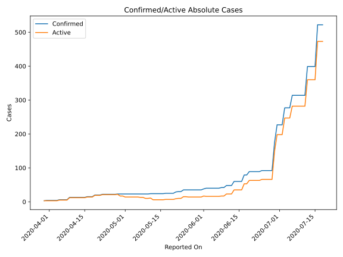
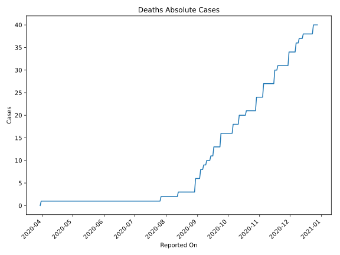
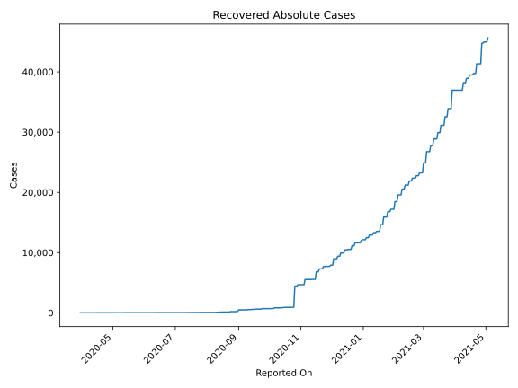
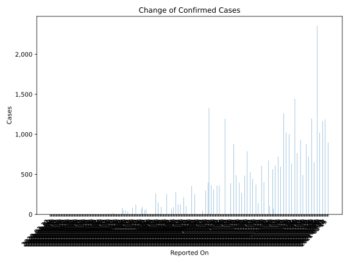
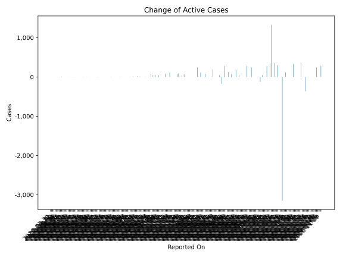
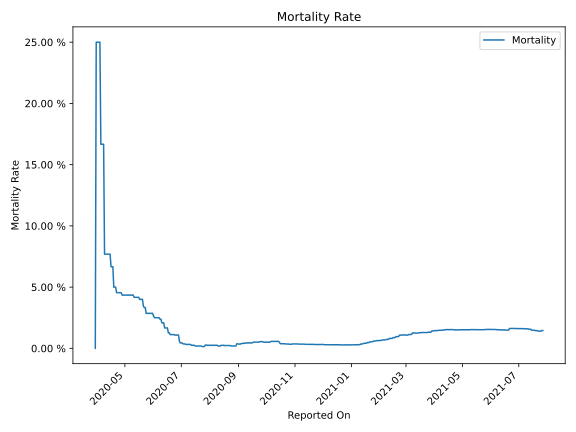

# Country Figures: Time Series for Botswana 

| Reported On | Confirmed | Deaths | Recovered | Active | Mortality | &Delta; Confirmed | &Delta; Deaths | &Delta; Recovered | &Delta; Active | % Active of Population |
|-------------|-----------|--------|-----------|--------|-----------|-------------------|----------------|-------------------|----------------|------------------------|
| 2020-05-08 | 23 | 1 | 9 | 13 |  4.35 %  | 0 | 0 | 0 | 0 |  0.001 %  | 
| 2020-05-07 | 23 | 1 | 9 | 13 |  4.35 %  | 0 | 0 | 1 | -1 |  0.001 %  | 
| 2020-05-06 | 23 | 1 | 8 | 14 |  4.35 %  | 0 | 0 | 0 | 0 |  0.001 %  | 
| 2020-05-05 | 23 | 1 | 8 | 14 |  4.35 %  | 0 | 0 | 0 | 0 |  0.001 %  | 
| 2020-05-04 | 23 | 1 | 8 | 14 |  4.35 %  | 0 | 0 | 0 | 0 |  0.001 %  | 
| 2020-05-03 | 23 | 1 | 8 | 14 |  4.35 %  | 0 | 0 | 0 | 0 |  0.001 %  | 
| 2020-05-02 | 23 | 1 | 8 | 14 |  4.35 %  | 0 | 0 | 0 | 0 |  0.001 %  | 
| 2020-05-01 | 23 | 1 | 8 | 14 |  4.35 %  | 0 | 0 | 3 | -3 |  0.001 %  | 
| 2020-04-30 | 23 | 1 | 5 | 17 |  4.35 %  | 0 | 0 | 0 | 0 |  0.001 %  | 
| 2020-04-29 | 23 | 1 | 5 | 17 |  4.35 %  | 0 | 0 | 5 | -5 |  0.001 %  | 
| 2020-04-28 | 23 | 1 | 0 | 22 |  4.35 %  | 1 | 0 | 0 | 1 |  0.001 %  | 
| 2020-04-27 | 22 | 1 | 0 | 21 |  4.55 %  | 0 | 0 | 0 | 0 |  0.001 %  | 
| 2020-04-26 | 22 | 1 | 0 | 21 |  4.55 %  | 0 | 0 | 0 | 0 |  0.001 %  | 
| 2020-04-25 | 22 | 1 | 0 | 21 |  4.55 %  | 0 | 0 | 0 | 0 |  0.001 %  | 
| 2020-04-24 | 22 | 1 | 0 | 21 |  4.55 %  | 0 | 0 | 0 | 0 |  0.001 %  | 
| 2020-04-23 | 22 | 1 | 0 | 21 |  4.55 %  | 0 | 0 | 0 | 0 |  0.001 %  | 
| 2020-04-22 | 22 | 1 | 0 | 21 |  4.55 %  | 2 | 0 | 0 | 2 |  0.001 %  | 
| 2020-04-21 | 20 | 1 | 0 | 19 |  5.00 %  | 0 | 0 | 0 | 0 |  0.001 %  | 
| 2020-04-20 | 20 | 1 | 0 | 19 |  5.00 %  | 0 | 0 | 0 | 0 |  0.001 %  | 
| 2020-04-19 | 20 | 1 | 0 | 19 |  5.00 %  | 5 | 0 | 0 | 5 |  0.001 %  | 
| 2020-04-18 | 15 | 1 | 0 | 14 |  6.67 %  | 0 | 0 | 0 | 0 |  0.001 %  | 
| 2020-04-17 | 15 | 1 | 0 | 14 |  6.67 %  | 0 | 0 | 0 | 0 |  0.001 %  | 
| 2020-04-16 | 15 | 1 | 0 | 14 |  6.67 %  | 2 | 0 | 0 | 2 |  0.001 %  | 
| 2020-04-15 | 13 | 1 | 0 | 12 |  7.69 %  | 0 | 0 | 0 | 0 |  0.001 %  | 
| 2020-04-14 | 13 | 1 | 0 | 12 |  7.69 %  | 0 | 0 | 0 | 0 |  0.001 %  | 
| 2020-04-13 | 13 | 1 | 0 | 12 |  7.69 %  | 0 | 0 | 0 | 0 |  0.001 %  | 
| 2020-04-12 | 13 | 1 | 0 | 12 |  7.69 %  | 0 | 0 | 0 | 0 |  0.001 %  | 
| 2020-04-11 | 13 | 1 | 0 | 12 |  7.69 %  | 0 | 0 | 0 | 0 |  0.001 %  | 
| 2020-04-10 | 13 | 1 | 0 | 12 |  7.69 %  | 0 | 0 | 0 | 0 |  0.001 %  | 
| 2020-04-09 | 13 | 1 | 0 | 12 |  7.69 %  | 7 | 0 | 0 | 7 |  0.001 %  | 
| 2020-04-08 | 6 | 1 | 0 | 5 |  16.67 %  | 0 | 0 | 0 | 0 |  0.000 %  | 
| 2020-04-07 | 6 | 1 | 0 | 5 |  16.67 %  | 0 | 0 | 0 | 0 |  0.000 %  | 
| 2020-04-06 | 6 | 1 | 0 | 5 |  16.67 %  | 0 | 0 | 0 | 0 |  0.000 %  | 
| 2020-04-05 | 6 | 1 | 0 | 5 |  16.67 %  | 2 | 0 | 0 | 2 |  0.000 %  | 
| 2020-04-04 | 4 | 1 | 0 | 3 |  25.00 %  | 0 | 0 | 0 | 0 |  0.000 %  | 
| 2020-04-03 | 4 | 1 | 0 | 3 |  25.00 %  | 0 | 0 | 0 | 0 |  0.000 %  | 
| 2020-04-02 | 4 | 1 | 0 | 3 |  25.00 %  | 0 | 0 | 0 | 0 |  0.000 %  | 
| 2020-04-01 | 4 | 1 | 0 | 3 |  25.00 %  | 0 | 0 | 0 | 0 |  0.000 %  | 
| 2020-03-31 | 4 | 1 | 0 | 3 |  25.00 %  | 1 | 1 | 0 | 0 |  0.000 %  | 
| 2020-03-30 | 3 | 0 | 0 | 3 |  None  | None | None | None | None |  0.000 %  | 

