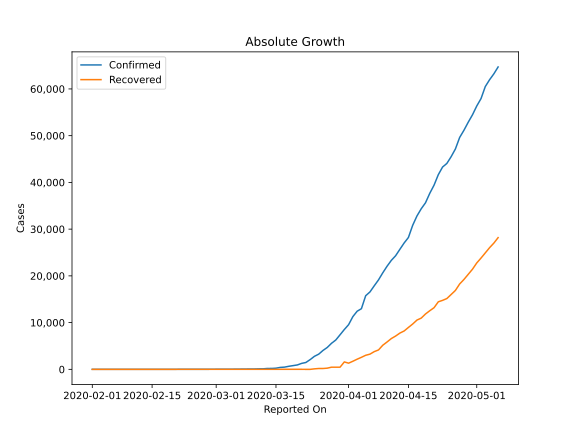
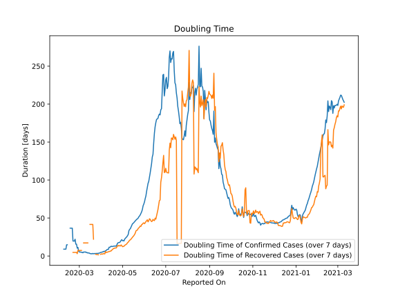

# Country Figures: Doubling Time of Infections for Canada 

The doubling time below are calculated based on
* an exponential growth assumption
* for time difference of past seven (7) days.
The doubling time's unit is "days".

The first growth rate indicates the increase of confirmed (infected) cases.

The second growth rate indicates the increase of recovered (healed) cases.

| Reported On | Confirmed | Doubling Time (Confirmed) | Recovered | Doubling Time (Recovered) |
|-------------|-----------|---------------------------|-----------|---------------------------|
| 2020-04-03 | 12437 |  5.3 days  | 2175 |  2.6 days  | 
| 2020-04-02 | 11284 |  5.1 days  | 1735 |  2.5 days  | 
| 2020-04-01 | 9560 |  4.8 days  | 1324 |  2.8 days  | 
| 2020-03-31 | 8527 |  4.7 days  | 1592 |  2.1 days  | 
| 2020-03-30 | 7398 |  4.2 days  | 466 |  None  | 
| 2020-03-29 | 6280 |  3.7 days  | 466 |  None  | 
| 2020-03-28 | 5576 |  3.6 days  | 466 |  1.6 days  | 
| 2020-03-27 | 4682 |  3.4 days  | 256 |  1.8 days  | 
| 2020-03-26 | 4042 |  3.3 days  | 184 |  1.9 days  | 
| 2020-03-25 | 3251 |  3.4 days  | 183 |  1.9 days  | 
| 2020-03-24 | 2790 |  3.1 days  | 110 |  2.3 days  | 
| 2020-03-23 | 2088 |  3.3 days  | 0 |  None  | 
| 2020-03-22 | 1470 |  3.1 days  | 0 |  None  | 
| 2020-03-21 | 1278 |  2.9 days  | 10 |  22.1 days  | 
| 2020-03-20 | 943 |  3.4 days  | 9 |  41.5 days  | 
| 2020-03-19 | 800 |  2.9 days  | 9 |  41.5 days  | 
| 2020-03-18 | 657 |  3.0 days  | 9 |  41.5 days  | 
| 2020-03-17 | 478 |  3.0 days  | 9 |  41.5 days  | 
| 2020-03-16 | 415 |  3.2 days  | 9 |  41.5 days  | 
| 2020-03-15 | 250 |  3.9 days  | 8 |  None  | 
| 2020-03-14 | 196 |  4.1 days  | 8 |  None  | 
| 2020-03-13 | 193 |  3.9 days  | 8 |  17.2 days  | 
| 2020-03-12 | 117 |  4.6 days  | 8 |  17.2 days  | 
| 2020-03-11 | 108 |  4.4 days  | 8 |  17.2 days  | 
| 2020-03-10 | 79 |  5.4 days  | 8 |  17.2 days  | 
| 2020-03-09 | 76 |  5.0 days  | 8 |  17.2 days  | 
| 2020-03-08 | 64 |  5.3 days  | 8 |  17.2 days  | 
| 2020-03-07 | 54 |  5.2 days  | 8 |  17.2 days  | 
| 2020-03-06 | 49 |  4.2 days  | 6 |  None  | 
| 2020-03-05 | 37 |  5.0 days  | 6 |  None  | 
| 2020-03-04 | 33 |  4.8 days  | 6 |  7.3 days  | 
| 2020-03-03 | 30 |  5.2 days  | 6 |  7.3 days  | 
| 2020-03-02 | 27 |  5.2 days  | 6 |  7.3 days  | 
| 2020-03-01 | 24 |  5.3 days  | 6 |  7.3 days  | 
| 2020-02-29 | 20 |  6.4 days  | 6 |  7.3 days  | 
| 2020-02-28 | 14 |  11.3 days  | 6 |  7.3 days  | 
| 2020-02-27 | 13 |  10.3 days  | 6 |  3.0 days  | 
| 2020-02-26 | 11 |  15.6 days  | 3 |  4.8 days  | 
| 2020-02-25 | 11 |  15.6 days  | 3 |  4.8 days  | 
| 2020-02-24 | 10 |  22.1 days  | 3 |  4.8 days  | 
| 2020-02-23 | 9 |  19.7 days  | 3 |  4.8 days  | 
| 2020-02-22 | 9 |  19.7 days  | 3 |  4.8 days  | 
| 2020-02-21 | 9 |  19.7 days  | 3 |  4.8 days  | 
| 2020-02-20 | 8 |  36.7 days  | 1 |  None  | 
| 2020-02-19 | 8 |  36.7 days  | 1 |  None  | 
| 2020-02-18 | 8 |  36.7 days  | 1 |  None  | 
| 2020-02-17 | 8 |  36.7 days  | 1 |  None  | 
| 2020-02-16 | 7 |  None  | 1 |  None  | 
| 2020-02-15 | 7 |  None  | 1 |  None  | 
| 2020-02-14 | 7 |  None  | 1 |  None  | 
| 2020-02-13 | 7 |  14.8 days  | 1 |  None  | 
| 2020-02-12 | 7 |  14.8 days  | 1 |  None  | 
| 2020-02-11 | 7 |  9.0 days  | 0 |  None  | 
| 2020-02-10 | 7 |  9.0 days  | 0 |  None  | 
| 2020-02-09 | 7 |  9.0 days  | 0 |  None  | 
| 2020-02-08 | 7 |  9.0 days  | 0 |  None  | 
| 2020-02-07 | 7 |  None  | 0 |  None  | 
| 2020-02-06 | 5 |  None  | 0 |  None  | 
| 2020-02-05 | 5 |  None  | 0 |  None  | 
| 2020-02-04 | 4 |  None  | 0 |  None  | 
| 2020-02-03 | 4 |  None  | 0 |  None  | 
| 2020-02-02 | 4 |  None  | 0 |  None  | 
| 2020-02-01 | 4 |  None  | 0 |  None  | 

