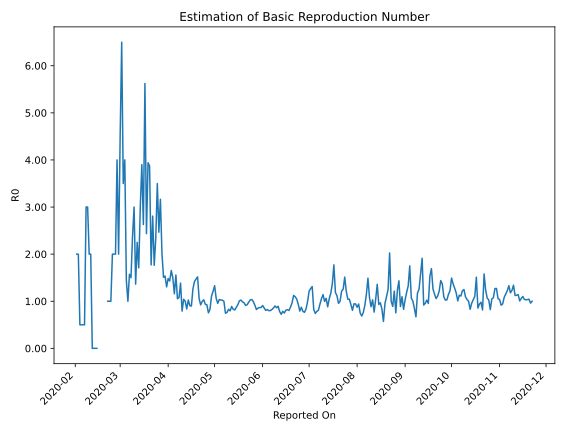

# Country Figures: Time Series for Basic Reproduction Number of Canada 

| Reported On | &Delta; Confirmed | Total &Delta; Confirmed First Interval | Total &Delta; Confirmed Second Interval | Estimated Basic Reproduction Number R0 | 
|-------------|-------------------|----------------------------------------|-----------------------------------------|---------------------------------------------------|
| 2020-05-07 | 1507 |  6768  |  6776  |  1.00  | 
| 2020-05-06 | 1479 |  6872  |  6727  |  1.02  | 
| 2020-05-05 | 1258 |  7500  |  7310  |  1.03  | 
| 2020-05-04 | 1453 |  7639  |  7372  |  1.04  | 
| 2020-05-03 | 2578 |  6776  |  7094  |  0.96  | 
| 2020-05-02 | 1583 |  6727  |  6330  |  1.06  | 
| 2020-05-01 | 1886 |  7310  |  5497  |  1.33  | 
| 2020-04-30 | 1592 |  7372  |  6091  |  1.21  | 
| 2020-04-29 | 1715 |  7094  |  6398  |  1.11  | 
| 2020-04-28 | 1534 |  6330  |  7653  |  0.83  | 
| 2020-04-27 | 2469 |  5497  |  7294  |  0.75  | 
| 2020-04-26 | 1654 |  6091  |  6588  |  0.92  | 
| 2020-04-25 | 1437 |  6398  |  6849  |  0.93  | 
| 2020-04-24 | 770 |  7653  |  7424  |  1.03  | 
| 2020-04-23 | 1636 |  7294  |  7321  |  1.00  | 
| 2020-04-22 | 2248 |  6588  |  7134  |  0.92  | 
| 2020-04-21 | 1744 |  6849  |  6510  |  1.05  | 
| 2020-04-20 | 2025 |  7424  |  4893  |  1.52  | 
| 2020-04-19 | 1277 |  7321  |  4976  |  1.47  | 
| 2020-04-18 | 1542 |  7134  |  5026  |  1.42  | 
| 2020-04-17 | 2005 |  6510  |  5158  |  1.26  | 
| 2020-04-16 | 2600 |  4893  |  5444  |  0.90  | 
| 2020-04-15 | 1174 |  4976  |  5496  |  0.91  | 
| 2020-04-14 | 1355 |  5026  |  4898  |  1.03  | 
| 2020-04-13 | 1381 |  5158  |  6163  |  0.84  | 
| 2020-04-12 | 983 |  5444  |  5435  |  1.00  | 
| 2020-04-11 | 1257 |  5496  |  5279  |  1.04  | 
| 2020-04-10 | 1405 |  4898  |  6196  |  0.79  | 
| 2020-04-09 | 1513 |  6163  |  4451  |  1.38  | 
| 2020-04-08 | 1269 |  5435  |  5039  |  1.08  | 
| 2020-04-07 | 1309 |  5279  |  5004  |  1.05  | 
| 2020-04-06 | 807 |  6196  |  3984  |  1.56  | 
| 2020-04-05 | 2778 |  4451  |  3845  |  1.16  | 
| 2020-04-04 | 541 |  5039  |  3356  |  1.50  | 
| 2020-04-03 | 1153 |  5004  |  3029  |  1.65  | 
| 2020-04-02 | 1724 |  3984  |  2786  |  1.43  | 
| 2020-04-01 | 1033 |  3845  |  2594  |  1.48  | 
| 2020-03-31 | 1129 |  3356  |  2572  |  1.30  | 
| 2020-03-30 | 1118 |  3029  |  1973  |  1.54  | 
| 2020-03-29 | 704 |  2786  |  1847  |  1.51  | 
| 2020-03-28 | 894 |  2594  |  1288  |  2.01  | 
| 2020-03-27 | 640 |  2572  |  813  |  3.16  | 
| 2020-03-26 | 791 |  1973  |  800  |  2.47  | 
| 2020-03-25 | 461 |  1847  |  528  |  3.50  | 
| 2020-03-24 | 702 |  1288  |  550  |  2.34  | 
| 2020-03-23 | 618 |  813  |  461  |  1.76  | 
| 2020-03-22 | 192 |  800  |  285  |  2.81  | 
| 2020-03-21 | 335 |  528  |  298  |  1.77  | 
| 2020-03-20 | 143 |  550  |  142  |  3.87  | 
| 2020-03-19 | 143 |  461  |  117  |  3.94  | 
| 2020-03-18 | 179 |  285  |  117  |  2.44  | 
| 2020-03-17 | 63 |  298  |  53  |  5.62  | 
| 2020-03-16 | 165 |  142  |  54  |  2.63  | 
| 2020-03-15 | 54 |  117  |  30  |  3.90  | 
| 2020-03-14 | 3 |  117  |  39  |  3.00  | 
| 2020-03-13 | 76 |  53  |  31  |  1.71  | 
| 2020-03-12 | 9 |  54  |  24  |  2.25  | 
| 2020-03-11 | 29 |  30  |  22  |  1.36  | 
| 2020-03-10 | 3 |  39  |  13  |  3.00  | 
| 2020-03-09 | 12 |  31  |  13  |  2.38  | 
| 2020-03-08 | 10 |  24  |  16  |  1.50  | 
| 2020-03-07 | 5 |  22  |  14  |  1.57  | 
| 2020-03-06 | 12 |  13  |  13  |  1.00  | 
| 2020-03-05 | 4 |  13  |  9  |  1.44  | 
| 2020-03-04 | 3 |  16  |  4  |  4.00  | 
| 2020-03-03 | 3 |  14  |  4  |  3.50  | 
| 2020-03-02 | 3 |  13  |  2  |  6.50  | 
| 2020-03-01 | 4 |  9  |  2  |  4.50  | 
| 2020-02-29 | 6 |  4  |  2  |  2.00  | 
| 2020-02-28 | 1 |  4  |  1  |  4.00  | 
| 2020-02-27 | 2 |  2  |  1  |  2.00  | 
| 2020-02-26 | 0 |  2  |  1  |  2.00  | 
| 2020-02-25 | 1 |  2  |  1  |  2.00  | 
| 2020-02-24 | 1 |  1  |  1  |  1.00  | 
| 2020-02-23 | 0 |  1  |  1  |  1.00  | 
| 2020-02-22 | 0 |  1  |  1  |  1.00  | 
| 2020-02-21 | 1 |  1  |  None  |  None  | 
| 2020-02-20 | 0 |  1  |  None  |  None  | 
| 2020-02-19 | 0 |  1  |  None  |  None  | 
| 2020-02-18 | 0 |  1  |  None  |  None  | 
| 2020-02-17 | 1 |  None  |  None  |  None  | 
| 2020-02-16 | 0 |  None  |  None  |  None  | 
| 2020-02-15 | 0 |  None  |  2  |  None  | 
| 2020-02-14 | 0 |  None  |  2  |  None  | 
| 2020-02-13 | 0 |  None  |  3  |  None  | 
| 2020-02-12 | 0 |  None  |  3  |  None  | 
| 2020-02-11 | 0 |  2  |  1  |  2.00  | 
| 2020-02-10 | 0 |  2  |  1  |  2.00  | 
| 2020-02-09 | 0 |  3  |  1  |  3.00  | 
| 2020-02-08 | 0 |  3  |  1  |  3.00  | 
| 2020-02-07 | 2 |  1  |  2  |  0.50  | 
| 2020-02-06 | 0 |  1  |  2  |  0.50  | 
| 2020-02-05 | 1 |  1  |  2  |  0.50  | 
| 2020-02-04 | 0 |  1  |  2  |  0.50  | 
| 2020-02-03 | 0 |  2  |  1  |  2.00  | 
| 2020-02-02 | 0 |  2  |  1  |  2.00  | 
| 2020-02-01 | 1 |  2  |  None  |  None  | 
| 2020-01-31 | 0 |  2  |  None  |  None  | 
| 2020-01-30 | 1 |  1  |  None  |  None  | 
| 2020-01-29 | 0 |  1  |  None  |  None  | 
| 2020-01-28 | 1 |  None  |  None  |  None  | 
| 2020-01-27 | 0 |  None  |  None  |  None  | 
| 2020-01-26 | None |  None  |  None  |  None  | 

