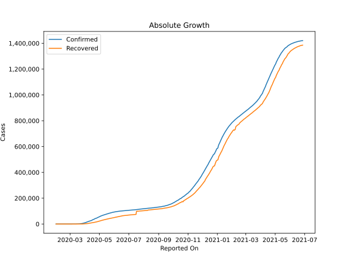
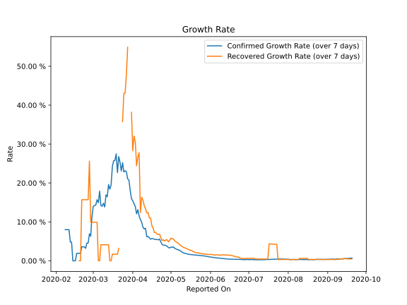

# Country Figures: Growth Rate for Canada 

The growth rates below are calculated based on
* an exponential growth assumption
* for time difference of past seven (7) days.
The growth rate is to be understood as on "growth per day".

The first growth rate indicates the increase of confirmed (infected) cases.

The second growth rate indicates the increase of recovered (healed) cases.

| Reported On | Confirmed | Growth Rate (Confirmed) | Recovered | Growth Rate (Recovered) |
|-------------|-----------|-------------------------|-----------|-------------------------|
| 2020-05-08 | 67674 |  2.62 %  | 30239 |  4.056 %  | 
| 2020-05-07 | 66201 |  2.79 %  | 29260 |  4.453 %  | 
| 2020-05-06 | 64694 |  2.88 %  | 28184 |  4.669 %  | 
| 2020-05-05 | 63215 |  3.03 %  | 27006 |  4.851 %  | 
| 2020-05-04 | 61957 |  3.17 %  | 26030 |  5.059 %  | 
| 2020-05-03 | 60504 |  3.56 %  | 24921 |  5.563 %  | 
| 2020-05-02 | 57926 |  3.45 %  | 23814 |  5.670 %  | 
| 2020-05-01 | 56343 |  3.51 %  | 22764 |  5.818 %  | 
| 2020-04-30 | 54457 |  3.28 %  | 21424 |  5.322 %  | 
| 2020-04-29 | 52865 |  3.41 %  | 20327 |  4.871 %  | 
| 2020-04-28 | 51150 |  3.73 %  | 19231 |  5.389 %  | 
| 2020-04-27 | 49616 |  3.94 %  | 18268 |  5.371 %  | 
| 2020-04-26 | 47147 |  4.00 %  | 16883 |  5.060 %  | 
| 2020-04-25 | 45493 |  4.01 %  | 16013 |  5.411 %  | 
| 2020-04-24 | 44056 |  4.21 %  | 15149 |  5.175 %  | 
| 2020-04-23 | 43286 |  4.86 %  | 14761 |  6.001 %  | 
| 2020-04-22 | 41650 |  5.57 %  | 14454 |  6.822 %  | 
| 2020-04-21 | 39402 |  5.38 %  | 13188 |  6.771 %  | 
| 2020-04-20 | 37658 |  5.47 %  | 12543 |  6.863 %  | 
| 2020-04-19 | 35633 |  5.47 %  | 11847 |  7.268 %  | 
| 2020-04-18 | 34356 |  5.54 %  | 10964 |  7.275 %  | 
| 2020-04-17 | 32814 |  5.67 %  | 10545 |  8.405 %  | 
| 2020-04-16 | 30809 |  5.71 %  | 9698 |  9.009 %  | 
| 2020-04-15 | 28209 |  5.54 %  | 8966 |  10.991 %  | 
| 2020-04-14 | 27035 |  5.91 %  | 8210 |  11.039 %  | 
| 2020-04-13 | 25680 |  6.26 %  | 7758 |  12.403 %  | 
| 2020-04-12 | 24299 |  6.19 %  | 7123 |  12.296 %  | 
| 2020-04-11 | 23316 |  8.37 %  | 6589 |  13.411 %  | 
| 2020-04-10 | 22059 |  8.19 %  | 5855 |  14.147 %  | 
| 2020-04-09 | 20654 |  8.64 %  | 5162 |  15.576 %  | 
| 2020-04-08 | 19141 |  9.92 %  | 4154 |  16.334 %  | 
| 2020-04-07 | 17872 |  10.57 %  | 3791 |  12.395 %  | 
| 2020-04-06 | 16563 |  11.51 %  | 3256 |  27.772 %  | 
| 2020-04-05 | 15756 |  13.14 %  | 3012 |  26.660 %  | 
| 2020-04-04 | 12978 |  12.07 %  | 2577 |  24.431 %  | 
| 2020-04-03 | 12437 |  13.96 %  | 2175 |  30.566 %  | 
| 2020-04-02 | 11284 |  14.67 %  | 1735 |  32.055 %  | 
| 2020-04-01 | 9560 |  15.41 %  | 1324 |  28.270 %  | 
| 2020-03-31 | 8527 |  15.96 %  | 1592 |  38.175 %  | 
| 2020-03-30 | 7398 |  18.07 %  | 466 |  None  | 
| 2020-03-29 | 6280 |  20.74 %  | 466 |  None  | 
| 2020-03-28 | 5576 |  21.05 %  | 466 |  54.880 %  | 
| 2020-03-27 | 4682 |  22.89 %  | 256 |  47.828 %  | 
| 2020-03-26 | 4042 |  23.14 %  | 184 |  43.110 %  | 
| 2020-03-25 | 3251 |  22.84 %  | 183 |  43.032 %  | 
| 2020-03-24 | 2790 |  25.20 %  | 110 |  35.761 %  | 
| 2020-03-23 | 2088 |  23.08 %  | 0 |  None  | 
| 2020-03-22 | 1470 |  25.31 %  | 0 |  None  | 
| 2020-03-21 | 1278 |  26.78 %  | 10 |  3.188 %  | 
| 2020-03-20 | 943 |  22.66 %  | 9 |  1.683 %  | 
| 2020-03-19 | 800 |  27.46 %  | 9 |  1.683 %  | 
| 2020-03-18 | 657 |  25.79 %  | 9 |  1.683 %  | 
| 2020-03-17 | 478 |  25.72 %  | 9 |  1.683 %  | 
| 2020-03-16 | 415 |  24.25 %  | 9 |  1.683 %  | 
| 2020-03-15 | 250 |  19.47 %  | 8 |  None  | 
| 2020-03-14 | 196 |  18.42 %  | 8 |  None  | 
| 2020-03-13 | 193 |  19.58 %  | 8 |  4.110 %  | 
| 2020-03-12 | 117 |  16.45 %  | 8 |  4.110 %  | 
| 2020-03-11 | 108 |  16.94 %  | 8 |  4.110 %  | 
| 2020-03-10 | 79 |  13.83 %  | 8 |  4.110 %  | 
| 2020-03-09 | 76 |  14.78 %  | 8 |  4.110 %  | 
| 2020-03-08 | 64 |  14.01 %  | 8 |  4.110 %  | 
| 2020-03-07 | 54 |  14.19 %  | 8 |  4.110 %  | 
| 2020-03-06 | 49 |  17.90 %  | 6 |  None  | 
| 2020-03-05 | 37 |  14.94 %  | 6 |  None  | 
| 2020-03-04 | 33 |  15.69 %  | 6 |  9.902 %  | 
| 2020-03-03 | 30 |  14.33 %  | 6 |  9.902 %  | 
| 2020-03-02 | 27 |  14.19 %  | 6 |  9.902 %  | 
| 2020-03-01 | 24 |  14.01 %  | 6 |  9.902 %  | 
| 2020-02-29 | 20 |  11.41 %  | 6 |  9.902 %  | 
| 2020-02-28 | 14 |  6.31 %  | 6 |  9.902 %  | 
| 2020-02-27 | 13 |  6.94 %  | 6 |  25.597 %  | 
| 2020-02-26 | 11 |  4.55 %  | 3 |  15.694 %  | 
| 2020-02-25 | 11 |  4.55 %  | 3 |  15.694 %  | 
| 2020-02-24 | 10 |  3.19 %  | 3 |  15.694 %  | 
| 2020-02-23 | 9 |  3.59 %  | 3 |  15.694 %  | 
| 2020-02-22 | 9 |  3.59 %  | 3 |  15.694 %  | 
| 2020-02-21 | 9 |  3.59 %  | 3 |  15.694 %  | 
| 2020-02-20 | 8 |  1.91 %  | 1 |  None  | 
| 2020-02-19 | 8 |  1.91 %  | 1 |  None  | 
| 2020-02-18 | 8 |  1.91 %  | 1 |  None  | 
| 2020-02-17 | 8 |  1.91 %  | 1 |  None  | 
| 2020-02-16 | 7 |  None  | 1 |  None  | 
| 2020-02-15 | 7 |  None  | 1 |  None  | 
| 2020-02-14 | 7 |  None  | 1 |  None  | 
| 2020-02-13 | 7 |  4.81 %  | 1 |  None  | 
| 2020-02-12 | 7 |  4.81 %  | 1 |  None  | 
| 2020-02-11 | 7 |  7.99 %  | 0 |  None  | 
| 2020-02-10 | 7 |  7.99 %  | 0 |  None  | 
| 2020-02-09 | 7 |  7.99 %  | 0 |  None  | 
| 2020-02-08 | 7 |  7.99 %  | 0 |  None  | 
| 2020-02-07 | 7 |  None  | 0 |  None  | 
| 2020-02-06 | 5 |  None  | 0 |  None  | 
| 2020-02-05 | 5 |  None  | 0 |  None  | 
| 2020-02-04 | 4 |  None  | 0 |  None  | 
| 2020-02-03 | 4 |  None  | 0 |  None  | 
| 2020-02-02 | 4 |  None  | 0 |  None  | 
| 2020-02-01 | 4 |  None  | 0 |  None  | 

