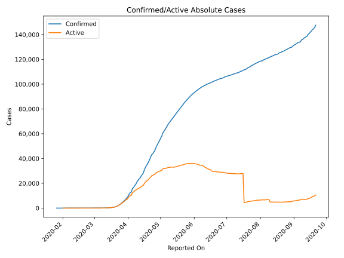
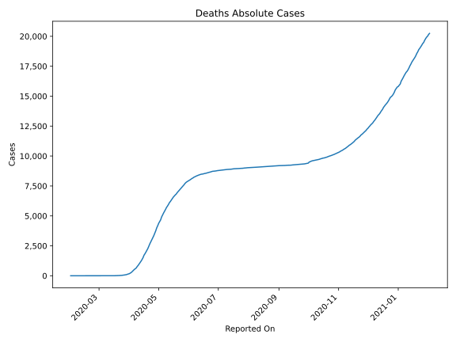
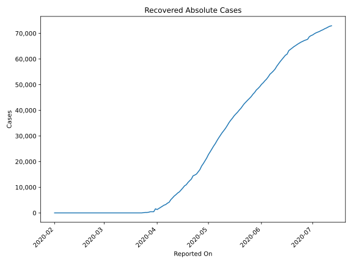
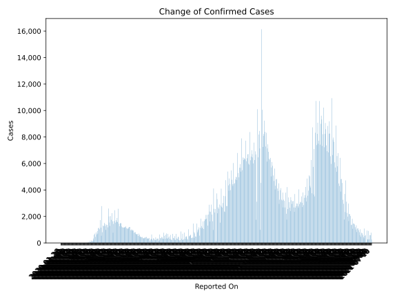
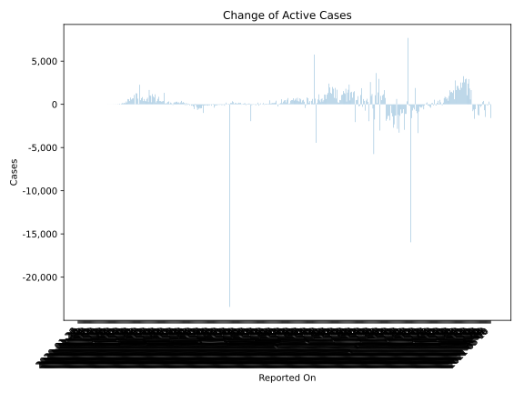
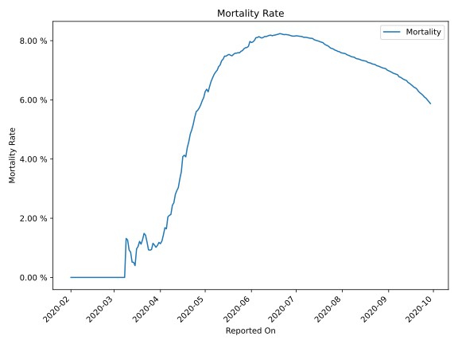

# Country Figures: Time Series for Canada 

| Reported On | Confirmed | Deaths | Recovered | Active | Mortality | &Delta; Confirmed | &Delta; Deaths | &Delta; Active | % Active of Population |
|-------------|-----------|--------|-----------|--------|-----------|-------------------|----------------|----------------|------------------------|
| 2020-03-28 | 5576 | 61 | 466 | 5049 |  1.09 %  | 894 | 7 | 677 |  0.014 %  | 
| 2020-03-27 | 4682 | 54 | 256 | 4372 |  1.15 %  | 640 | 16 | 552 |  0.012 %  | 
| 2020-03-26 | 4042 | 38 | 184 | 3820 |  0.94 %  | 791 | 8 | 782 |  0.010 %  | 
| 2020-03-25 | 3251 | 30 | 183 | 3038 |  0.92 %  | 461 | 4 | 384 |  0.008 %  | 
| 2020-03-24 | 2790 | 26 | 110 | 2654 |  0.93 %  | 702 | 1 | 591 |  0.007 %  | 
| 2020-03-23 | 2088 | 25 | 0 | 2063 |  1.20 %  | 618 | 4 | 614 |  0.006 %  | 
| 2020-03-22 | 1470 | 21 | 0 | 1449 |  1.43 %  | 192 | 2 | 200 |  0.004 %  | 
| 2020-03-21 | 1278 | 19 | 10 | 1249 |  1.49 %  | 335 | 7 | 327 |  0.003 %  | 
| 2020-03-20 | 943 | 12 | 9 | 922 |  1.27 %  | 143 | 3 | 140 |  0.002 %  | 
| 2020-03-19 | 800 | 9 | 9 | 782 |  1.12 %  | 143 | 1 | 142 |  0.002 %  | 
| 2020-03-18 | 657 | 8 | 9 | 640 |  1.22 %  | 179 | 3 | 176 |  0.002 %  | 
| 2020-03-17 | 478 | 5 | 9 | 464 |  1.05 %  | 63 | 1 | 62 |  0.001 %  | 
| 2020-03-16 | 415 | 4 | 9 | 402 |  0.96 %  | 165 | 3 | 161 |  0.001 %  | 
| 2020-03-15 | 250 | 1 | 8 | 241 |  0.40 %  | 54 | 0 | 54 |  0.001 %  | 
| 2020-03-14 | 196 | 1 | 8 | 187 |  0.51 %  | 3 | 0 | 3 |  0.001 %  | 
| 2020-03-13 | 193 | 1 | 8 | 184 |  0.52 %  | 76 | 0 | 76 |  0.000 %  | 
| 2020-03-12 | 117 | 1 | 8 | 108 |  0.85 %  | 9 | 0 | 9 |  0.000 %  | 
| 2020-03-11 | 108 | 1 | 8 | 99 |  0.93 %  | 29 | 0 | 29 |  0.000 %  | 
| 2020-03-10 | 79 | 1 | 8 | 70 |  1.27 %  | 3 | 0 | 3 |  0.000 %  | 
| 2020-03-09 | 76 | 1 | 8 | 67 |  1.32 %  | 12 | 1 | 11 |  0.000 %  | 
| 2020-03-08 | 64 | 0 | 8 | 56 |  None  | 10 | 0 | 10 |  0.000 %  | 
| 2020-03-07 | 54 | 0 | 8 | 46 |  None  | 5 | 0 | 3 |  0.000 %  | 
| 2020-03-06 | 49 | 0 | 6 | 43 |  None  | 12 | 0 | 12 |  0.000 %  | 
| 2020-03-05 | 37 | 0 | 6 | 31 |  None  | 4 | 0 | 4 |  0.000 %  | 
| 2020-03-04 | 33 | 0 | 6 | 27 |  None  | 3 | 0 | 3 |  0.000 %  | 
| 2020-03-03 | 30 | 0 | 6 | 24 |  None  | 3 | 0 | 3 |  0.000 %  | 
| 2020-03-02 | 27 | 0 | 6 | 21 |  None  | 3 | 0 | 3 |  0.000 %  | 
| 2020-03-01 | 24 | 0 | 6 | 18 |  None  | 4 | 0 | 4 |  0.000 %  | 
| 2020-02-29 | 20 | 0 | 6 | 14 |  None  | 6 | 0 | 6 |  0.000 %  | 
| 2020-02-28 | 14 | 0 | 6 | 8 |  None  | 1 | 0 | 1 |  0.000 %  | 
| 2020-02-27 | 13 | 0 | 6 | 7 |  None  | 2 | 0 | -1 |  0.000 %  | 
| 2020-02-26 | 11 | 0 | 3 | 8 |  None  | 0 | 0 | 0 |  0.000 %  | 
| 2020-02-25 | 11 | 0 | 3 | 8 |  None  | 1 | 0 | 1 |  0.000 %  | 
| 2020-02-24 | 10 | 0 | 3 | 7 |  None  | 1 | 0 | 1 |  0.000 %  | 
| 2020-02-23 | 9 | 0 | 3 | 6 |  None  | 0 | 0 | 0 |  0.000 %  | 
| 2020-02-22 | 9 | 0 | 3 | 6 |  None  | 0 | 0 | 0 |  0.000 %  | 
| 2020-02-21 | 9 | 0 | 3 | 6 |  None  | 1 | 0 | -1 |  0.000 %  | 
| 2020-02-20 | 8 | 0 | 1 | 7 |  None  | 0 | 0 | 0 |  0.000 %  | 
| 2020-02-19 | 8 | 0 | 1 | 7 |  None  | 0 | 0 | 0 |  0.000 %  | 
| 2020-02-18 | 8 | 0 | 1 | 7 |  None  | 0 | 0 | 0 |  0.000 %  | 
| 2020-02-17 | 8 | 0 | 1 | 7 |  None  | 1 | 0 | 1 |  0.000 %  | 
| 2020-02-16 | 7 | 0 | 1 | 6 |  None  | 0 | 0 | 0 |  0.000 %  | 
| 2020-02-15 | 7 | 0 | 1 | 6 |  None  | 0 | 0 | 0 |  0.000 %  | 
| 2020-02-14 | 7 | 0 | 1 | 6 |  None  | 0 | 0 | 0 |  0.000 %  | 
| 2020-02-13 | 7 | 0 | 1 | 6 |  None  | 0 | 0 | 0 |  0.000 %  | 
| 2020-02-12 | 7 | 0 | 1 | 6 |  None  | 0 | 0 | -1 |  0.000 %  | 
| 2020-02-11 | 7 | 0 | 0 | 7 |  None  | 0 | 0 | 0 |  0.000 %  | 
| 2020-02-10 | 7 | 0 | 0 | 7 |  None  | 0 | 0 | 0 |  0.000 %  | 
| 2020-02-09 | 7 | 0 | 0 | 7 |  None  | 0 | 0 | 0 |  0.000 %  | 
| 2020-02-08 | 7 | 0 | 0 | 7 |  None  | 0 | 0 | 0 |  0.000 %  | 
| 2020-02-07 | 7 | 0 | 0 | 7 |  None  | 2 | 0 | 2 |  0.000 %  | 
| 2020-02-06 | 5 | 0 | 0 | 5 |  None  | 0 | 0 | 0 |  0.000 %  | 
| 2020-02-05 | 5 | 0 | 0 | 5 |  None  | 1 | 0 | 1 |  0.000 %  | 
| 2020-02-04 | 4 | 0 | 0 | 4 |  None  | 0 | 0 | 0 |  0.000 %  | 
| 2020-02-03 | 4 | 0 | 0 | 4 |  None  | 0 | 0 | 0 |  0.000 %  | 
| 2020-02-02 | 4 | 0 | 0 | 4 |  None  | 0 | 0 | 0 |  0.000 %  | 
| 2020-02-01 | 4 | 0 | 0 | 4 |  None  | 1 | None | None |  0.000 %  | 
| 2020-01-31 | 3 | None | None | None |  None  | 0 | None | None |  n/a  | 
| 2020-01-30 | 3 | None | None | None |  None  | 1 | None | None |  n/a  | 
| 2020-01-29 | 2 | None | None | None |  None  | 0 | None | None |  n/a  | 
| 2020-01-28 | 2 | None | None | None |  None  | 1 | None | None |  n/a  | 
| 2020-01-27 | 1 | None | None | None |  None  | 0 | None | None |  n/a  | 
| 2020-01-26 | 1 | None | None | None |  None  | None | None | None |  n/a  | 

