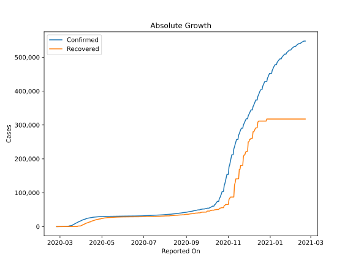
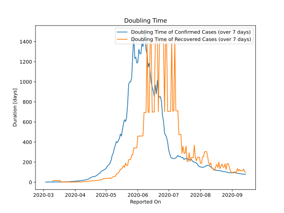

# Country Figures: Doubling Time of Infections for Switzerland 

The doubling time below are calculated based on
* an exponential growth assumption
* for time difference of past seven (7) days.
The doubling time's unit is "days".

The first doubling time indicates the increase of confirmed (infected)
cases. There, the *higher* the number is, the better is to take control
of the disease.

The second doubling time indicates the increase of recovered (healed)
cases. There, the *lower* the number is, the better it is to take
control of the disease.

| Reported On | Confirmed | Doubling Time (Confirmed) | Recovered | Doubling Time (Recovered) |
|-------------|-----------|---------------------------|-----------|---------------------------|
| 2020-05-07 | 30126 |  268.6 days  | 25900 |  48.1 days  | 
| 2020-05-06 | 30060 |  221.3 days  | 25700 |  38.1 days  | 
| 2020-05-05 | 30009 |  193.4 days  | 25400 |  41.9 days  | 
| 2020-05-04 | 29981 |  176.0 days  | 25200 |  38.6 days  | 
| 2020-05-03 | 29905 |  169.8 days  | 24500 |  41.9 days  | 
| 2020-05-02 | 29817 |  154.6 days  | 24200 |  38.4 days  | 
| 2020-05-01 | 29705 |  138.1 days  | 23900 |  37.9 days  | 
| 2020-04-30 | 29586 |  129.6 days  | 23400 |  38.4 days  | 
| 2020-04-29 | 29407 |  123.2 days  | 22600 |  38.5 days  | 
| 2020-04-28 | 29264 |  116.1 days  | 22600 |  32.1 days  | 
| 2020-04-27 | 29164 |  113.9 days  | 22200 |  27.8 days  | 
| 2020-04-26 | 29061 |  104.6 days  | 21800 |  24.3 days  | 
| 2020-04-25 | 28894 |  92.0 days  | 21300 |  22.4 days  | 
| 2020-04-24 | 28677 |  84.9 days  | 21000 |  20.0 days  | 
| 2020-04-23 | 28496 |  76.3 days  | 20600 |  19.1 days  | 
| 2020-04-22 | 28268 |  68.9 days  | 19900 |  19.3 days  | 
| 2020-04-21 | 28063 |  61.9 days  | 19400 |  14.3 days  | 
| 2020-04-20 | 27944 |  58.0 days  | 18600 |  16.2 days  | 
| 2020-04-19 | 27740 |  55.8 days  | 17800 |  14.7 days  | 
| 2020-04-18 | 27404 |  55.8 days  | 17100 |  14.4 days  | 
| 2020-04-17 | 27078 |  49.9 days  | 16400 |  12.8 days  | 
| 2020-04-16 | 26732 |  46.3 days  | 15900 |  12.3 days  | 
| 2020-04-15 | 26336 |  39.7 days  | 15400 |  11.1 days  | 
| 2020-04-14 | 25936 |  32.0 days  | 13700 |  11.0 days  | 
| 2020-04-13 | 25688 |  28.8 days  | 13700 |  9.5 days  | 
| 2020-04-12 | 25415 |  26.4 days  | 12700 |  7.4 days  | 
| 2020-04-11 | 25107 |  24.3 days  | 12100 |  8.0 days  | 
| 2020-04-10 | 24551 |  21.9 days  | 11100 |  6.2 days  | 
| 2020-04-09 | 24051 |  20.2 days  | 10600 |  5.3 days  | 
| 2020-04-08 | 23280 |  18.3 days  | 9800 |  4.4 days  | 
| 2020-04-07 | 22253 |  16.9 days  | 8704 |  3.4 days  | 
| 2020-04-06 | 21657 |  16.1 days  | 8056 |  3.6 days  | 
| 2020-04-05 | 21100 |  14.1 days  | 6415 |  3.8 days  | 
| 2020-04-04 | 20505 |  13.2 days  | 6415 |  3.7 days  | 
| 2020-04-03 | 19606 |  12.0 days  | 4846 |  4.5 days  | 
| 2020-04-02 | 18827 |  10.7 days  | 4013 |  1.7 days  | 
| 2020-04-01 | 17768 |  10.3 days  | 2967 |  1.9 days  | 
| 2020-03-31 | 16605 |  9.7 days  | 1823 |  2.2 days  | 
| 2020-03-30 | 15922 |  8.5 days  | 1823 |  2.2 days  | 
| 2020-03-29 | 14829 |  7.4 days  | 1595 |  2.3 days  | 
| 2020-03-28 | 14076 |  6.7 days  | 1530 |  1.4 days  | 
| 2020-03-27 | 12928 |  5.8 days  | 1530 |  1.4 days  | 
| 2020-03-26 | 11811 |  4.9 days  | 131 |  2.6 days  | 
| 2020-03-25 | 10897 |  4.1 days  | 131 |  2.6 days  | 
| 2020-03-24 | 9877 |  4.1 days  | 131 |  1.7 days  | 
| 2020-03-23 | 8795 |  3.8 days  | 131 |  1.7 days  | 
| 2020-03-22 | 7474 |  4.3 days  | 131 |  1.7 days  | 
| 2020-03-21 | 6575 |  3.4 days  | 15 |  4.0 days  | 
| 2020-03-20 | 5294 |  3.5 days  | 15 |  4.0 days  | 
| 2020-03-19 | 4075 |  3.0 days  | 15 |  4.0 days  | 
| 2020-03-18 | 3028 |  3.5 days  | 15 |  4.0 days  | 
| 2020-03-17 | 2700 |  3.2 days  | 4 |  17.2 days  | 
| 2020-03-16 | 2200 |  3.1 days  | 4 |  17.2 days  | 
| 2020-03-15 | 2200 |  2.9 days  | 4 |  17.2 days  | 
| 2020-03-14 | 1359 |  3.3 days  | 4 |  17.2 days  | 
| 2020-03-13 | 1139 |  3.2 days  | 4 |  17.2 days  | 
| 2020-03-12 | 652 |  3.1 days  | 4 |  17.2 days  | 
| 2020-03-11 | 652 |  2.8 days  | 4 |  17.2 days  | 
| 2020-03-10 | 491 |  2.6 days  | 3 |  12.3 days  | 
| 2020-03-09 | 374 |  2.5 days  | 3 |  None  | 
| 2020-03-08 | 337 |  2.3 days  | 3 |  None  | 
| 2020-03-07 | 268 |  2.1 days  | 3 |  None  | 
| 2020-03-06 | 214 |  1.8 days  | 3 |  None  | 
| 2020-03-05 | 114 |  2.2 days  | 3 |  None  | 
| 2020-03-04 | 90 |  1.4 days  | 3 |  None  | 
| 2020-03-03 | 56 |  1.5 days  | 2 |  None  | 
| 2020-03-02 | 42 |  None  | 0 |  None  | 
| 2020-03-01 | 27 |  None  | 0 |  None  | 
| 2020-02-29 | 18 |  None  | 0 |  None  | 
| 2020-02-28 | 8 |  None  | 0 |  None  | 
| 2020-02-27 | 8 |  None  | 0 |  None  | 
| 2020-02-26 | 1 |  None  | 0 |  None  | 
| 2020-02-25 | 1 |  None  | 0 |  None  | 

