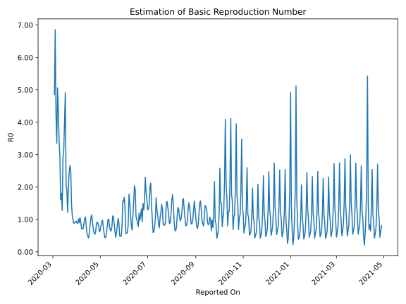

# Country Figures: Time Series for Basic Reproduction Number of Switzerland 

| Reported On | &Delta; Confirmed | Total &Delta; Confirmed First Interval | Total &Delta; Confirmed Second Interval | Estimated Basic Reproduction Number R0 | 
|-------------|-------------------|----------------------------------------|-----------------------------------------|---------------------------------------------------|
| 2020-05-06 | 51 |  304  |  541  |  0.56  | 
| 2020-05-05 | 28 |  395  |  525  |  0.75  | 
| 2020-05-04 | 76 |  498  |  513  |  0.97  | 
| 2020-05-03 | 88 |  553  |  587  |  0.94  | 
| 2020-05-02 | 112 |  541  |  668  |  0.81  | 
| 2020-05-01 | 119 |  525  |  793  |  0.66  | 
| 2020-04-30 | 179 |  513  |  831  |  0.62  | 
| 2020-04-29 | 143 |  587  |  733  |  0.80  | 
| 2020-04-28 | 100 |  668  |  756  |  0.88  | 
| 2020-04-27 | 103 |  793  |  864  |  0.92  | 
| 2020-04-26 | 167 |  831  |  985  |  0.84  | 
| 2020-04-25 | 217 |  733  |  1212  |  0.60  | 
| 2020-04-24 | 181 |  756  |  1404  |  0.54  | 
| 2020-04-23 | 228 |  864  |  1468  |  0.59  | 
| 2020-04-22 | 205 |  985  |  1390  |  0.71  | 
| 2020-04-21 | 119 |  1212  |  1317  |  0.92  | 
| 2020-04-20 | 204 |  1404  |  1229  |  1.14  | 
| 2020-04-19 | 336 |  1468  |  1385  |  1.06  | 
| 2020-04-18 | 326 |  1390  |  1637  |  0.85  | 
| 2020-04-17 | 346 |  1317  |  2135  |  0.62  | 
| 2020-04-16 | 396 |  1229  |  2854  |  0.43  | 
| 2020-04-15 | 400 |  1385  |  2894  |  0.48  | 
| 2020-04-14 | 248 |  1637  |  2951  |  0.55  | 
| 2020-04-13 | 273 |  2135  |  2775  |  0.77  | 
| 2020-04-12 | 308 |  2854  |  2647  |  1.08  | 
| 2020-04-11 | 556 |  2894  |  2830  |  1.02  | 
| 2020-04-10 | 500 |  2951  |  3332  |  0.89  | 
| 2020-04-09 | 771 |  2775  |  3900  |  0.71  | 
| 2020-04-08 | 1027 |  2647  |  3684  |  0.72  | 
| 2020-04-07 | 596 |  2830  |  3998  |  0.71  | 
| 2020-04-06 | 557 |  3332  |  3692  |  0.90  | 
| 2020-04-05 | 595 |  3900  |  3677  |  1.06  | 
| 2020-04-04 | 899 |  3684  |  4111  |  0.90  | 
| 2020-04-03 | 779 |  3998  |  3932  |  1.02  | 
| 2020-04-02 | 1059 |  3692  |  4199  |  0.88  | 
| 2020-04-01 | 1163 |  3677  |  4133  |  0.89  | 
| 2020-03-31 | 683 |  4111  |  4337  |  0.95  | 
| 2020-03-30 | 1093 |  3932  |  4322  |  0.91  | 
| 2020-03-29 | 753 |  4199  |  4583  |  0.92  | 
| 2020-03-28 | 1148 |  4133  |  4720  |  0.88  | 
| 2020-03-27 | 1117 |  4337  |  4446  |  0.98  | 
| 2020-03-26 | 914 |  4322  |  3875  |  1.12  | 
| 2020-03-25 | 1020 |  4583  |  3094  |  1.48  | 
| 2020-03-24 | 1082 |  4720  |  1875  |  2.52  | 
| 2020-03-23 | 1321 |  4446  |  1669  |  2.66  | 
| 2020-03-22 | 899 |  3875  |  1561  |  2.48  | 
| 2020-03-21 | 1281 |  3094  |  1548  |  2.00  | 
| 2020-03-20 | 1219 |  1875  |  1548  |  1.21  | 
| 2020-03-19 | 1047 |  1669  |  868  |  1.92  | 
| 2020-03-18 | 328 |  1561  |  765  |  2.04  | 
| 2020-03-17 | 500 |  1548  |  315  |  4.91  | 
| 2020-03-16 | 0 |  1548  |  384  |  4.03  | 
| 2020-03-15 | 841 |  868  |  277  |  3.13  | 
| 2020-03-14 | 220 |  765  |  260  |  2.94  | 
| 2020-03-13 | 487 |  315  |  247  |  1.28  | 
| 2020-03-12 | 0 |  384  |  212  |  1.81  | 
| 2020-03-11 | 161 |  277  |  172  |  1.61  | 
| 2020-03-10 | 117 |  260  |  87  |  2.99  | 
| 2020-03-09 | 37 |  247  |  72  |  3.43  | 
| 2020-03-08 | 69 |  212  |  48  |  4.42  | 
| 2020-03-07 | 54 |  172  |  34  |  5.06  | 
| 2020-03-06 | 100 |  87  |  26  |  3.35  | 
| 2020-03-05 | 24 |  72  |  17  |  4.24  | 
| 2020-03-04 | 34 |  48  |  7  |  6.86  | 
| 2020-03-03 | 14 |  34  |  7  |  4.86  | 
| 2020-03-02 | 15 |  26  |  None  |  None  | 
| 2020-03-01 | 9 |  17  |  None  |  None  | 
| 2020-02-29 | 10 |  7  |  None  |  None  | 
| 2020-02-28 | 0 |  7  |  None  |  None  | 
| 2020-02-27 | 7 |  None  |  None  |  None  | 
| 2020-02-26 | 0 |  None  |  None  |  None  | 
| 2020-02-25 | None |  None  |  None  |  None  | 

