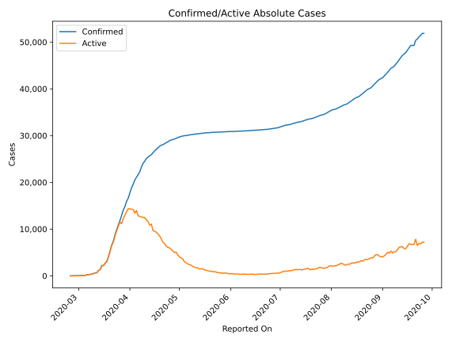
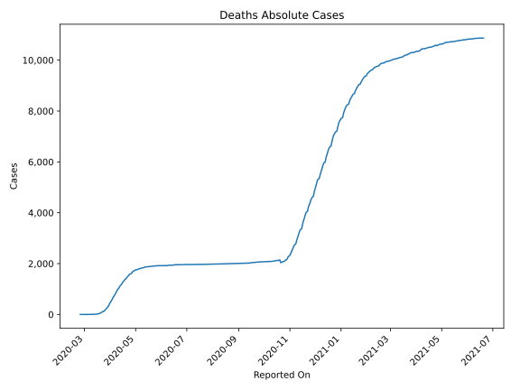
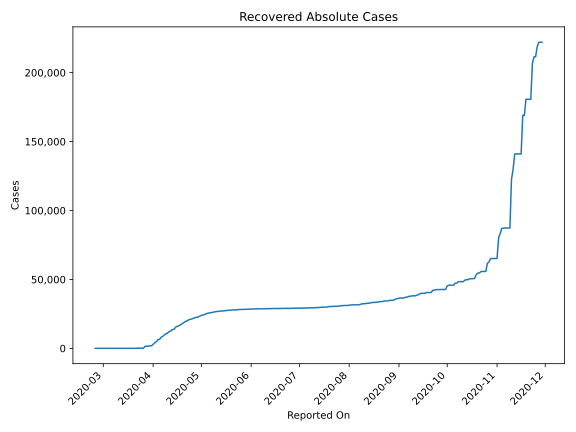
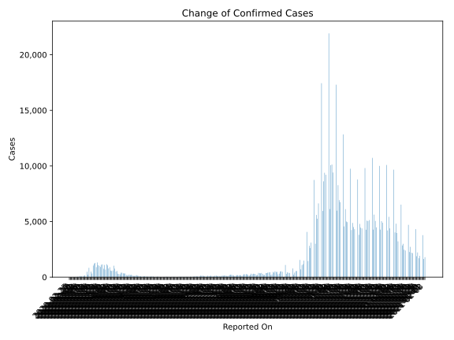
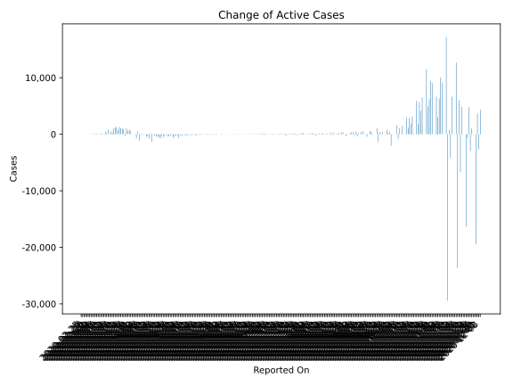
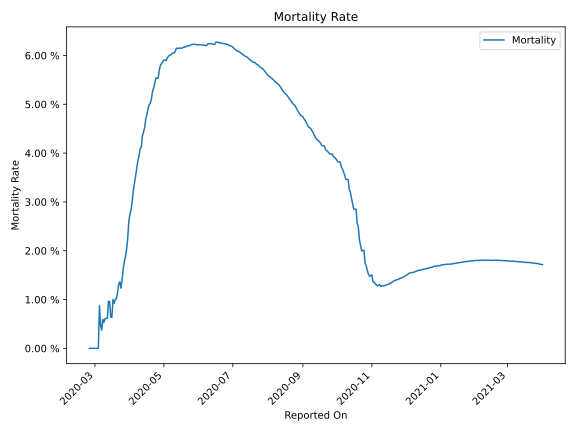

# Country Figures: Time Series for Switzerland 

| Reported On | Confirmed | Deaths | Recovered | Active | Mortality | &Delta; Confirmed | &Delta; Deaths | &Delta; Active | % Active of Population |
|-------------|-----------|--------|-----------|--------|-----------|-------------------|----------------|----------------|------------------------|
| 2020-04-06 | 21657 | 765 | 8056 | 12836 |  3.53 %  | 557 | 50 | -1134 |  0.151 %  | 
| 2020-04-05 | 21100 | 715 | 6415 | 13970 |  3.39 %  | 595 | 49 | 546 |  0.164 %  | 
| 2020-04-04 | 20505 | 666 | 6415 | 13424 |  3.25 %  | 899 | 75 | -745 |  0.158 %  | 
| 2020-04-03 | 19606 | 591 | 4846 | 14169 |  3.01 %  | 779 | 55 | -109 |  0.166 %  | 
| 2020-04-02 | 18827 | 536 | 4013 | 14278 |  2.85 %  | 1059 | 48 | -35 |  0.168 %  | 
| 2020-04-01 | 17768 | 488 | 2967 | 14313 |  2.75 %  | 1163 | 55 | -36 |  0.168 %  | 
| 2020-03-31 | 16605 | 433 | 1823 | 14349 |  2.61 %  | 683 | 74 | 609 |  0.168 %  | 
| 2020-03-30 | 15922 | 359 | 1823 | 13740 |  2.25 %  | 1093 | 59 | 806 |  0.161 %  | 
| 2020-03-29 | 14829 | 300 | 1595 | 12934 |  2.02 %  | 753 | 36 | 652 |  0.152 %  | 
| 2020-03-28 | 14076 | 264 | 1530 | 12282 |  1.88 %  | 1148 | 33 | 1115 |  0.144 %  | 
| 2020-03-27 | 12928 | 231 | 1530 | 11167 |  1.79 %  | 1117 | 40 | -322 |  0.131 %  | 
| 2020-03-26 | 11811 | 191 | 131 | 11489 |  1.62 %  | 914 | 38 | 876 |  0.135 %  | 
| 2020-03-25 | 10897 | 153 | 131 | 10613 |  1.40 %  | 1020 | 31 | 989 |  0.125 %  | 
| 2020-03-24 | 9877 | 122 | 131 | 9624 |  1.24 %  | 1082 | 2 | 1080 |  0.113 %  | 
| 2020-03-23 | 8795 | 120 | 131 | 8544 |  1.36 %  | 1321 | 22 | 1299 |  0.100 %  | 
| 2020-03-22 | 7474 | 98 | 131 | 7245 |  1.31 %  | 899 | 23 | 760 |  0.085 %  | 
| 2020-03-21 | 6575 | 75 | 15 | 6485 |  1.14 %  | 1281 | 21 | 1260 |  0.076 %  | 
| 2020-03-20 | 5294 | 54 | 15 | 5225 |  1.02 %  | 1219 | 13 | 1206 |  0.061 %  | 
| 2020-03-19 | 4075 | 41 | 15 | 4019 |  1.01 %  | 1047 | 13 | 1034 |  0.047 %  | 
| 2020-03-18 | 3028 | 28 | 15 | 2985 |  0.92 %  | 328 | 1 | 316 |  0.035 %  | 
| 2020-03-17 | 2700 | 27 | 4 | 2669 |  1.00 %  | 500 | 13 | 487 |  0.031 %  | 
| 2020-03-16 | 2200 | 14 | 4 | 2182 |  0.64 %  | 0 | 0 | 0 |  0.026 %  | 
| 2020-03-15 | 2200 | 14 | 4 | 2182 |  0.64 %  | 841 | 1 | 840 |  0.026 %  | 
| 2020-03-14 | 1359 | 13 | 4 | 1342 |  0.96 %  | 220 | 2 | 218 |  0.016 %  | 
| 2020-03-13 | 1139 | 11 | 4 | 1124 |  0.97 %  | 487 | 7 | 480 |  0.013 %  | 
| 2020-03-12 | 652 | 4 | 4 | 644 |  0.61 %  | 0 | 0 | 0 |  0.008 %  | 
| 2020-03-11 | 652 | 4 | 4 | 644 |  0.61 %  | 161 | 1 | 159 |  0.008 %  | 
| 2020-03-10 | 491 | 3 | 3 | 485 |  0.61 %  | 117 | 1 | 116 |  0.006 %  | 
| 2020-03-09 | 374 | 2 | 3 | 369 |  0.53 %  | 37 | 0 | 37 |  0.004 %  | 
| 2020-03-08 | 337 | 2 | 3 | 332 |  0.59 %  | 69 | 1 | 68 |  0.004 %  | 
| 2020-03-07 | 268 | 1 | 3 | 264 |  0.37 %  | 54 | 0 | 54 |  0.003 %  | 
| 2020-03-06 | 214 | 1 | 3 | 210 |  0.47 %  | 100 | 0 | 100 |  0.002 %  | 
| 2020-03-05 | 114 | 1 | 3 | 110 |  0.88 %  | 24 | 1 | 23 |  0.001 %  | 
| 2020-03-04 | 90 | 0 | 3 | 87 |  None  | 34 | 0 | 33 |  0.001 %  | 
| 2020-03-03 | 56 | 0 | 2 | 54 |  None  | 14 | 0 | 12 |  0.001 %  | 
| 2020-03-02 | 42 | 0 | 0 | 42 |  None  | 15 | 0 | 15 |  0.000 %  | 
| 2020-03-01 | 27 | 0 | 0 | 27 |  None  | 9 | 0 | 9 |  0.000 %  | 
| 2020-02-29 | 18 | 0 | 0 | 18 |  None  | 10 | 0 | 10 |  0.000 %  | 
| 2020-02-28 | 8 | 0 | 0 | 8 |  None  | 0 | 0 | 0 |  0.000 %  | 
| 2020-02-27 | 8 | 0 | 0 | 8 |  None  | 7 | 0 | 7 |  0.000 %  | 
| 2020-02-26 | 1 | 0 | 0 | 1 |  None  | 0 | 0 | 0 |  0.000 %  | 
| 2020-02-25 | 1 | 0 | 0 | 1 |  None  | None | None | None |  0.000 %  | 

