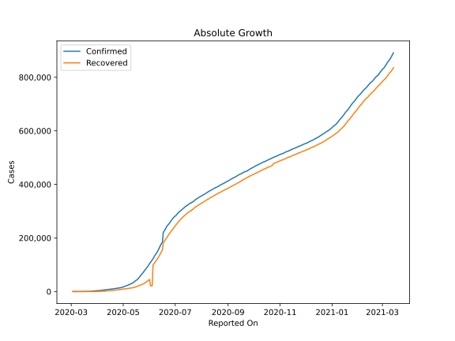
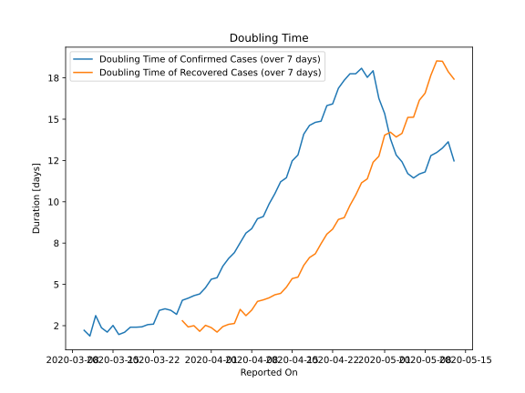

# Country Figures: Doubling Time of Infections for Chile 

The doubling time below are calculated based on
* an exponential growth assumption
* for time difference of past seven (7) days.
The doubling time's unit is "days".

The first doubling time indicates the increase of confirmed (infected)
cases. There, the *higher* the number is, the better is to take control
of the disease.

The second doubling time indicates the increase of recovered (healed)
cases. There, the *lower* the number is, the better it is to take
control of the disease.

| Reported On | Confirmed | Doubling Time (Confirmed) | Recovered | Doubling Time (Recovered) |
|-------------|-----------|---------------------------|-----------|---------------------------|
| 2020-05-02 | 18435 |  13.8 days  | 9572 |  14.2 days  | 
| 2020-05-01 | 17008 |  15.3 days  | 9018 |  14.0 days  | 
| 2020-04-30 | 16023 |  16.3 days  | 8580 |  12.8 days  | 
| 2020-04-29 | 14885 |  17.9 days  | 8057 |  12.4 days  | 
| 2020-04-28 | 14365 |  17.5 days  | 7710 |  11.4 days  | 
| 2020-04-27 | 13813 |  18.1 days  | 7327 |  11.1 days  | 
| 2020-04-26 | 13331 |  17.8 days  | 7024 |  10.4 days  | 
| 2020-04-25 | 12858 |  17.8 days  | 6746 |  9.8 days  | 
| 2020-04-24 | 12306 |  17.4 days  | 6327 |  9.0 days  | 
| 2020-04-23 | 11812 |  16.9 days  | 5804 |  8.9 days  | 
| 2020-04-22 | 11296 |  15.9 days  | 5386 |  8.3 days  | 
| 2020-04-21 | 10832 |  15.8 days  | 4969 |  8.0 days  | 
| 2020-04-20 | 10507 |  14.9 days  | 4676 |  7.5 days  | 
| 2020-04-19 | 10088 |  14.8 days  | 4338 |  6.9 days  | 
| 2020-04-18 | 9730 |  14.6 days  | 4035 |  6.6 days  | 
| 2020-04-17 | 9252 |  14.1 days  | 3621 |  6.2 days  | 
| 2020-04-16 | 8807 |  12.8 days  | 3299 |  5.4 days  | 
| 2020-04-15 | 8273 |  12.5 days  | 2937 |  5.3 days  | 
| 2020-04-14 | 7917 |  11.5 days  | 2646 |  4.8 days  | 
| 2020-04-13 | 7525 |  11.2 days  | 2367 |  4.5 days  | 
| 2020-04-12 | 7213 |  10.5 days  | 2059 |  4.4 days  | 
| 2020-04-11 | 6927 |  9.9 days  | 1864 |  4.2 days  | 
| 2020-04-10 | 6501 |  9.1 days  | 1571 |  4.1 days  | 
| 2020-04-09 | 5972 |  9.0 days  | 1274 |  4.0 days  | 
| 2020-04-08 | 5546 |  8.4 days  | 1115 |  3.4 days  | 
| 2020-04-07 | 5116 |  8.1 days  | 898 |  3.1 days  | 
| 2020-04-06 | 4815 |  7.5 days  | 728 |  3.5 days  | 
| 2020-04-05 | 4471 |  6.9 days  | 618 |  2.6 days  | 
| 2020-04-04 | 4161 |  6.6 days  | 528 |  2.6 days  | 
| 2020-04-03 | 3737 |  6.1 days  | 427 |  2.4 days  | 
| 2020-04-02 | 3404 |  5.4 days  | 335 |  2.1 days  | 
| 2020-04-01 | 3031 |  5.3 days  | 234 |  2.4 days  | 
| 2020-03-31 | 2738 |  4.8 days  | 156 |  2.5 days  | 
| 2020-03-30 | 2449 |  4.4 days  | 156 |  2.2 days  | 
| 2020-03-29 | 2139 |  4.3 days  | 75 |  2.5 days  | 
| 2020-03-28 | 1909 |  4.2 days  | 61 |  2.4 days  | 
| 2020-03-27 | 1610 |  4.0 days  | 43 |  2.8 days  | 
| 2020-03-26 | 1306 |  3.2 days  | 22 |  None  | 
| 2020-03-25 | 1142 |  3.4 days  | 22 |  None  | 
| 2020-03-24 | 922 |  3.5 days  | 17 |  None  | 
| 2020-03-23 | 746 |  3.4 days  | 11 |  None  | 
| 2020-03-22 | 632 |  2.6 days  | 8 |  None  | 
| 2020-03-21 | 537 |  2.6 days  | 6 |  None  | 
| 2020-03-20 | 434 |  2.4 days  | 6 |  None  | 
| 2020-03-19 | 238 |  2.4 days  | 0 |  None  | 
| 2020-03-18 | 238 |  2.4 days  | 0 |  None  | 
| 2020-03-17 | 201 |  2.1 days  | 0 |  None  | 
| 2020-03-16 | 155 |  2.0 days  | 0 |  None  | 
| 2020-03-15 | 74 |  2.5 days  | 0 |  None  | 
| 2020-03-14 | 61 |  2.1 days  | 0 |  None  | 
| 2020-03-13 | 43 |  2.4 days  | 0 |  None  | 
| 2020-03-12 | 23 |  3.1 days  | 0 |  None  | 
| 2020-03-11 | 23 |  1.9 days  | 0 |  None  | 
| 2020-03-10 | 13 |  2.2 days  | 0 |  None  | 
| 2020-03-09 | 8 |  None  | 0 |  None  | 
| 2020-03-08 | 8 |  None  | 0 |  None  | 
| 2020-03-07 | 4 |  None  | 0 |  None  | 
| 2020-03-06 | 4 |  None  | 0 |  None  | 
| 2020-03-05 | 4 |  None  | 0 |  None  | 
| 2020-03-04 | 1 |  None  | 0 |  None  | 
| 2020-03-03 | 1 |  None  | 0 |  None  | 

