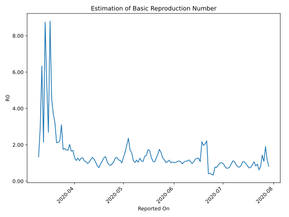

# Country Figures: Time Series for Basic Reproduction Number of Chile 

| Reported On | &Delta; Confirmed | Total &Delta; Confirmed First Interval | Total &Delta; Confirmed Second Interval | Estimated Basic Reproduction Number R0 | 
|-------------|-------------------|----------------------------------------|-----------------------------------------|---------------------------------------------------|
| 2020-04-28 | 552 |  2001  |  1724  |  1.16  | 
| 2020-04-27 | 482 |  2035  |  1566  |  1.30  | 
| 2020-04-26 | 473 |  2026  |  1580  |  1.28  | 
| 2020-04-25 | 552 |  1799  |  1700  |  1.06  | 
| 2020-04-24 | 494 |  1724  |  1815  |  0.95  | 
| 2020-04-23 | 516 |  1566  |  1813  |  0.86  | 
| 2020-04-22 | 464 |  1580  |  1727  |  0.91  | 
| 2020-04-21 | 325 |  1700  |  1594  |  1.07  | 
| 2020-04-20 | 419 |  1815  |  1346  |  1.35  | 
| 2020-04-19 | 358 |  1813  |  1416  |  1.28  | 
| 2020-04-18 | 478 |  1727  |  1553  |  1.11  | 
| 2020-04-17 | 445 |  1594  |  1667  |  0.96  | 
| 2020-04-16 | 534 |  1346  |  1811  |  0.74  | 
| 2020-04-15 | 356 |  1416  |  1686  |  0.84  | 
| 2020-04-14 | 392 |  1553  |  1501  |  1.03  | 
| 2020-04-13 | 312 |  1667  |  1385  |  1.20  | 
| 2020-04-12 | 286 |  1811  |  1379  |  1.31  | 
| 2020-04-11 | 426 |  1686  |  1411  |  1.19  | 
| 2020-04-10 | 529 |  1501  |  1440  |  1.04  | 
| 2020-04-09 | 426 |  1385  |  1423  |  0.97  | 
| 2020-04-08 | 430 |  1379  |  1288  |  1.07  | 
| 2020-04-07 | 301 |  1411  |  1265  |  1.12  | 
| 2020-04-06 | 344 |  1440  |  1122  |  1.28  | 
| 2020-04-05 | 310 |  1423  |  1128  |  1.26  | 
| 2020-04-04 | 424 |  1288  |  1143  |  1.13  | 
| 2020-04-03 | 333 |  1265  |  997  |  1.27  | 
| 2020-04-02 | 373 |  1122  |  987  |  1.14  | 
| 2020-04-01 | 293 |  1128  |  864  |  1.31  | 
| 2020-03-31 | 289 |  1143  |  674  |  1.70  | 
| 2020-03-30 | 310 |  997  |  605  |  1.65  | 
| 2020-03-29 | 230 |  987  |  488  |  2.02  | 
| 2020-03-28 | 299 |  864  |  508  |  1.70  | 
| 2020-03-27 | 304 |  674  |  394  |  1.71  | 
| 2020-03-26 | 164 |  605  |  336  |  1.80  | 
| 2020-03-25 | 220 |  488  |  279  |  1.75  | 
| 2020-03-24 | 176 |  508  |  164  |  3.10  | 
| 2020-03-23 | 114 |  394  |  177  |  2.23  | 
| 2020-03-22 | 95 |  336  |  158  |  2.13  | 
| 2020-03-21 | 103 |  279  |  132  |  2.11  | 
| 2020-03-20 | 196 |  164  |  51  |  3.22  | 
| 2020-03-19 | 0 |  177  |  48  |  3.69  | 
| 2020-03-18 | 37 |  158  |  35  |  4.51  | 
| 2020-03-17 | 46 |  132  |  15  |  8.80  | 
| 2020-03-16 | 81 |  51  |  19  |  2.68  | 
| 2020-03-15 | 13 |  48  |  9  |  5.33  | 
| 2020-03-14 | 18 |  35  |  4  |  8.75  | 
| 2020-03-13 | 20 |  15  |  7  |  2.14  | 
| 2020-03-12 | 0 |  19  |  3  |  6.33  | 
| 2020-03-11 | 10 |  9  |  3  |  3.00  | 
| 2020-03-10 | 5 |  4  |  3  |  1.33  | 
| 2020-03-09 | 0 |  7  |  None  |  None  | 
| 2020-03-08 | 4 |  3  |  None  |  None  | 
| 2020-03-07 | 0 |  3  |  None  |  None  | 
| 2020-03-06 | 0 |  3  |  None  |  None  | 
| 2020-03-05 | 3 |  None  |  None  |  None  | 
| 2020-03-04 | 0 |  None  |  None  |  None  | 
| 2020-03-03 | None |  None  |  None  |  None  | 

