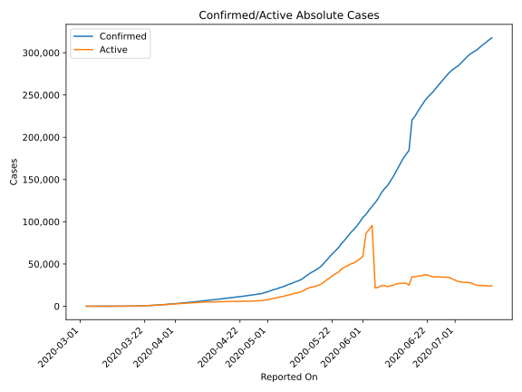
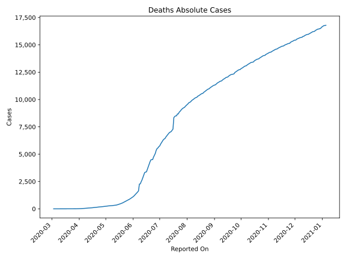
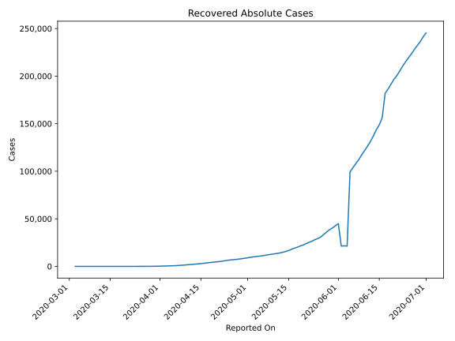
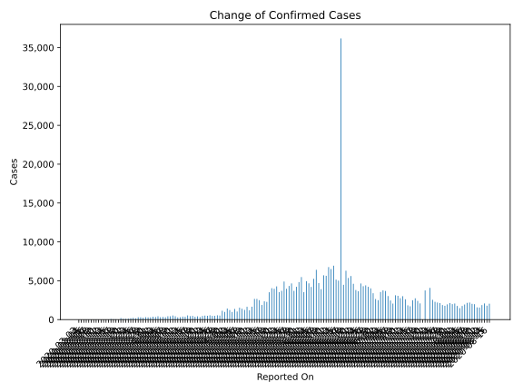
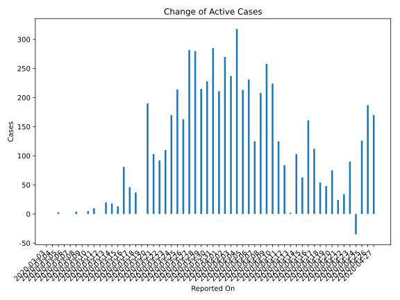
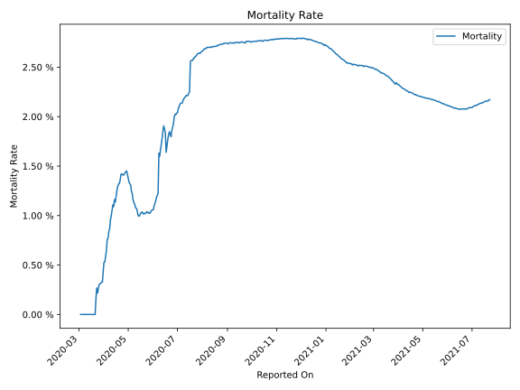

# Country Figures: Time Series for Chile 

| Reported On | Confirmed | Deaths | Recovered | Active | Mortality | &Delta; Confirmed | &Delta; Deaths | &Delta; Recovered | &Delta; Active | % Active of Population |
|-------------|-----------|--------|-----------|--------|-----------|-------------------|----------------|-------------------|----------------|------------------------|
| 2020-04-19 | 10088 | 133 | 4338 | 5617 |  1.32 %  | 358 | 7 | 303 | 48 |  0.030 %  | 
| 2020-04-18 | 9730 | 126 | 4035 | 5569 |  1.29 %  | 478 | 10 | 414 | 54 |  0.030 %  | 
| 2020-04-17 | 9252 | 116 | 3621 | 5515 |  1.25 %  | 445 | 11 | 322 | 112 |  0.029 %  | 
| 2020-04-16 | 8807 | 105 | 3299 | 5403 |  1.19 %  | 534 | 11 | 362 | 161 |  0.029 %  | 
| 2020-04-15 | 8273 | 94 | 2937 | 5242 |  1.14 %  | 356 | 2 | 291 | 63 |  0.028 %  | 
| 2020-04-14 | 7917 | 92 | 2646 | 5179 |  1.16 %  | 392 | 10 | 279 | 103 |  0.028 %  | 
| 2020-04-13 | 7525 | 82 | 2367 | 5076 |  1.09 %  | 312 | 2 | 308 | 2 |  0.027 %  | 
| 2020-04-12 | 7213 | 80 | 2059 | 5074 |  1.11 %  | 286 | 7 | 195 | 84 |  0.027 %  | 
| 2020-04-11 | 6927 | 73 | 1864 | 4990 |  1.05 %  | 426 | 8 | 293 | 125 |  0.027 %  | 
| 2020-04-10 | 6501 | 65 | 1571 | 4865 |  1.00 %  | 529 | 8 | 297 | 224 |  0.026 %  | 
| 2020-04-09 | 5972 | 57 | 1274 | 4641 |  0.95 %  | 426 | 9 | 159 | 258 |  0.025 %  | 
| 2020-04-08 | 5546 | 48 | 1115 | 4383 |  0.87 %  | 430 | 5 | 217 | 208 |  0.023 %  | 
| 2020-04-07 | 5116 | 43 | 898 | 4175 |  0.84 %  | 301 | 6 | 170 | 125 |  0.022 %  | 
| 2020-04-06 | 4815 | 37 | 728 | 4050 |  0.77 %  | 344 | 3 | 110 | 231 |  0.022 %  | 
| 2020-04-05 | 4471 | 34 | 618 | 3819 |  0.76 %  | 310 | 7 | 90 | 213 |  0.020 %  | 
| 2020-04-04 | 4161 | 27 | 528 | 3606 |  0.65 %  | 424 | 5 | 101 | 318 |  0.019 %  | 
| 2020-04-03 | 3737 | 22 | 427 | 3288 |  0.59 %  | 333 | 4 | 92 | 237 |  0.018 %  | 
| 2020-04-02 | 3404 | 18 | 335 | 3051 |  0.53 %  | 373 | 2 | 101 | 270 |  0.016 %  | 
| 2020-04-01 | 3031 | 16 | 234 | 2781 |  0.53 %  | 293 | 4 | 78 | 211 |  0.015 %  | 
| 2020-03-31 | 2738 | 12 | 156 | 2570 |  0.44 %  | 289 | 4 | 0 | 285 |  0.014 %  | 
| 2020-03-30 | 2449 | 8 | 156 | 2285 |  0.33 %  | 310 | 1 | 81 | 228 |  0.012 %  | 
| 2020-03-29 | 2139 | 7 | 75 | 2057 |  0.33 %  | 230 | 1 | 14 | 215 |  0.011 %  | 
| 2020-03-28 | 1909 | 6 | 61 | 1842 |  0.31 %  | 299 | 1 | 18 | 280 |  0.010 %  | 
| 2020-03-27 | 1610 | 5 | 43 | 1562 |  0.31 %  | 304 | 1 | 21 | 282 |  0.008 %  | 
| 2020-03-26 | 1306 | 4 | 22 | 1280 |  0.31 %  | 164 | 1 | 0 | 163 |  0.007 %  | 
| 2020-03-25 | 1142 | 3 | 22 | 1117 |  0.26 %  | 220 | 1 | 5 | 214 |  0.006 %  | 
| 2020-03-24 | 922 | 2 | 17 | 903 |  0.22 %  | 176 | 0 | 6 | 170 |  0.005 %  | 
| 2020-03-23 | 746 | 2 | 11 | 733 |  0.27 %  | 114 | 1 | 3 | 110 |  0.004 %  | 
| 2020-03-22 | 632 | 1 | 8 | 623 |  0.16 %  | 95 | 1 | 2 | 92 |  0.003 %  | 
| 2020-03-21 | 537 | 0 | 6 | 531 |  None  | 103 | 0 | 0 | 103 |  0.003 %  | 
| 2020-03-20 | 434 | 0 | 6 | 428 |  None  | 196 | 0 | 6 | 190 |  0.002 %  | 
| 2020-03-19 | 238 | 0 | 0 | 238 |  None  | 0 | 0 | 0 | 0 |  0.001 %  | 
| 2020-03-18 | 238 | 0 | 0 | 238 |  None  | 37 | 0 | 0 | 37 |  0.001 %  | 
| 2020-03-17 | 201 | 0 | 0 | 201 |  None  | 46 | 0 | 0 | 46 |  0.001 %  | 
| 2020-03-16 | 155 | 0 | 0 | 155 |  None  | 81 | 0 | 0 | 81 |  0.001 %  | 
| 2020-03-15 | 74 | 0 | 0 | 74 |  None  | 13 | 0 | 0 | 13 |  0.000 %  | 
| 2020-03-14 | 61 | 0 | 0 | 61 |  None  | 18 | 0 | 0 | 18 |  0.000 %  | 
| 2020-03-13 | 43 | 0 | 0 | 43 |  None  | 20 | 0 | 0 | 20 |  0.000 %  | 
| 2020-03-12 | 23 | 0 | 0 | 23 |  None  | 0 | 0 | 0 | 0 |  0.000 %  | 
| 2020-03-11 | 23 | 0 | 0 | 23 |  None  | 10 | 0 | 0 | 10 |  0.000 %  | 
| 2020-03-10 | 13 | 0 | 0 | 13 |  None  | 5 | 0 | 0 | 5 |  0.000 %  | 
| 2020-03-09 | 8 | 0 | 0 | 8 |  None  | 0 | 0 | 0 | 0 |  0.000 %  | 
| 2020-03-08 | 8 | 0 | 0 | 8 |  None  | 4 | 0 | 0 | 4 |  0.000 %  | 
| 2020-03-07 | 4 | 0 | 0 | 4 |  None  | 0 | 0 | 0 | 0 |  0.000 %  | 
| 2020-03-06 | 4 | 0 | 0 | 4 |  None  | 0 | 0 | 0 | 0 |  0.000 %  | 
| 2020-03-05 | 4 | 0 | 0 | 4 |  None  | 3 | 0 | 0 | 3 |  0.000 %  | 
| 2020-03-04 | 1 | 0 | 0 | 1 |  None  | 0 | 0 | 0 | 0 |  0.000 %  | 
| 2020-03-03 | 1 | 0 | 0 | 1 |  None  | None | None | None | None |  0.000 %  | 

