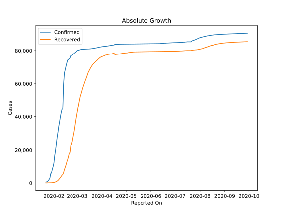
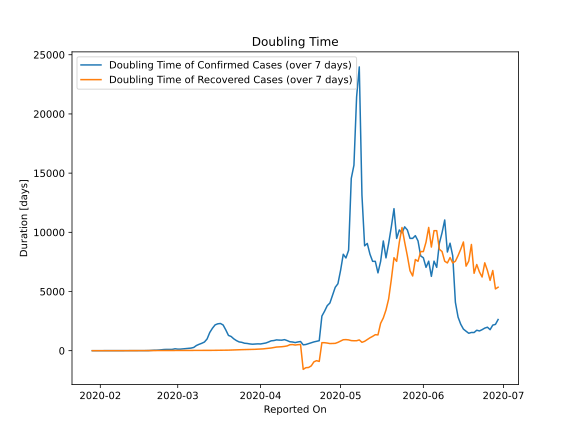

# Country Figures: Doubling Time of Infections for China 

The doubling time below are calculated based on
* an exponential growth assumption
* for time difference of past seven (7) days.
The doubling time's unit is "days".

The first doubling time indicates the increase of confirmed (infected)
cases. There, the *higher* the number is, the better is to take control
of the disease.

The second doubling time indicates the increase of recovered (healed)
cases. There, the *lower* the number is, the better it is to take
control of the disease.

| Reported On | Confirmed | Doubling Time (Confirmed) | Recovered | Doubling Time (Recovered) |
|-------------|-----------|---------------------------|-----------|---------------------------|
| 2020-04-21 | 83853 |  741.7 days  | 77799 |  -943.4 days  | 
| 2020-04-20 | 83817 |  671.2 days  | 77745 |  -1285.1 days  | 
| 2020-04-19 | 83805 |  603.9 days  | 77690 |  -1419.2 days  | 
| 2020-04-18 | 83787 |  523.8 days  | 77614 |  -1434.0 days  | 
| 2020-04-17 | 83760 |  494.1 days  | 77552 |  -1576.5 days  | 
| 2020-04-16 | 83403 |  776.1 days  | 78401 |  524.8 days  | 
| 2020-04-15 | 83356 |  737.3 days  | 78311 |  508.6 days  | 
| 2020-04-14 | 83306 |  685.3 days  | 78200 |  478.2 days  | 
| 2020-04-13 | 83213 |  734.7 days  | 78039 |  517.3 days  | 
| 2020-04-12 | 83134 |  756.1 days  | 77956 |  502.9 days  | 
| 2020-04-11 | 83014 |  853.1 days  | 77877 |  403.8 days  | 
| 2020-04-10 | 82941 |  933.8 days  | 77791 |  364.0 days  | 
| 2020-04-09 | 82883 |  889.6 days  | 77679 |  336.2 days  | 
| 2020-04-08 | 82809 |  894.8 days  | 77567 |  320.1 days  | 
| 2020-04-07 | 82718 |  912.2 days  | 77410 |  308.3 days  | 
| 2020-04-06 | 82665 |  856.8 days  | 77310 |  267.2 days  | 
| 2020-04-05 | 82602 |  832.9 days  | 77207 |  227.6 days  | 
| 2020-04-04 | 82543 |  734.1 days  | 76946 |  199.5 days  | 
| 2020-04-03 | 82511 |  649.9 days  | 76760 |  179.9 days  | 
| 2020-04-02 | 82432 |  613.2 days  | 76565 |  153.3 days  | 
| 2020-04-01 | 82361 |  568.8 days  | 76399 |  138.7 days  | 
| 2020-03-31 | 82279 |  578.2 days  | 76200 |  124.3 days  | 
| 2020-03-30 | 82198 |  566.0 days  | 75917 |  116.8 days  | 
| 2020-03-29 | 82122 |  547.5 days  | 75576 |  112.0 days  | 
| 2020-03-28 | 81999 |  571.2 days  | 75094 |  110.5 days  | 
| 2020-03-27 | 81897 |  612.1 days  | 74714 |  103.0 days  | 
| 2020-03-26 | 81782 |  631.8 days  | 74175 |  96.8 days  | 
| 2020-03-25 | 81661 |  706.7 days  | 73767 |  87.1 days  | 
| 2020-03-24 | 81591 |  740.7 days  | 73274 |  77.3 days  | 
| 2020-03-23 | 81496 |  852.0 days  | 72819 |  69.9 days  | 
| 2020-03-22 | 81397 |  1000.3 days  | 72362 |  63.6 days  | 
| 2020-03-21 | 81305 |  1200.6 days  | 71857 |  54.1 days  | 
| 2020-03-20 | 81250 |  1290.5 days  | 71266 |  46.8 days  | 
| 2020-03-19 | 81156 |  1755.8 days  | 70535 |  42.7 days  | 
| 2020-03-18 | 81102 |  2172.0 days  | 69755 |  39.6 days  | 
| 2020-03-17 | 81058 |  2297.9 days  | 68798 |  36.6 days  | 
| 2020-03-16 | 81033 |  2270.6 days  | 67910 |  34.0 days  | 
| 2020-03-15 | 81003 |  2181.4 days  | 67017 |  31.6 days  | 
| 2020-03-14 | 80977 |  1896.0 days  | 65660 |  29.3 days  | 
| 2020-03-13 | 80945 |  1538.1 days  | 64196 |  28.2 days  | 
| 2020-03-12 | 80932 |  992.1 days  | 62901 |  26.6 days  | 
| 2020-03-11 | 80921 |  731.8 days  | 61644 |  23.5 days  | 
| 2020-03-10 | 80887 |  624.9 days  | 60181 |  20.8 days  | 
| 2020-03-09 | 80860 |  539.8 days  | 58804 |  18.3 days  | 
| 2020-03-08 | 80823 |  438.0 days  | 57388 |  16.1 days  | 
| 2020-03-07 | 80770 |  275.1 days  | 55539 |  14.4 days  | 
| 2020-03-06 | 80690 |  220.1 days  | 53944 |  12.6 days  | 
| 2020-03-05 | 80537 |  199.6 days  | 52292 |  10.8 days  | 
| 2020-03-04 | 80386 |  173.6 days  | 50001 |  9.9 days  | 
| 2020-03-03 | 80261 |  153.2 days  | 47450 |  9.3 days  | 
| 2020-03-02 | 80136 |  132.2 days  | 44854 |  8.7 days  | 
| 2020-03-01 | 79932 |  131.2 days  | 42162 |  8.5 days  | 
| 2020-02-29 | 79356 |  161.4 days  | 39320 |  9.2 days  | 
| 2020-02-28 | 78928 |  111.3 days  | 36329 |  7.6 days  | 
| 2020-02-27 | 78600 |  106.2 days  | 32930 |  8.4 days  | 
| 2020-02-26 | 78166 |  104.8 days  | 30084 |  8.0 days  | 
| 2020-02-25 | 77754 |  104.4 days  | 27676 |  7.6 days  | 
| 2020-02-24 | 77241 |  75.9 days  | 25015 |  7.3 days  | 
| 2020-02-23 | 77022 |  55.3 days  | 23187 |  6.7 days  | 
| 2020-02-22 | 77001 |  41.4 days  | 22699 |  5.8 days  | 
| 2020-02-21 | 75550 |  37.7 days  | 18704 |  6.0 days  | 
| 2020-02-20 | 75077 |  21.8 days  | 18014 |  4.9 days  | 
| 2020-02-19 | 74619 |  9.8 days  | 15962 |  4.6 days  | 
| 2020-02-18 | 74211 |  9.8 days  | 14206 |  4.7 days  | 
| 2020-02-17 | 72434 |  9.4 days  | 12462 |  4.5 days  | 
| 2020-02-16 | 70513 |  8.8 days  | 10755 |  4.4 days  | 
| 2020-02-15 | 68413 |  8.2 days  | 9298 |  4.1 days  | 
| 2020-02-14 | 66358 |  7.6 days  | 7977 |  3.8 days  | 
| 2020-02-13 | 59895 |  7.6 days  | 6217 |  3.7 days  | 
| 2020-02-12 | 44759 |  10.3 days  | 5082 |  3.5 days  | 
| 2020-02-11 | 44386 |  8.1 days  | 4636 |  3.2 days  | 
| 2020-02-10 | 42354 |  6.7 days  | 3918 |  3.0 days  | 
| 2020-02-09 | 39829 |  5.9 days  | 3219 |  2.8 days  | 
| 2020-02-08 | 36814 |  4.6 days  | 2596 |  2.5 days  | 
| 2020-02-07 | 34110 |  4.2 days  | 1999 |  2.5 days  | 
| 2020-02-06 | 30587 |  4.0 days  | 1477 |  2.4 days  | 
| 2020-02-05 | 27440 |  3.6 days  | 1115 |  2.5 days  | 
| 2020-02-04 | 23707 |  3.7 days  | 843 |  2.6 days  | 
| 2020-02-03 | 19716 |  2.9 days  | 614 |  2.4 days  | 
| 2020-02-02 | 16630 |  2.7 days  | 463 |  2.5 days  | 
| 2020-02-01 | 11891 |  2.6 days  | 275 |  2.8 days  | 
| 2020-01-31 | 9802 |  2.4 days  | 214 |  3.1 days  | 
| 2020-01-30 | 8141 |  2.2 days  | 135 |  3.6 days  | 
| 2020-01-29 | 6087 |  2.3 days  | 120 |  3.7 days  | 
| 2020-01-28 | 5509 |  None  | 101 |  None  | 
| 2020-01-27 | 2877 |  None  | 58 |  None  | 
| 2020-01-26 | 2075 |  None  | 49 |  None  | 
| 2020-01-25 | 1406 |  None  | 39 |  None  | 
| 2020-01-24 | 920 |  None  | 36 |  None  | 
| 2020-01-23 | 643 |  None  | 30 |  None  | 
| 2020-01-22 | 548 |  None  | 28 |  None  | 

