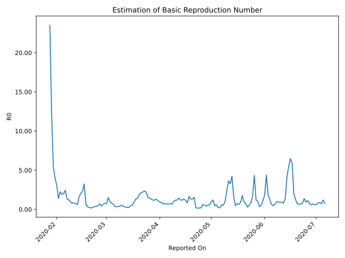

# Country Figures: Time Series for Basic Reproduction Number of China 

| Reported On | &Delta; Confirmed | Total &Delta; Confirmed First Interval | Total &Delta; Confirmed Second Interval | Estimated Basic Reproduction Number R0 | 
|-------------|-------------------|----------------------------------------|-----------------------------------------|---------------------------------------------------|
| 2020-05-03 | 5 |  19  |  41  |  0.46  | 
| 2020-05-02 | 0 |  41  |  34  |  1.21  | 
| 2020-05-01 | 3 |  44  |  44  |  1.00  | 
| 2020-04-30 | 12 |  35  |  56  |  0.62  | 
| 2020-04-29 | 4 |  41  |  82  |  0.50  | 
| 2020-04-28 | 22 |  34  |  79  |  0.43  | 
| 2020-04-27 | 6 |  44  |  81  |  0.54  | 
| 2020-04-26 | 3 |  56  |  93  |  0.60  | 
| 2020-04-25 | 10 |  82  |  414  |  0.20  | 
| 2020-04-24 | 15 |  79  |  449  |  0.18  | 
| 2020-04-23 | 16 |  81  |  481  |  0.17  | 
| 2020-04-22 | 15 |  93  |  547  |  0.17  | 
| 2020-04-21 | 36 |  414  |  269  |  1.54  | 
| 2020-04-20 | 12 |  449  |  342  |  1.31  | 
| 2020-04-19 | 18 |  481  |  365  |  1.32  | 
| 2020-04-18 | 27 |  547  |  330  |  1.66  | 
| 2020-04-17 | 357 |  269  |  325  |  0.83  | 
| 2020-04-16 | 47 |  342  |  296  |  1.16  | 
| 2020-04-15 | 50 |  365  |  276  |  1.32  | 
| 2020-04-14 | 93 |  330  |  281  |  1.17  | 
| 2020-04-13 | 79 |  325  |  266  |  1.22  | 
| 2020-04-12 | 120 |  296  |  207  |  1.43  | 
| 2020-04-11 | 73 |  276  |  233  |  1.18  | 
| 2020-04-10 | 58 |  281  |  241  |  1.17  | 
| 2020-04-09 | 74 |  266  |  264  |  1.01  | 
| 2020-04-08 | 91 |  207  |  313  |  0.66  | 
| 2020-04-07 | 53 |  233  |  310  |  0.75  | 
| 2020-04-06 | 63 |  241  |  362  |  0.67  | 
| 2020-04-05 | 59 |  264  |  382  |  0.69  | 
| 2020-04-04 | 32 |  313  |  416  |  0.75  | 
| 2020-04-03 | 79 |  310  |  461  |  0.67  | 
| 2020-04-02 | 71 |  362  |  408  |  0.89  | 
| 2020-04-01 | 82 |  382  |  401  |  0.95  | 
| 2020-03-31 | 81 |  416  |  385  |  1.08  | 
| 2020-03-30 | 76 |  461  |  356  |  1.29  | 
| 2020-03-29 | 123 |  408  |  341  |  1.20  | 
| 2020-03-28 | 102 |  401  |  340  |  1.18  | 
| 2020-03-27 | 115 |  385  |  295  |  1.31  | 
| 2020-03-26 | 121 |  356  |  247  |  1.44  | 
| 2020-03-25 | 70 |  341  |  217  |  1.57  | 
| 2020-03-24 | 95 |  340  |  153  |  2.22  | 
| 2020-03-23 | 99 |  295  |  125  |  2.36  | 
| 2020-03-22 | 92 |  247  |  113  |  2.19  | 
| 2020-03-21 | 55 |  217  |  101  |  2.15  | 
| 2020-03-20 | 94 |  153  |  82  |  1.87  | 
| 2020-03-19 | 54 |  125  |  90  |  1.39  | 
| 2020-03-18 | 44 |  113  |  85  |  1.33  | 
| 2020-03-17 | 25 |  101  |  109  |  0.93  | 
| 2020-03-16 | 30 |  82  |  151  |  0.54  | 
| 2020-03-15 | 26 |  90  |  197  |  0.46  | 
| 2020-03-14 | 32 |  85  |  323  |  0.26  | 
| 2020-03-13 | 13 |  109  |  437  |  0.25  | 
| 2020-03-12 | 11 |  151  |  509  |  0.30  | 
| 2020-03-11 | 34 |  197  |  554  |  0.36  | 
| 2020-03-10 | 27 |  323  |  605  |  0.53  | 
| 2020-03-09 | 37 |  437  |  1030  |  0.42  | 
| 2020-03-08 | 53 |  509  |  1333  |  0.38  | 
| 2020-03-07 | 80 |  554  |  1536  |  0.36  | 
| 2020-03-06 | 153 |  605  |  1766  |  0.34  | 
| 2020-03-05 | 151 |  1030  |  1602  |  0.64  | 
| 2020-03-04 | 125 |  1333  |  1687  |  0.79  | 
| 2020-03-03 | 125 |  1536  |  1578  |  0.97  | 
| 2020-03-02 | 204 |  1766  |  1165  |  1.52  | 
| 2020-03-01 | 576 |  1602  |  2204  |  0.73  | 
| 2020-02-29 | 428 |  1687  |  2164  |  0.78  | 
| 2020-02-28 | 328 |  1578  |  2403  |  0.66  | 
| 2020-02-27 | 434 |  1165  |  2790  |  0.42  | 
| 2020-02-26 | 412 |  2204  |  3116  |  0.71  | 
| 2020-02-25 | 513 |  2164  |  4564  |  0.47  | 
| 2020-02-24 | 219 |  2403  |  6206  |  0.39  | 
| 2020-02-23 | 21 |  2790  |  7853  |  0.36  | 
| 2020-02-22 | 1451 |  3116  |  12539  |  0.25  | 
| 2020-02-21 | 473 |  4564  |  25754  |  0.18  | 
| 2020-02-20 | 458 |  6206  |  24027  |  0.26  | 
| 2020-02-19 | 408 |  7853  |  24004  |  0.33  | 
| 2020-02-18 | 1777 |  12539  |  20066  |  0.62  | 
| 2020-02-17 | 1921 |  25754  |  7945  |  3.24  | 
| 2020-02-16 | 2100 |  24027  |  10276  |  2.34  | 
| 2020-02-15 | 2055 |  24004  |  11767  |  2.04  | 
| 2020-02-14 | 6463 |  20066  |  12389  |  1.62  | 
| 2020-02-13 | 15136 |  7945  |  13107  |  0.61  | 
| 2020-02-12 | 373 |  10276  |  14394  |  0.71  | 
| 2020-02-11 | 2032 |  11767  |  13957  |  0.84  | 
| 2020-02-10 | 2525 |  12389  |  15549  |  0.80  | 
| 2020-02-09 | 3015 |  13107  |  13905  |  0.94  | 
| 2020-02-08 | 2704 |  14394  |  11575  |  1.24  | 
| 2020-02-07 | 3523 |  13957  |  10543  |  1.32  | 
| 2020-02-06 | 3147 |  15549  |  6382  |  2.44  | 
| 2020-02-05 | 3733 |  13905  |  6925  |  2.01  | 
| 2020-02-04 | 3991 |  11575  |  6066  |  1.91  | 
| 2020-02-03 | 3086 |  10543  |  4681  |  2.25  | 
| 2020-02-02 | 4739 |  6382  |  4589  |  1.39  | 
| 2020-02-01 | 2089 |  6925  |  2234  |  3.10  | 
| 2020-01-31 | 1661 |  6066  |  1527  |  3.97  | 
| 2020-01-30 | 2054 |  4681  |  858  |  5.46  | 
| 2020-01-29 | 578 |  4589  |  372  |  12.34  | 
| 2020-01-28 | 2632 |  2234  |  95  |  23.52  | 
| 2020-01-27 | 802 |  1527  |  None  |  None  | 
| 2020-01-26 | 669 |  858  |  None  |  None  | 
| 2020-01-25 | 486 |  372  |  None  |  None  | 
| 2020-01-24 | 277 |  95  |  None  |  None  | 
| 2020-01-23 | 95 |  None  |  None  |  None  | 
| 2020-01-22 | None |  None  |  None  |  None  | 

