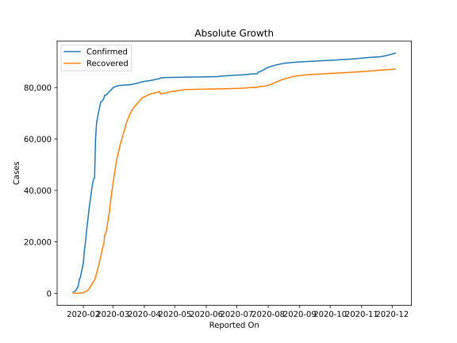
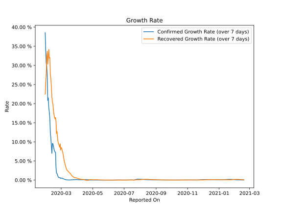

# Country Figures: Growth Rate for China 

The growth rates below are calculated based on
* an exponential growth assumption
* for time difference of past seven (7) days.
The growth rate is to be understood as on "growth per day".

The first growth rate indicates the increase of confirmed (infected) cases.

The second growth rate indicates the increase of recovered (healed) cases.

| Reported On | Confirmed | Growth Rate (Confirmed) | Recovered | Growth Rate (Recovered) |
|-------------|-----------|-------------------------|-----------|-------------------------|
| 2020-03-27 | 81897 |  0.11 %  | 74720 |  0.676 %  | 
| 2020-03-26 | 81782 |  0.11 %  | 74181 |  0.720 %  | 
| 2020-03-25 | 81661 |  0.10 %  | 73773 |  0.800 %  | 
| 2020-03-24 | 81591 |  0.09 %  | 73280 |  0.902 %  | 
| 2020-03-23 | 81496 |  0.08 %  | 72819 |  0.997 %  | 
| 2020-03-22 | 81397 |  0.07 %  | 72362 |  1.096 %  | 
| 2020-03-21 | 81305 |  0.06 %  | 71857 |  1.288 %  | 
| 2020-03-20 | 81250 |  0.05 %  | 71266 |  1.493 %  | 
| 2020-03-19 | 81156 |  0.04 %  | 70535 |  1.636 %  | 
| 2020-03-18 | 81102 |  0.03 %  | 69755 |  1.766 %  | 
| 2020-03-17 | 81058 |  0.03 %  | 68798 |  1.912 %  | 
| 2020-03-16 | 81033 |  0.03 %  | 67910 |  2.057 %  | 
| 2020-03-15 | 81003 |  0.03 %  | 67017 |  2.216 %  | 
| 2020-03-14 | 80977 |  0.04 %  | 65660 |  2.391 %  | 
| 2020-03-13 | 80945 |  0.05 %  | 64196 |  2.486 %  | 
| 2020-03-12 | 80932 |  0.07 %  | 62901 |  2.639 %  | 
| 2020-03-11 | 80921 |  0.09 %  | 61644 |  2.990 %  | 
| 2020-03-10 | 80887 |  0.11 %  | 60181 |  3.395 %  | 
| 2020-03-09 | 80860 |  0.13 %  | 58804 |  3.869 %  | 
| 2020-03-08 | 80823 |  0.16 %  | 57388 |  4.405 %  | 
| 2020-03-07 | 80770 |  0.25 %  | 55539 |  4.934 %  | 
| 2020-03-06 | 80690 |  0.32 %  | 53944 |  5.648 %  | 
| 2020-03-05 | 80537 |  0.35 %  | 52292 |  6.607 %  | 
| 2020-03-04 | 80386 |  0.40 %  | 50001 |  7.258 %  | 
| 2020-03-03 | 80261 |  0.45 %  | 47450 |  7.702 %  | 
| 2020-03-02 | 80136 |  0.53 %  | 44854 |  8.342 %  | 
| 2020-03-01 | 79932 |  0.53 %  | 42162 |  8.542 %  | 
| 2020-02-29 | 79356 |  0.43 %  | 39320 |  7.849 %  | 
| 2020-02-28 | 78928 |  0.62 %  | 36329 |  9.484 %  | 
| 2020-02-27 | 78600 |  0.66 %  | 32930 |  8.618 %  | 
| 2020-02-26 | 78166 |  0.66 %  | 30084 |  9.054 %  | 
| 2020-02-25 | 77754 |  0.67 %  | 27676 |  9.527 %  | 
| 2020-02-24 | 77241 |  0.92 %  | 25015 |  9.954 %  | 
| 2020-02-23 | 77022 |  1.26 %  | 23187 |  10.975 %  | 
| 2020-02-22 | 77001 |  1.69 %  | 22699 |  12.750 %  | 
| 2020-02-21 | 75550 |  1.85 %  | 18704 |  12.174 %  | 
| 2020-02-20 | 75077 |  3.23 %  | 18014 |  15.198 %  | 
| 2020-02-19 | 74619 |  7.30 %  | 15962 |  16.350 %  | 
| 2020-02-18 | 74211 |  7.34 %  | 14206 |  15.997 %  | 
| 2020-02-17 | 72434 |  7.67 %  | 12462 |  16.530 %  | 
| 2020-02-16 | 70513 |  8.16 %  | 10755 |  17.233 %  | 
| 2020-02-15 | 68413 |  8.85 %  | 9298 |  18.226 %  | 
| 2020-02-14 | 66358 |  9.51 %  | 7977 |  19.770 %  | 
| 2020-02-13 | 59895 |  9.60 %  | 6217 |  20.532 %  | 
| 2020-02-12 | 44759 |  6.99 %  | 5082 |  21.669 %  | 
| 2020-02-11 | 44386 |  8.96 %  | 4636 |  24.352 %  | 
| 2020-02-10 | 42354 |  10.92 %  | 3918 |  26.476 %  | 
| 2020-02-09 | 39829 |  12.48 %  | 3219 |  27.701 %  | 
| 2020-02-08 | 36814 |  16.14 %  | 2596 |  32.071 %  | 
| 2020-02-07 | 34110 |  17.81 %  | 1999 |  31.920 %  | 
| 2020-02-06 | 30587 |  18.91 %  | 1477 |  34.178 %  | 
| 2020-02-05 | 27440 |  21.51 %  | 1115 |  31.845 %  | 
| 2020-02-04 | 23707 |  20.85 %  | 843 |  30.312 %  | 
| 2020-02-03 | 19716 |  27.50 %  | 614 |  33.708 %  | 
| 2020-02-02 | 16630 |  29.73 %  | 463 |  32.084 %  | 
| 2020-02-01 | 11891 |  30.50 %  | 275 |  27.903 %  | 
| 2020-01-31 | 9802 |  33.80 %  | 214 |  25.464 %  | 
| 2020-01-30 | 8141 |  36.26 %  | 135 |  21.487 %  | 
| 2020-01-29 | 6087 |  34.39 %  | 120 |  20.790 %  | 
| 2020-01-28 | 5509 |  None  | 101 |  None  | 
| 2020-01-27 | 2877 |  None  | 58 |  None  | 
| 2020-01-26 | 2075 |  None  | 49 |  None  | 
| 2020-01-25 | 1406 |  None  | 39 |  None  | 
| 2020-01-24 | 920 |  None  | 36 |  None  | 
| 2020-01-23 | 643 |  None  | 30 |  None  | 
| 2020-01-22 | 548 |  None  | 28 |  None  | 

