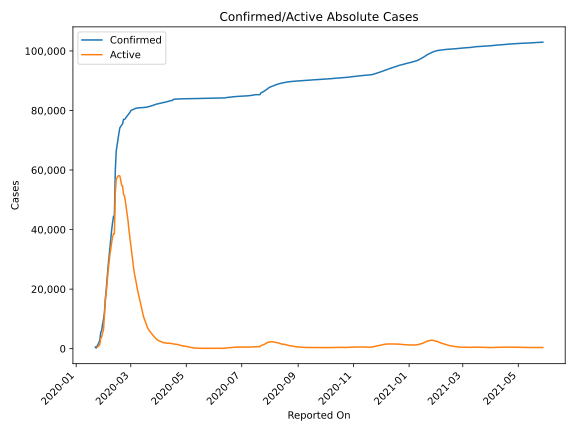
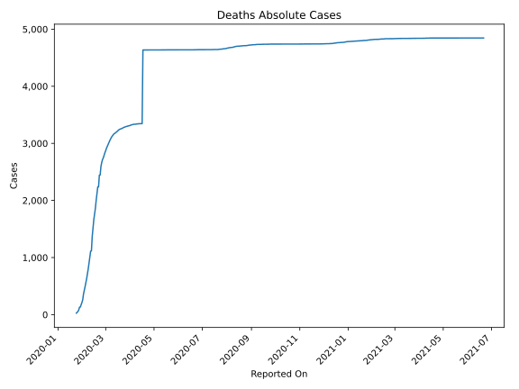
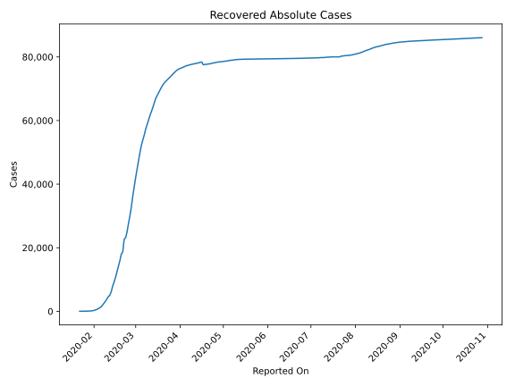
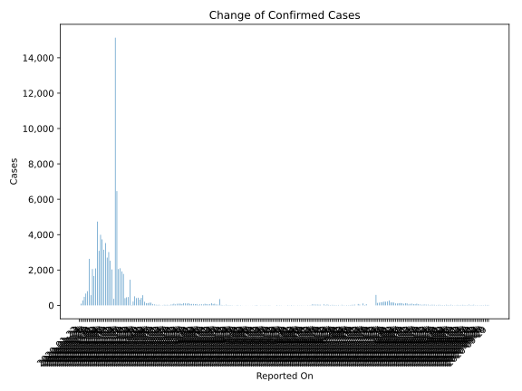
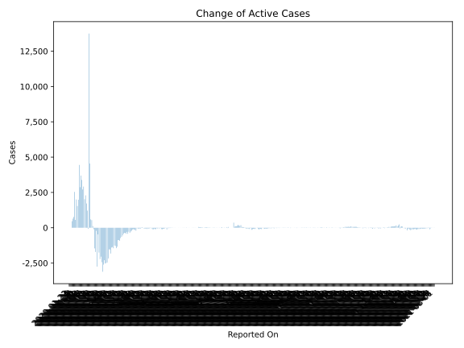
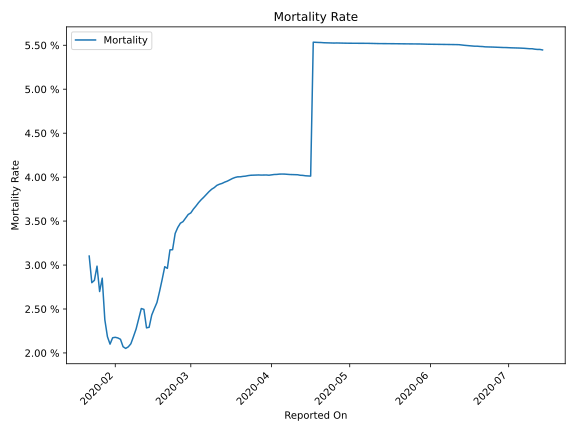

# Country Figures: Time Series for China 

| Reported On | Confirmed | Deaths | Recovered | Active | Mortality | &Delta; Confirmed | &Delta; Deaths | &Delta; Active | % Active of Population |
|-------------|-----------|--------|-----------|--------|-----------|-------------------|----------------|----------------|------------------------|
| 2020-03-21 | 81305 | 3259 | 71857 | 6189 |  4.01 %  | 55 | 6 | -542 |  0.000 %  | 
| 2020-03-20 | 81250 | 3253 | 71266 | 6731 |  4.00 %  | 94 | 4 | -641 |  0.000 %  | 
| 2020-03-19 | 81156 | 3249 | 70535 | 7372 |  4.00 %  | 54 | 8 | -734 |  0.001 %  | 
| 2020-03-18 | 81102 | 3241 | 69755 | 8106 |  4.00 %  | 44 | 11 | -924 |  0.001 %  | 
| 2020-03-17 | 81058 | 3230 | 68798 | 9030 |  3.98 %  | 25 | 13 | -876 |  0.001 %  | 
| 2020-03-16 | 81033 | 3217 | 67910 | 9906 |  3.97 %  | 30 | 14 | -877 |  0.001 %  | 
| 2020-03-15 | 81003 | 3203 | 67017 | 10783 |  3.95 %  | 26 | 10 | -1341 |  0.001 %  | 
| 2020-03-14 | 80977 | 3193 | 65660 | 12124 |  3.94 %  | 32 | 13 | -1445 |  0.001 %  | 
| 2020-03-13 | 80945 | 3180 | 64196 | 13569 |  3.93 %  | 13 | 8 | -1290 |  0.001 %  | 
| 2020-03-12 | 80932 | 3172 | 62901 | 14859 |  3.92 %  | 11 | 11 | -1257 |  0.001 %  | 
| 2020-03-11 | 80921 | 3161 | 61644 | 16116 |  3.91 %  | 34 | 22 | -1451 |  0.001 %  | 
| 2020-03-10 | 80887 | 3139 | 60181 | 17567 |  3.88 %  | 27 | 16 | -1366 |  0.001 %  | 
| 2020-03-09 | 80860 | 3123 | 58804 | 18933 |  3.86 %  | 37 | 23 | -1402 |  0.001 %  | 
| 2020-03-08 | 80823 | 3100 | 57388 | 20335 |  3.84 %  | 53 | 28 | -1824 |  0.001 %  | 
| 2020-03-07 | 80770 | 3072 | 55539 | 22159 |  3.80 %  | 80 | 28 | -1543 |  0.002 %  | 
| 2020-03-06 | 80690 | 3044 | 53944 | 23702 |  3.77 %  | 153 | 29 | -1528 |  0.002 %  | 
| 2020-03-05 | 80537 | 3015 | 52292 | 25230 |  3.74 %  | 151 | 32 | -2172 |  0.002 %  | 
| 2020-03-04 | 80386 | 2983 | 50001 | 27402 |  3.71 %  | 125 | 36 | -2462 |  0.002 %  | 
| 2020-03-03 | 80261 | 2947 | 47450 | 29864 |  3.67 %  | 125 | 33 | -2504 |  0.002 %  | 
| 2020-03-02 | 80136 | 2914 | 44854 | 32368 |  3.64 %  | 204 | 42 | -2530 |  0.002 %  | 
| 2020-03-01 | 79932 | 2872 | 42162 | 34898 |  3.59 %  | 576 | 35 | -2301 |  0.003 %  | 
| 2020-02-29 | 79356 | 2837 | 39320 | 37199 |  3.58 %  | 428 | 47 | -2610 |  0.003 %  | 
| 2020-02-28 | 78928 | 2790 | 36329 | 39809 |  3.53 %  | 328 | 44 | -3115 |  0.003 %  | 
| 2020-02-27 | 78600 | 2746 | 32930 | 42924 |  3.49 %  | 434 | 29 | -2441 |  0.003 %  | 
| 2020-02-26 | 78166 | 2717 | 30084 | 45365 |  3.48 %  | 412 | 52 | -2048 |  0.003 %  | 
| 2020-02-25 | 77754 | 2665 | 27676 | 47413 |  3.43 %  | 513 | 70 | -2218 |  0.003 %  | 
| 2020-02-24 | 77241 | 2595 | 25015 | 49631 |  3.36 %  | 219 | 150 | -1759 |  0.004 %  | 
| 2020-02-23 | 77022 | 2445 | 23187 | 51390 |  3.17 %  | 21 | 2 | -469 |  0.004 %  | 
| 2020-02-22 | 77001 | 2443 | 22699 | 51859 |  3.17 %  | 1451 | 205 | -2749 |  0.004 %  | 
| 2020-02-21 | 75550 | 2238 | 18704 | 54608 |  2.96 %  | 473 | 0 | -217 |  0.004 %  | 
| 2020-02-20 | 75077 | 2238 | 18014 | 54825 |  2.98 %  | 458 | 122 | -1716 |  0.004 %  | 
| 2020-02-19 | 74619 | 2116 | 15962 | 56541 |  2.84 %  | 408 | 113 | -1461 |  0.004 %  | 
| 2020-02-18 | 74211 | 2003 | 14206 | 58002 |  2.70 %  | 1777 | 139 | -106 |  0.004 %  | 
| 2020-02-17 | 72434 | 1864 | 12462 | 58108 |  2.57 %  | 1921 | 98 | 116 |  0.004 %  | 
| 2020-02-16 | 70513 | 1766 | 10755 | 57992 |  2.50 %  | 2100 | 103 | 540 |  0.004 %  | 
| 2020-02-15 | 68413 | 1663 | 9298 | 57452 |  2.43 %  | 2055 | 142 | 592 |  0.004 %  | 
| 2020-02-14 | 66358 | 1521 | 7977 | 56860 |  2.29 %  | 6463 | 152 | 4551 |  0.004 %  | 
| 2020-02-13 | 59895 | 1369 | 6217 | 52309 |  2.29 %  | 15136 | 252 | 13749 |  0.004 %  | 
| 2020-02-12 | 44759 | 1117 | 5082 | 38560 |  2.50 %  | 373 | 5 | -78 |  0.003 %  | 
| 2020-02-11 | 44386 | 1112 | 4636 | 38638 |  2.51 %  | 2032 | 100 | 1214 |  0.003 %  | 
| 2020-02-10 | 42354 | 1012 | 3918 | 37424 |  2.39 %  | 2525 | 107 | 1719 |  0.003 %  | 
| 2020-02-09 | 39829 | 905 | 3219 | 35705 |  2.27 %  | 3015 | 100 | 2292 |  0.003 %  | 
| 2020-02-08 | 36814 | 805 | 2596 | 33413 |  2.19 %  | 2704 | 87 | 2020 |  0.002 %  | 
| 2020-02-07 | 34110 | 718 | 1999 | 31393 |  2.10 %  | 3523 | 85 | 2916 |  0.002 %  | 
| 2020-02-06 | 30587 | 633 | 1477 | 28477 |  2.07 %  | 3147 | 70 | 2715 |  0.002 %  | 
| 2020-02-05 | 27440 | 563 | 1115 | 25762 |  2.05 %  | 3733 | 72 | 3389 |  0.002 %  | 
| 2020-02-04 | 23707 | 491 | 843 | 22373 |  2.07 %  | 3991 | 66 | 3696 |  0.002 %  | 
| 2020-02-03 | 19716 | 425 | 614 | 18677 |  2.16 %  | 3086 | 64 | 2871 |  0.001 %  | 
| 2020-02-02 | 16630 | 361 | 463 | 15806 |  2.17 %  | 4739 | 102 | 4449 |  0.001 %  | 
| 2020-02-01 | 11891 | 259 | 275 | 11357 |  2.18 %  | 2089 | 46 | 1982 |  0.001 %  | 
| 2020-01-31 | 9802 | 213 | 214 | 6291 |  2.17 %  | 1661 | 42 | 1540 |  0.000 %  | 
| 2020-01-30 | 8141 | 171 | 135 | 5324 |  2.10 %  | 2054 | 38 | 2001 |  0.000 %  | 
| 2020-01-29 | 6087 | 133 | 120 | 3846 |  2.18 %  | 578 | 2 | 557 |  0.000 %  | 
| 2020-01-28 | 5509 | 131 | 101 | 3496 |  2.38 %  | 2632 | 49 | 2540 |  0.000 %  | 
| 2020-01-27 | 2877 | 82 | 58 | 1428 |  2.85 %  | 802 | 26 | 767 |  0.000 %  | 
| 2020-01-26 | 2075 | 56 | 49 | 1002 |  2.70 %  | 669 | 14 | 645 |  0.000 %  | 
| 2020-01-25 | 1406 | 42 | 39 | 689 |  2.99 %  | 486 | 16 | 467 |  0.000 %  | 
| 2020-01-24 | 920 | 26 | 36 | 494 |  2.83 %  | 277 | 8 | 263 |  0.000 %  | 
| 2020-01-23 | 643 | 18 | 30 | 399 |  2.80 %  | 95 | 1 | 92 |  0.000 %  | 
| 2020-01-22 | 548 | 17 | 28 | 399 |  3.10 %  | None | None | None |  0.000 %  | 

